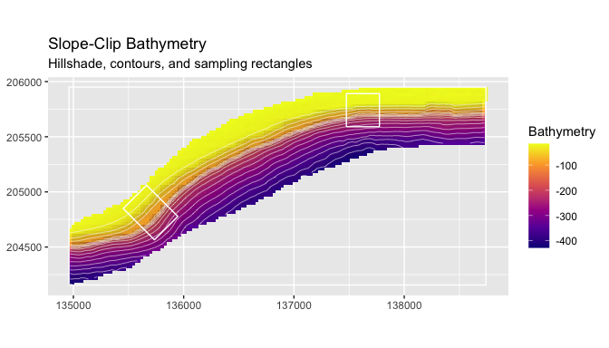
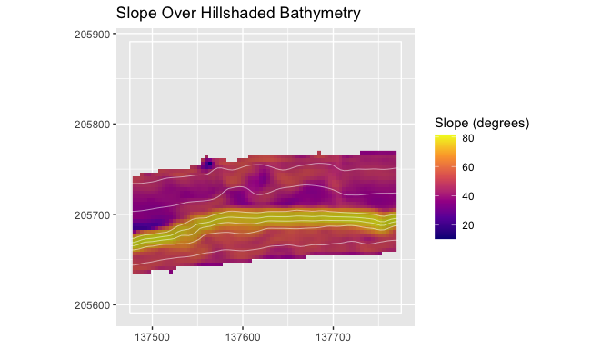
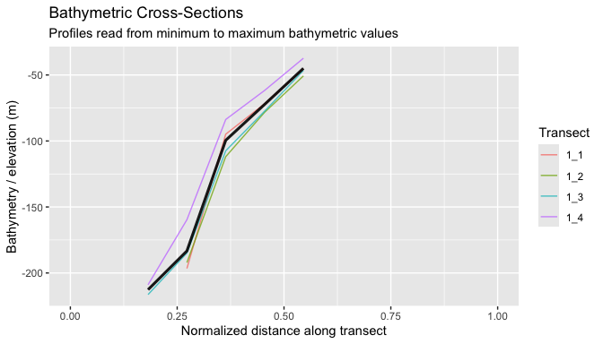
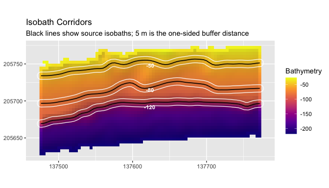

# blueterra

[](https://github.com/el-cordero/blueterra/actions/workflows/R-CMD-check.yaml)
[](https://github.com/el-cordero/blueterra/actions/workflows/pkgdown.yaml)
[](https://CRAN.R-project.org/package=blueterra)
[](https://github.com/el-cordero/blueterra/blob/main/LICENSE.md)

`blueterra` is an R package for geomorphometric analysis of submerged
terrain. It works from user-supplied bathymetric or elevation rasters
and provides workflows for deriving terrain metrics, organizing metrics
into process-oriented groups, and summarizing seafloor structure across
polygons, transects, depth bands, and isobath corridors.

For a complete worked example using the installed example rasters, see
the [Get Started
article](https://el-cordero.github.io/blueterra/articles/blueterra.html).

Full documentation and articles are available at
<https://el-cordero.github.io/blueterra/>.

## Installation

Install the released version from CRAN:

``` r
install.packages("blueterra")
```

The development version is available from GitHub:

``` r
install.packages("remotes")
remotes::install_github("el-cordero/blueterra")
```

From a local source checkout:

``` r
install.packages("path/to/blueterra", repos = NULL, type = "source")
```

## Example Data

The installed examples are reduced from analysis rasters and sampling
rectangles used to test terrain workflows on real shelf-margin
morphology. They are compact enough for package examples, but they
retain depth gradients, slope breaks, local relief, and
sampling-rectangle geometry.

``` r
library(blueterra)
library(terra)

hitw <- read_bathy(blueterra_example("hitw"))
hoyo <- read_bathy(blueterra_example("hoyo"))
slope <- read_bathy(blueterra_example("slope"))
rectangles <- terra::vect(blueterra_example("sampling_rectangles"))

hitw_rect <- rectangles[rectangles$site_id == "hitw", ]
```

``` r
examples <- blueterra_examples()
examples$path <- basename(examples$path)
examples
#> # A tibble: 6 × 8
#>   name                path     type  description crs    nrow  ncol feature_count
#>   <chr>               <chr>    <chr> <chr>       <chr> <dbl> <dbl>         <dbl>
#> 1 hitw                lapargu… rast… Reduced Ho… +pro…    75    75            NA
#> 2 hoyo                lapargu… rast… Reduced El… +pro…   123   124            NA
#> 3 slope               lapargu… rast… Aggregated… +pro…    90   190            NA
#> 4 sampling_rectangles lapargu… vect… Sampling r… +pro…    NA    NA             3
#> 5 synthetic_bathy     synthet… rast… Synthetic … +pro…    60    60            NA
#> 6 synthetic_zones     synthet… vect… Synthetic … +pro…    NA    NA             2
```

## Quick Start

This compact workflow reads Hole-in-the-Wall bathymetry, checks the
raster assumptions, prepares the surface, derives a focused terrain
stack, and summarizes metrics inside the sampling rectangle.

``` r
bathy_info(hitw)
#> # A tibble: 1 × 13
#>   layer    nrow  ncol ncell    xmin   xmax   ymin   ymax  xres  yres   min   max
#>   <chr>   <dbl> <dbl> <dbl>   <dbl>  <dbl>  <dbl>  <dbl> <dbl> <dbl> <dbl> <dbl>
#> 1 bathy_m    75    75  5625 137474. 1.38e5 2.06e5 2.06e5  4.00  4.00 -269. -16.6
#> # ℹ 1 more variable: crs <chr>

hitw_prepared <- prepare_bathy(
  hitw,
  depth_range = c(-220, -25),
  smooth = TRUE,
  smooth_window = 3
)

hitw_metrics <- derive_terrain(
  hitw_prepared,
  metrics = c("slope", "aspect", "northness", "eastness", "tri", "rugosity",
              "bpi", "curvature", "surface_area_ratio")
)

terrain_summary <- summarize_terrain(
  hitw_metrics,
  hitw_rect,
  fun = c("mean", "sd", "min", "max")
)

names(hitw_metrics)
#>  [1] "slope_deg"          "aspect_deg"         "northness"         
#>  [4] "eastness"           "tri"                "rugosity_vrm_3x3"  
#>  [7] "bpi_3x3"            "bpi_11x11"          "curvature"         
#> [10] "surface_area_ratio"
terrain_summary[, c("site_id", "site_name", "slope_deg_mean", "bpi_3x3_mean")]
#> # A tibble: 1 × 4
#>   site_id site_name        slope_deg_mean bpi_3x3_mean
#>   <chr>   <chr>                     <dbl>        <dbl>
#> 1 hitw    Hole-in-the-Wall           50.9      0.00568
```

Depth sign conventions are preserved unless conversion is requested
explicitly. The example rasters are stored as negative elevation, so
larger numeric values are shallower and smaller values are deeper.

Square BPI windows are expressed in cells and include the focal cell.
Annular BPI radii are expressed in map units, require a projected CRS,
and use each raster axis’s own cell dimension. BPI and VRM-style
rugosity use available focal support at raster edges and along
missing-data boundaries; the outermost derivative cells can still be
missing. Normalized BPI returns `NA` when its focal support has zero
variance or no usable values.

For boundary-sensitive polygon summaries, set `exact = TRUE` when the
optional `exactextractr` dependency is available. This uses
raster–polygon coverage fractions to weight means, population standard
deviations, medians, sums, and effective cell counts; minima and maxima
use positively intersected cells.

## Key Figures

Hillshade is used in these figures as visual relief. It helps the reader
see the terrain form behind contours, vectors, and metric layers; it is
not a model predictor unless the analyst chooses to include it.

``` r
plot_bathy(
  slope,
  contours = TRUE,
  contour_interval = 25,
  vectors = rectangles,
  title = "Slope-Clip Bathymetry",
  subtitle = "Hillshade, contours, and sampling rectangles"
)
```



``` r
plot_metric(
  hitw_metrics,
  metric = "slope_deg",
  bathy = hitw_prepared,
  contours = TRUE,
  contour_interval = 25,
  vectors = hitw_rect,
  title = "Slope Over Hillshaded Bathymetry",
  legend_title = "Slope (degrees)"
)
```



``` r
transects <- make_transects(hitw_rect, spacing = 75, bathy = hitw_prepared)
cross_sections <- sample_transects(transects, hitw_prepared, n = 12)

plot_cross_sections(
  cross_sections,
  value_col = "bathy_m",
  mean_profile = TRUE,
  mean_profile_na_rm = TRUE,
  normalize_distance = FALSE,
  profile_direction = "top_to_bottom",
  title = "Bathymetric Cross-Sections",
  subtitle = "Profiles read from shallow to deep terrain"
)
```



Surface-derived transects record `orientation_resultant_length`
alongside the angle and source. Values near one indicate aligned aspect
vectors; values near zero indicate cancelling aspects and an unreliable
mean direction, in which case a manual or bounding-box orientation is
more defensible.

``` r
isobaths <- extract_isobaths(hitw_prepared, depths = c(-50, -80, -120))
corridors <- make_isobath_corridors(
  hitw_prepared,
  depths = c(-50, -80, -120),
  width = 5
)

plot_isobath_corridors(
  corridors,
  hitw_prepared,
  isobaths = isobaths,
  background_contours = FALSE,
  title = "Isobath Corridors",
  subtitle = "Black lines show source isobaths; 5 m is the one-sided buffer distance"
)
```



Here `width = 5` creates a nominal 10 m full-width corridor around each
source isobath. Corridors are independent buffers and may overlap, so
their summaries are not mutually exclusive or additive. The returned
features record `buffer_distance`, `nominal_corridor_width`, and
`overlap_policy`.

## Articles

The pkgdown articles carry the full worked examples:

- [Get
  started](https://el-cordero.github.io/blueterra/articles/blueterra.html)
- [User-supplied
  rasters](https://el-cordero.github.io/blueterra/articles/user-supplied-rasters.html)
- [Terrain
  metrics](https://el-cordero.github.io/blueterra/articles/terrain-metrics.html)
- [Process
  groups](https://el-cordero.github.io/blueterra/articles/process-groups.html)
- [Transects and
  cross-sections](https://el-cordero.github.io/blueterra/articles/transects-cross-sections.html)
- [Isobath
  corridors](https://el-cordero.github.io/blueterra/articles/isobath-corridors.html)
- [Custom metrics and process
  groups](https://el-cordero.github.io/blueterra/articles/custom-metrics-process-groups.html)
- [Visual
  proof](https://el-cordero.github.io/blueterra/articles/visual-proof.html)

## Citation

Please cite `blueterra` with the package citation once the release
metadata are finalized:

``` r
citation("blueterra")
```

## License

`blueterra` is released under the MIT license.
