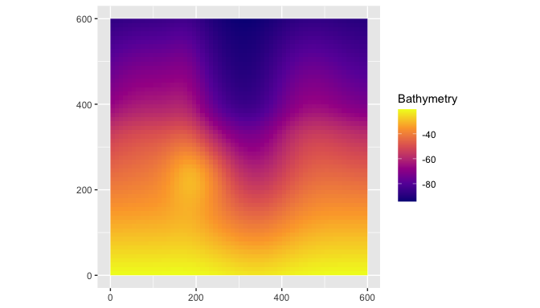
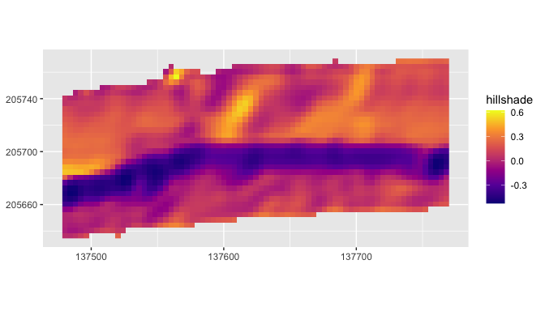
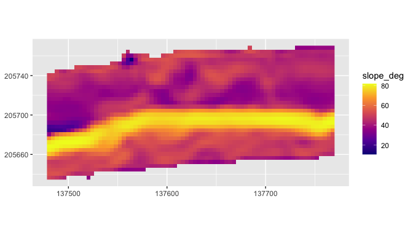
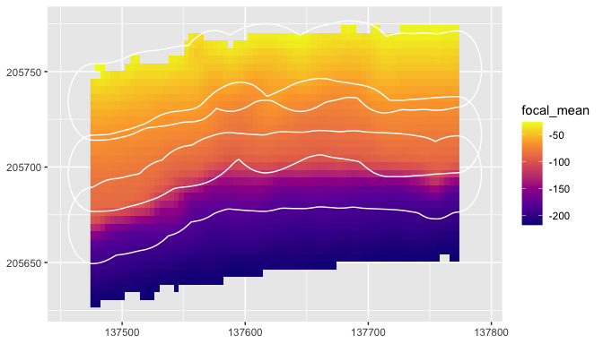
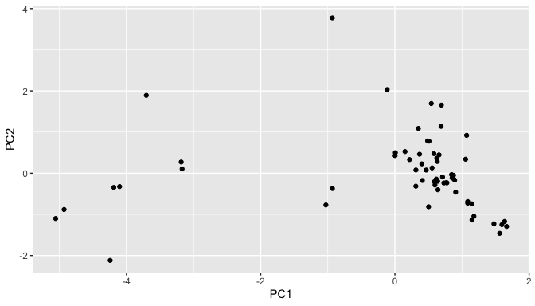
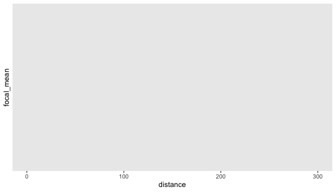
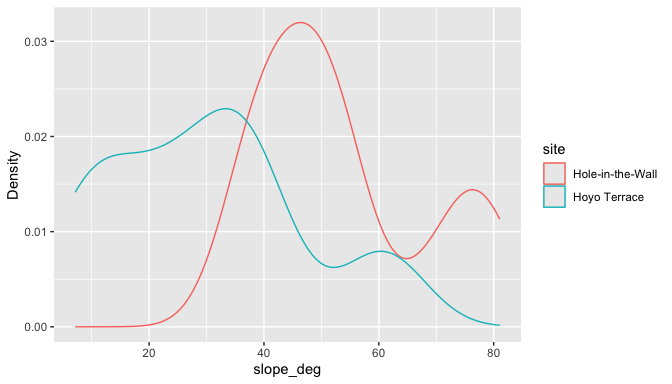

# blueterra

`blueterra` is an R package for submerged-terrain geomorphometry from
bathymetric and elevation rasters. It uses `terra` as the spatial engine
for raster preparation, terrain-derivative calculation, process-oriented
metric grouping, polygon summaries, depth-band summaries, transects,
isobath corridors, and model-ready terrain tables. The package is
written for scientific workflows where seafloor form, grid resolution,
vertical sign convention, and coordinate reference system all affect
interpretation.

## Installation

``` r
install.packages("remotes")
remotes::install_github("el-cordero/blueterra")
```

From a local checkout:

``` r
install.packages("path/to/blueterra", repos = NULL, type = "source")
```

## Core Workflow

The examples below use reduced bathymetry clips and sampling rectangles
from the La Parguera shelf margin. The rasters are small enough for
package examples but retain real depth gradients, local relief, and
shelf-margin structure.

``` r
library(blueterra)
library(terra)

hitw_path <- blueterra_example("hitw")
hoyo_path <- blueterra_example("hoyo")
slope_path <- blueterra_example("slope")
rect_path <- blueterra_example("sampling_rectangles")

hitw <- read_bathy(hitw_path)
hoyo <- read_bathy(hoyo_path)
slope <- read_bathy(slope_path)
rectangles <- terra::vect(rect_path)

hitw_rect <- rectangles[rectangles$site_id == "hitw", ]
hoyo_rect <- rectangles[rectangles$site_id == "hoyo", ]
slope_rect <- rectangles[rectangles$site_id == "slope", ]
```

``` r
hitw_prepared <- prepare_bathy(
  hitw,
  depth_range = c(-220, -25),
  smooth = TRUE,
  smooth_window = 3
)

hitw_metrics <- derive_terrain(
  hitw_prepared,
  metrics = c(
    "slope", "aspect", "northness", "eastness", "tri", "rugosity",
    "bpi", "curvature", "surface_area_ratio"
  )
)

terrain_summary <- summarize_terrain(
  hitw_metrics,
  hitw_rect,
  fun = c("mean", "sd", "min", "max")
)

names(hitw_metrics)
#>  [1] "slope_deg"          "aspect_deg"         "northness"         
#>  [4] "eastness"           "tri"                "rugosity_vrm_3x3"  
#>  [7] "bpi_3x3"            "bpi_11x11"          "curvature"         
#> [10] "surface_area_ratio"
terrain_summary[, c("site_id", "site_name", "slope_deg_mean", "bpi_3x3_mean")]
#> # A tibble: 1 × 4
#>   site_id site_name        slope_deg_mean bpi_3x3_mean
#>   <chr>   <chr>                     <dbl>        <dbl>
#> 1 hitw    Hole-in-the-Wall           50.9      0.00568
```

## Example Data

``` r
examples <- blueterra_examples()
examples$path <- basename(examples$path)
examples
#> # A tibble: 6 × 8
#>   name                path     type  description crs    nrow  ncol feature_count
#>   <chr>               <chr>    <chr> <chr>       <chr> <dbl> <dbl>         <dbl>
#> 1 hitw                lapargu… rast… Reduced Ho… +pro…    75    75            NA
#> 2 hoyo                lapargu… rast… Reduced Ho… +pro…   123   124            NA
#> 3 slope               lapargu… rast… Aggregated… +pro…    90   190            NA
#> 4 sampling_rectangles lapargu… vect… Sampling r… +pro…    NA    NA             3
#> 5 synthetic_bathy     synthet… rast… Synthetic … +pro…    60    60            NA
#> 6 synthetic_zones     synthet… vect… Synthetic … +pro…    NA    NA             2
```

`blueterra_example()` returns installed file paths. The short aliases
`"bathy"` and `"zones"` point to the slope bathymetry and sampling
rectangles. The explicitly named `"synthetic_bathy"` and
`"synthetic_zones"` fixtures are kept for small numerical tests.

``` r
basename(blueterra_example("hitw"))
#> [1] "laparguera_hitw_bathy.tif"
basename(blueterra_example("hoyo"))
#> [1] "laparguera_hoyo_bathy.tif"
basename(blueterra_example("slope"))
#> [1] "laparguera_slope_bathy.tif"
basename(blueterra_example("sampling_rectangles"))
#> [1] "laparguera_sampling_rectangles.gpkg"
```

## Raster Input and Validation

Depth sign conventions are preserved. These examples store bathymetry as
negative elevation in metres.

``` r
class(hitw)
#> [1] "SpatRaster"
#> attr(,"package")
#> [1] "terra"
bathy_info(hitw)
#> # A tibble: 1 × 13
#>   layer    nrow  ncol ncell    xmin   xmax   ymin   ymax  xres  yres   min   max
#>   <chr>   <dbl> <dbl> <dbl>   <dbl>  <dbl>  <dbl>  <dbl> <dbl> <dbl> <dbl> <dbl>
#> 1 bathy_m    75    75  5625 137474. 1.38e5 2.06e5 2.06e5  4.00  4.00 -269. -16.6
#> # ℹ 1 more variable: crs <chr>
check_bathy_crs(hitw)
#> # A tibble: 1 × 4
#>   has_crs is_lonlat is_projected crs                                            
#>   <lgl>   <lgl>     <lgl>        <chr>                                          
#> 1 TRUE    FALSE     TRUE         "PROJCRS[\"NAD83 / Puerto Rico & Virgin Is.\",…
check_bathy_units(hitw, units = "m", positive_depth = FALSE)
#> # A tibble: 1 × 5
#>   layer     min   max units positive_depth
#>   <chr>   <dbl> <dbl> <chr> <lgl>         
#> 1 bathy_m -269. -16.6 m     FALSE

same_raster <- as_bathy(hitw)
path_raster <- as_bathy(hitw_path)
class(same_raster)
#> [1] "SpatRaster"
#> attr(,"package")
#> [1] "terra"
class(path_raster)
#> [1] "SpatRaster"
#> attr(,"package")
#> [1] "terra"
```

## Raster Preparation

Raster preparation is explicit. Reprojection, resampling, cropping,
masking, smoothing, and depth filtering are separate operations unless
combined through `prepare_bathy()`.

``` r
hitw_crop <- crop_bathy(hitw, terra::ext(hitw_rect))
hitw_mask <- mask_bathy(hitw, hitw_rect)
hitw_smooth <- smooth_bathy(hitw, window = 3)
hitw_filtered <- depth_filter(hitw, depth_range = c(-180, -30))

positive_depth <- set_depth_positive(hitw)
negative_depth <- set_depth_negative(positive_depth)

template <- terra::aggregate(hitw, fact = 2)
hitw_resampled <- resample_bathy(hitw, template)
hitw_projected <- project_bathy(template, terra::crs(hitw))

c(
  cropped_cells = terra::ncell(hitw_crop),
  masked_cells = terra::ncell(hitw_mask),
  resampled_cells = terra::ncell(hitw_resampled)
)
#>   cropped_cells    masked_cells resampled_cells 
#>            5625            5625            1444
range(terra::values(hitw_filtered), na.rm = TRUE)
#> [1] -179.88435  -30.45825
range(terra::values(positive_depth), na.rm = TRUE)
#> [1]  16.63148 268.95309
range(terra::values(negative_depth), na.rm = TRUE)
#> [1] -268.95309  -16.63148
```

<details>

<summary>

Terrain Metric Examples
</summary>

Terrain derivatives are scale-sensitive; window sizes should match the
feature scale being interpreted. BPI and TPI signs follow the stored
vertical convention: for negative-elevation bathymetry, positive BPI
indicates cells that are shallower than their local neighborhood.

``` r
slope_deg <- derive_slope(hitw_prepared, units = "degrees")
aspect_deg <- derive_aspect(hitw_prepared, units = "degrees")
northness <- derive_northness(hitw_prepared)
eastness <- derive_eastness(hitw_prepared)
hillshade <- derive_hillshade(hitw_prepared)
roughness <- derive_roughness(hitw_prepared)
tri <- derive_tri(hitw_prepared)
tpi <- derive_tpi(hitw_prepared)
bpi_5 <- derive_bpi(hitw_prepared, window = 5)
bpi_multi <- derive_multiscale_bpi(hitw_prepared, windows = c(3, 7, 11))
rugosity <- derive_rugosity(hitw_prepared, window = 3)
curvature <- derive_curvature(hitw_prepared)
surface_ratio <- derive_surface_area_ratio(hitw_prepared)

metric_classes <- vapply(
  list(
    slope_deg, aspect_deg, northness, eastness, hillshade, roughness,
    tri, tpi, bpi_5, bpi_multi, rugosity, curvature, surface_ratio
  ),
  class,
  character(1)
)
metric_classes
#>  [1] "SpatRaster" "SpatRaster" "SpatRaster" "SpatRaster" "SpatRaster"
#>  [6] "SpatRaster" "SpatRaster" "SpatRaster" "SpatRaster" "SpatRaster"
#> [11] "SpatRaster" "SpatRaster" "SpatRaster"

terra::global(slope_deg, c("min", "mean", "max"), na.rm = TRUE)
#>                min     mean      max
#> slope_deg 10.63308 50.87477 81.67002
terra::global(bpi_5, c("min", "mean", "max"), na.rm = TRUE)
#>               min       mean      max
#> bpi_5x5 -13.18512 0.01187423 13.61357
```

`derive_curvature()` is a local Laplacian-style curvature index. It
should not be interpreted as profile curvature or plan curvature.

</details>

## Process Groups

Process groups organize terrain metrics by interpretation. They are not
measurements of a process by themselves; they help keep related terrain
derivatives together for summaries and models.

``` r
catalog <- metric_catalog()
catalog[, c("metric", "label", "process_group", "source_function")][1:8, ]
#> # A tibble: 8 × 4
#>   metric     label      process_group     source_function 
#>   <chr>      <chr>      <chr>             <chr>           
#> 1 bathy      Bathymetry base_bathymetry   as_bathy        
#> 2 slope_deg  Slope      slope_gradient    derive_slope    
#> 3 slope_rad  Slope      slope_gradient    derive_slope    
#> 4 aspect_deg Aspect     orientation       derive_aspect   
#> 5 aspect_rad Aspect     orientation       derive_aspect   
#> 6 northness  Northness  orientation       derive_northness
#> 7 eastness   Eastness   orientation       derive_eastness 
#> 8 hillshade  Hillshade  surface_structure derive_hillshade

process_groups()
#> [1] "base_bathymetry"   "slope_gradient"    "orientation"      
#> [4] "surface_structure" "seafloor_rugosity" "seafloor_position"
#> [7] "curvature"
assign_process_groups(hitw_metrics)
#> # A tibble: 10 × 7
#>    metric        metric_standard label process_group description source_function
#>    <chr>         <chr>           <chr> <chr>         <chr>       <chr>          
#>  1 slope_deg     slope_deg       Slope slope_gradie… Local slop… derive_slope   
#>  2 aspect_deg    aspect_deg      Aspe… orientation   Local down… derive_aspect  
#>  3 northness     northness       Nort… orientation   Cosine tra… derive_northne…
#>  4 eastness      eastness        East… orientation   Sine trans… derive_eastness
#>  5 tri           tri             Terr… seafloor_rug… Local terr… derive_tri     
#>  6 rugosity_vrm… rugosity_vrm_3… Vect… seafloor_rug… Vector rug… derive_rugosity
#>  7 bpi_3x3       bpi_3x3         Fine… seafloor_pos… Fine-scale… derive_bpi     
#>  8 bpi_11x11     bpi_11x11       Broa… seafloor_pos… Broad-scal… derive_bpi     
#>  9 curvature     curvature       Curv… curvature     Laplacian-… derive_curvatu…
#> 10 surface_area… surface_area_r… Surf… surface_stru… Approximat… derive_surface…
#> # ℹ 1 more variable: matched <lgl>
select_process_representatives(metrics_available = names(hitw_metrics))
#> # A tibble: 6 × 9
#>   metric             label       process_group description units source_function
#>   <chr>              <chr>       <chr>         <chr>       <chr> <chr>          
#> 1 curvature          Curvature   curvature     Laplacian-… inpu… derive_curvatu…
#> 2 aspect_deg         Aspect      orientation   Local down… degr… derive_aspect  
#> 3 bpi_11x11          Broad BPI   seafloor_pos… Broad-scal… inpu… derive_bpi     
#> 4 rugosity_vrm_3x3   Vector Rug… seafloor_rug… Vector rug… unit… derive_rugosity
#> 5 slope_deg          Slope       slope_gradie… Local slop… degr… derive_slope   
#> 6 surface_area_ratio Surface Ar… surface_stru… Approximat… unit… derive_surface…
#> # ℹ 3 more variables: requires_optional_dependency <lgl>,
#> #   scale_sensitive <lgl>, interpretation_notes <chr>
summarize_process_groups(hitw_metrics)
#> # A tibble: 6 × 3
#>   process_group     n_metrics metrics                        
#>   <chr>                 <int> <chr>                          
#> 1 curvature                 1 curvature                      
#> 2 orientation               3 aspect_deg, northness, eastness
#> 3 seafloor_position         2 bpi_3x3, bpi_11x11             
#> 4 seafloor_rugosity         2 tri, rugosity_vrm_3x3          
#> 5 slope_gradient            1 slope_deg                      
#> 6 surface_structure         1 surface_area_ratio

standardize_metric_names(c("Slope (deg)", "Broad BPI"))
#> [1] "slope_deg" "broad_bpi"
rename_metric_layers(c("old_slope", "old_bpi"), c(old_slope = "slope_deg"))
#> [1] "slope_deg" "old_bpi"
```

## Sampling Rectangles and Polygon Summaries

Polygon summaries work with `terra::SpatVector` objects or local vector
paths. Here the slope example is summarized across two site rectangles
and a broader analysis extent.

``` r
slope_metrics <- derive_terrain(
  slope,
  metrics = c("slope", "tri", "bpi", "curvature")
)

sampling_summary <- summarize_terrain(
  slope_metrics,
  rectangles,
  fun = c("mean", "sd", "min", "max")
)

sampling_summary[, c(
  "site_id", "site_name", "feature_type",
  "slope_deg_mean", "tri_mean", "bpi_3x3_mean"
)]
#> # A tibble: 3 × 6
#>   site_id site_name        feature_type     slope_deg_mean tri_mean bpi_3x3_mean
#>   <chr>   <chr>            <chr>                     <dbl>    <dbl>        <dbl>
#> 1 hitw    Hole-in-the-Wall sampling_rectan…           31.6    12.9        0.223 
#> 2 hoyo    Hoyo Terrace     sampling_rectan…           26.9     8.94       0.230 
#> 3 slope   Slope Clip       analysis_extent            27.7     9.66      -0.0384

summarize_terrain_by_zone(slope_metrics, rectangles, fun = "mean")
#> # A tibble: 3 × 13
#>   site_id site_name  feature_type source_name width_m height_m angle_deg zone_id
#>   <chr>   <chr>      <chr>        <chr>         <dbl>    <dbl>     <dbl>   <int>
#> 1 hitw    Hole-in-t… sampling_re… Hole In th…     300      300         0       1
#> 2 hoyo    Hoyo Terr… sampling_re… Hoyo Terra…     300      400       135       2
#> 3 slope   Slope Clip analysis_ex… Slope_clip…     NaN      NaN       NaN       3
#> # ℹ 5 more variables: slope_deg_mean <dbl>, tri_mean <dbl>, bpi_3x3_mean <dbl>,
#> #   bpi_11x11_mean <dbl>, curvature_mean <dbl>
```

## Depth-Band Summaries

Depth bands can be applied to the stored values or to positive-depth
values when `positive_depth = TRUE`.

``` r
depth_bands <- summarize_depth_bands(
  hitw_prepared,
  metrics = hitw_metrics,
  breaks = c(-220, -150, -100, -60, -30, -20)
)
depth_bands[depth_bands$metric == "slope_deg", ]
#> # A tibble: 5 × 8
#>   depth_band  metric    n_cells  mean    sd   min   max median
#>   <chr>       <chr>       <int> <dbl> <dbl> <dbl> <dbl>  <dbl>
#> 1 [-220,-150) slope_deg     819  55.3 10.7   34.8  80.5   51.8
#> 2 [-150,-100) slope_deg     180  77.8  2.29  68.5  81.7   77.8
#> 3 [-100,-60)  slope_deg     791  43.5  9.79  18.8  76.5   40.9
#> 4 [-60,-30)   slope_deg     521  45.7  4.87  10.6  55.5   45.5
#> 5 [-30,-20]   slope_deg       4  NA   NA     NA    NA     NA

positive_bands <- summarize_depth_bands(
  set_depth_positive(hitw_prepared),
  breaks = c(20, 30, 60, 100, 150, 220),
  positive_depth = TRUE
)
positive_bands
#> # A tibble: 5 × 8
#>   depth_band metric     n_cells  mean    sd   min   max median
#>   <chr>      <chr>        <int> <dbl> <dbl> <dbl> <dbl>  <dbl>
#> 1 [20,30)    focal_mean       4  28.9  1.23  27.2  30.0   29.2
#> 2 [30,60)    focal_mean     521  45.5  8.29  30.2  59.9   45.8
#> 3 [60,100)   focal_mean     791  77.8 10.3   60.1  99.9   77.6
#> 4 [100,150)  focal_mean     180 123.  14.3  100.  150.   123. 
#> 5 [150,220]  focal_mean     819 193.  17.9  150.  218.   196.
```

## Transects and Cross-Sections

Transects are generated in projected map units. They are useful for
summarizing cross-shelf or cross-slope profiles inside a sampling
rectangle.

``` r
hitw_transects <- make_transects(hitw_rect, spacing = 75)
class(hitw_transects)
#> [1] "SpatVector"
#> attr(,"package")
#> [1] "terra"

transect_samples <- sample_transects(hitw_transects, hitw_prepared, n = 12)
head(transect_samples)
#> # A tibble: 6 × 5
#>   transect_id distance       x       y focal_mean
#>   <chr>          <dbl>   <dbl>   <dbl>      <dbl>
#> 1 1_1              0   137475. 205617.        NaN
#> 2 1_1             27.3 137502. 205617.        NaN
#> 3 1_1             54.5 137530. 205617.        NaN
#> 4 1_1             81.8 137557. 205617.        NaN
#> 5 1_1            109.  137584. 205617.        NaN
#> 6 1_1            136.  137612. 205617.        NaN

cross_sections <- extract_cross_sections(hitw_transects, hitw_prepared, n = 12)
summarize_cross_sections(cross_sections)
#> # A tibble: 4 × 6
#>   transect_id focal_mean_mean focal_mean_sd focal_mean_min focal_mean_max
#>   <chr>                 <dbl>         <dbl>          <dbl>          <dbl>
#> 1 1_1                    NA           NA              NA             NA  
#> 2 1_2                  -130.          30.3          -159.           -83.4
#> 3 1_3                   -35.1          2.52          -38.5          -31.5
#> 4 1_4                    NA           NA              NA             NA  
#> # ℹ 1 more variable: focal_mean_median <dbl>
```

## Isobaths and Isobath Corridors

Isobath corridors summarize terrain along depth horizons, which is
useful when observations are collected or interpreted relative to
contours.

``` r
hitw_isobaths <- extract_isobaths(hitw_prepared, depths = c(-50, -80, -120))
hitw_corridors <- make_isobath_corridors(
  hitw_prepared,
  depths = c(-50, -80, -120),
  width = 20
)

class(hitw_isobaths)
#> [1] "SpatVector"
#> attr(,"package")
#> [1] "terra"
class(hitw_corridors)
#> [1] "SpatVector"
#> attr(,"package")
#> [1] "terra"
terra::geomtype(hitw_corridors)
#> [1] "polygons"

corridor_cells <- extract_isobath_corridors(hitw_metrics, hitw_corridors)
head(corridor_cells)
#> # A tibble: 6 × 15
#>      ID level contour_value depth_label corridor_id slope_deg aspect_deg
#>   <int> <dbl>         <dbl>       <dbl>       <int>     <dbl>      <dbl>
#> 1     1   -50           -50         -50           1        NA         NA
#> 2     1   -50           -50         -50           1        NA         NA
#> 3     1   -50           -50         -50           1        NA         NA
#> 4     1   -50           -50         -50           1        NA         NA
#> 5     1   -50           -50         -50           1        NA         NA
#> 6     1   -50           -50         -50           1        NA         NA
#> # ℹ 8 more variables: northness <dbl>, eastness <dbl>, tri <dbl>,
#> #   rugosity_vrm_3x3 <dbl>, bpi_3x3 <dbl>, bpi_11x11 <dbl>, curvature <dbl>,
#> #   surface_area_ratio <dbl>

corridor_summary <- summarize_isobath_terrain(hitw_metrics, hitw_corridors)
corridor_summary[, c("contour_value", "slope_deg_mean", "bpi_3x3_mean")]
#> # A tibble: 3 × 3
#>   contour_value slope_deg_mean bpi_3x3_mean
#>           <dbl>          <dbl>        <dbl>
#> 1           -50           45.0       0.150 
#> 2           -80           45.6       0.418 
#> 3          -120           61.6       0.0736
```

## Model-Ready Terrain Tables

``` r
terrain_cells <- sample_terrain_cells(
  hitw_metrics,
  size = 120,
  method = "regular"
)
head(terrain_cells)
#> # A tibble: 6 × 12
#>         x       y slope_deg aspect_deg northness eastness   tri rugosity_vrm_3x3
#>     <dbl>   <dbl>     <dbl>      <dbl>     <dbl>    <dbl> <dbl>            <dbl>
#> 1 137484. 205636.      49.2       170.    -0.985    0.172  3.66         0.00154 
#> 2 137520. 205636.      35.5       166.    -0.972    0.234  2.22         0.00365 
#> 3 137484. 205652.      48.5       164.    -0.963    0.270  3.60         0.00216 
#> 4 137504. 205652.      50.3       168.    -0.977    0.212  3.78         0.000161
#> 5 137520. 205652.      50.4       172.    -0.991    0.137  3.75         0.000537
#> 6 137540. 205652.      52.0       171.    -0.988    0.153  4.01         0.00171 
#> # ℹ 4 more variables: bpi_3x3 <dbl>, bpi_11x11 <dbl>, curvature <dbl>,
#> #   surface_area_ratio <dbl>

points <- terra::centroids(hitw_rect)
extract_terrain_points(hitw_metrics, points)
#> # A tibble: 1 × 17
#>   site_id site_name        feature_type   source_name width_m height_m angle_deg
#>   <chr>   <chr>            <chr>          <chr>         <dbl>    <dbl>     <dbl>
#> 1 hitw    Hole-in-the-Wall sampling_rect… Hole In th…     300      300         0
#> # ℹ 10 more variables: slope_deg <dbl>, aspect_deg <dbl>, northness <dbl>,
#> #   eastness <dbl>, tri <dbl>, rugosity_vrm_3x3 <dbl>, bpi_3x3 <dbl>,
#> #   bpi_11x11 <dbl>, curvature <dbl>, surface_area_ratio <dbl>

model_matrix <- prepare_model_matrix(
  terrain_cells,
  vars = c("slope_deg", "tri", "bpi_3x3", "curvature"),
  scale = TRUE
)

dim(model_matrix$x)
#> [1] 100   4
```

## PCA, Effect Size, and Correlation Helpers

``` r
hoyo_prepared <- prepare_bathy(hoyo, depth_range = c(-220, -25), smooth = TRUE)
hoyo_metrics <- derive_terrain(
  hoyo_prepared,
  metrics = c("slope", "tri", "bpi", "curvature")
)

hitw_cells <- sample_terrain_cells(
  hitw_metrics[[c("slope_deg", "tri", "bpi_3x3", "curvature")]],
  size = 40,
  method = "regular"
)
hitw_cells$site <- "Hole-in-the-Wall"

hoyo_cells <- sample_terrain_cells(
  hoyo_metrics[[c("slope_deg", "tri", "bpi_3x3", "curvature")]],
  size = 40,
  method = "regular"
)
hoyo_cells$site <- "Hoyo Terrace"

comparison <- rbind(hitw_cells, hoyo_cells)

pca <- terrain_pca(
  comparison,
  vars = c("slope_deg", "tri", "bpi_3x3", "curvature")
)
pca$variance
#> # A tibble: 4 × 3
#>   component proportion cumulative
#>   <chr>          <dbl>      <dbl>
#> 1 PC1         0.734         0.734
#> 2 PC2         0.234         0.968
#> 3 PC3         0.0323        1.000
#> 4 PC4         0.000144      1

terrain_effect_size(
  comparison,
  group = "site",
  vars = c("slope_deg", "tri", "bpi_3x3", "curvature")
)
#> # A tibble: 4 × 7
#>   variable  group_1          group_2      mean_1  mean_2 effect_size method  
#>   <chr>     <chr>            <chr>         <dbl>   <dbl>       <dbl> <chr>   
#> 1 slope_deg Hole-in-the-Wall Hoyo Terrace 53.4   30.1          1.53  cohens_d
#> 2 tri       Hole-in-the-Wall Hoyo Terrace  5.73   1.98         0.964 cohens_d
#> 3 bpi_3x3   Hole-in-the-Wall Hoyo Terrace  0.434 -0.0869       0.524 cohens_d
#> 4 curvature Hole-in-the-Wall Hoyo Terrace -1.30   0.237       -0.510 cohens_d

terrain_correlation(
  comparison,
  vars = c("slope_deg", "tri", "bpi_3x3", "curvature")
)
#> # A tibble: 6 × 3
#>   var1      var2      correlation
#>   <chr>     <chr>           <dbl>
#> 1 slope_deg tri             0.863
#> 2 slope_deg bpi_3x3         0.454
#> 3 tri       bpi_3x3         0.560
#> 4 slope_deg curvature      -0.443
#> 5 tri       curvature      -0.541
#> 6 bpi_3x3   curvature      -0.999

balanced <- balance_samples(comparison, group = "site", seed = 42)
table(balanced$site)
#> 
#> Hole-in-the-Wall     Hoyo Terrace 
#>               21               21
```

## Plotting

``` r
plot_bathy(hitw)
```



``` r
plot_hillshade(hitw_prepared)
```



``` r
plot_metric(hitw_metrics, "slope_deg")
```



``` r
plot_metric_stack(hitw_metrics[[c("slope_deg", "tri", "bpi_3x3")]])
```


``` r
plot_cross_sections(cross_sections)
#> Warning: Removed 29 rows containing missing values or values outside the scale range
#> (`geom_line()`).
```


``` r
plot_isobath_corridors(hitw_corridors, hitw_prepared)
```



``` r
plot_process_pca(pca)
```



``` r
plot_terrain_summary(sampling_summary, value = "slope_deg_mean")
```


``` r
plot_depth_profile(
  transect_samples[transect_samples$transect_id == transect_samples$transect_id[1], ],
  depth_col = "focal_mean"
)
```



``` r

plot_process_density(comparison, value = "slope_deg", group = "site")
```



## Function Cookbook

<details>

<summary>

Input and preparation
</summary>

``` r
read_bathy(hitw_path)
#> class       : SpatRaster
#> size        : 75, 75, 1  (nrow, ncol, nlyr)
#> resolution  : 3.996743, 3.996743  (x, y)
#> extent      : 137474.2, 137774, 205590.5, 205890.2  (xmin, xmax, ymin, ymax)
#> coord. ref. : NAD83 / Puerto Rico & Virgin Is. (EPSG:32161)
#> source      : laparguera_hitw_bathy.tif
#> name        :     bathy_m
#> min value   : -268.953094
#> max value   :  -16.631475
as_bathy(hitw)
#> class       : SpatRaster
#> size        : 75, 75, 1  (nrow, ncol, nlyr)
#> resolution  : 3.996743, 3.996743  (x, y)
#> extent      : 137474.2, 137774, 205590.5, 205890.2  (xmin, xmax, ymin, ymax)
#> coord. ref. : NAD83 / Puerto Rico & Virgin Is. (EPSG:32161)
#> source      : laparguera_hitw_bathy.tif
#> name        :     bathy_m
#> min value   : -268.953094
#> max value   :  -16.631475
validate_bathy(hitw)
check_bathy_crs(hitw)
#> # A tibble: 1 × 4
#>   has_crs is_lonlat is_projected crs                                            
#>   <lgl>   <lgl>     <lgl>        <chr>                                          
#> 1 TRUE    FALSE     TRUE         "PROJCRS[\"NAD83 / Puerto Rico & Virgin Is.\",…
check_bathy_units(hitw, units = "m", positive_depth = FALSE)
#> # A tibble: 1 × 5
#>   layer     min   max units positive_depth
#>   <chr>   <dbl> <dbl> <chr> <lgl>         
#> 1 bathy_m -269. -16.6 m     FALSE
bathy_info(hitw)
#> # A tibble: 1 × 13
#>   layer    nrow  ncol ncell    xmin   xmax   ymin   ymax  xres  yres   min   max
#>   <chr>   <dbl> <dbl> <dbl>   <dbl>  <dbl>  <dbl>  <dbl> <dbl> <dbl> <dbl> <dbl>
#> 1 bathy_m    75    75  5625 137474. 1.38e5 2.06e5 2.06e5  4.00  4.00 -269. -16.6
#> # ℹ 1 more variable: crs <chr>
prepare_bathy(hitw, depth_range = c(-180, -30))
#> class       : SpatRaster
#> size        : 28, 75, 1  (nrow, ncol, nlyr)
#> resolution  : 3.996743, 3.996743  (x, y)
#> extent      : 137474.2, 137774, 205658.4, 205770.3  (xmin, xmax, ymin, ymax)
#> coord. ref. : NAD83 / Puerto Rico & Virgin Is. (EPSG:32161)
#> source(s)   : memory
#> varname     : laparguera_hitw_bathy
#> name        :     bathy_m
#> min value   : -179.884354
#> max value   :   -30.45825
crop_bathy(hitw, terra::ext(hitw_rect))
#> class       : SpatRaster
#> size        : 75, 75, 1  (nrow, ncol, nlyr)
#> resolution  : 3.996743, 3.996743  (x, y)
#> extent      : 137474.2, 137774, 205590.5, 205890.2  (xmin, xmax, ymin, ymax)
#> coord. ref. : NAD83 / Puerto Rico & Virgin Is. (EPSG:32161)
#> source      : laparguera_hitw_bathy.tif
#> name        :     bathy_m
#> min value   : -268.953094
#> max value   :  -16.631475
mask_bathy(hitw, hitw_rect)
#> class       : SpatRaster
#> size        : 75, 75, 1  (nrow, ncol, nlyr)
#> resolution  : 3.996743, 3.996743  (x, y)
#> extent      : 137474.2, 137774, 205590.5, 205890.2  (xmin, xmax, ymin, ymax)
#> coord. ref. : NAD83 / Puerto Rico & Virgin Is. (EPSG:32161)
#> source(s)   : memory
#> varname     : laparguera_hitw_bathy
#> name        :     bathy_m
#> min value   : -268.953094
#> max value   :  -16.631475
resample_bathy(hitw, template)
#> class       : SpatRaster
#> size        : 38, 38, 1  (nrow, ncol, nlyr)
#> resolution  : 7.993486, 7.993486  (x, y)
#> extent      : 137474.2, 137778, 205586.5, 205890.2  (xmin, xmax, ymin, ymax)
#> coord. ref. : NAD83 / Puerto Rico & Virgin Is. (EPSG:32161)
#> source(s)   : memory
#> name        :     bathy_m
#> min value   : -264.672546
#> max value   :  -16.735676
project_bathy(template, terra::crs(hitw))
#> class       : SpatRaster
#> size        : 38, 38, 1  (nrow, ncol, nlyr)
#> resolution  : 7.993486, 7.993486  (x, y)
#> extent      : 137474.2, 137778, 205586.5, 205890.2  (xmin, xmax, ymin, ymax)
#> coord. ref. : NAD83 / Puerto Rico & Virgin Is. (EPSG:32161)
#> source(s)   : memory
#> name        :     bathy_m
#> min value   : -264.692688
#> max value   :  -16.673401
smooth_bathy(hitw, window = 3)
#> class       : SpatRaster
#> size        : 75, 75, 1  (nrow, ncol, nlyr)
#> resolution  : 3.996743, 3.996743  (x, y)
#> extent      : 137474.2, 137774, 205590.5, 205890.2  (xmin, xmax, ymin, ymax)
#> coord. ref. : NAD83 / Puerto Rico & Virgin Is. (EPSG:32161)
#> source(s)   : memory
#> varname     : laparguera_hitw_bathy
#> name        :  focal_mean
#> min value   : -267.476662
#> max value   :  -16.719014
depth_filter(hitw, c(-180, -30))
#> class       : SpatRaster
#> size        : 28, 75, 1  (nrow, ncol, nlyr)
#> resolution  : 3.996743, 3.996743  (x, y)
#> extent      : 137474.2, 137774, 205658.4, 205770.3  (xmin, xmax, ymin, ymax)
#> coord. ref. : NAD83 / Puerto Rico & Virgin Is. (EPSG:32161)
#> source(s)   : memory
#> varname     : laparguera_hitw_bathy
#> name        :     bathy_m
#> min value   : -179.884354
#> max value   :   -30.45825
invert_depth(hitw)
#> class       : SpatRaster
#> size        : 75, 75, 1  (nrow, ncol, nlyr)
#> resolution  : 3.996743, 3.996743  (x, y)
#> extent      : 137474.2, 137774, 205590.5, 205890.2  (xmin, xmax, ymin, ymax)
#> coord. ref. : NAD83 / Puerto Rico & Virgin Is. (EPSG:32161)
#> source(s)   : memory
#> varname     : laparguera_hitw_bathy
#> name        :    bathy_m
#> min value   :  16.631475
#> max value   : 268.953094
set_depth_positive(hitw)
#> class       : SpatRaster
#> size        : 75, 75, 1  (nrow, ncol, nlyr)
#> resolution  : 3.996743, 3.996743  (x, y)
#> extent      : 137474.2, 137774, 205590.5, 205890.2  (xmin, xmax, ymin, ymax)
#> coord. ref. : NAD83 / Puerto Rico & Virgin Is. (EPSG:32161)
#> source(s)   : memory
#> varname     : laparguera_hitw_bathy
#> name        :    bathy_m
#> min value   :  16.631475
#> max value   : 268.953094
set_depth_negative(positive_depth)
#> class       : SpatRaster
#> size        : 75, 75, 1  (nrow, ncol, nlyr)
#> resolution  : 3.996743, 3.996743  (x, y)
#> extent      : 137474.2, 137774, 205590.5, 205890.2  (xmin, xmax, ymin, ymax)
#> coord. ref. : NAD83 / Puerto Rico & Virgin Is. (EPSG:32161)
#> source(s)   : memory
#> varname     : laparguera_hitw_bathy
#> name        :     bathy_m
#> min value   : -268.953094
#> max value   :  -16.631475
```

</details>

<details>

<summary>

Metrics, summaries, and models
</summary>

``` r
derive_metric_stack(hitw_prepared, metrics = c("slope", "bpi"))
#> class       : SpatRaster
#> size        : 37, 75, 3  (nrow, ncol, nlyr)
#> resolution  : 3.996743, 3.996743  (x, y)
#> extent      : 137474.2, 137774, 205626.5, 205774.3  (xmin, xmax, ymin, ymax)
#> coord. ref. : NAD83 / Puerto Rico & Virgin Is. (EPSG:32161)
#> source(s)   : memory
#> varnames    : laparguera_hitw_bathy
#>               laparguera_hitw_bathy
#>               laparguera_hitw_bathy
#> names       : slope_deg,   bpi_3x3,  bpi_11x11
#> min values  : 10.633082, -5.548068, -24.949998
#> max values  : 81.670015,  5.581367,  29.158179
summarize_process_groups(hitw_metrics)
#> # A tibble: 6 × 3
#>   process_group     n_metrics metrics                        
#>   <chr>                 <int> <chr>                          
#> 1 curvature                 1 curvature                      
#> 2 orientation               3 aspect_deg, northness, eastness
#> 3 seafloor_position         2 bpi_3x3, bpi_11x11             
#> 4 seafloor_rugosity         2 tri, rugosity_vrm_3x3          
#> 5 slope_gradient            1 slope_deg                      
#> 6 surface_structure         1 surface_area_ratio
summarize_terrain(hitw_metrics, hitw_rect)
#> # A tibble: 1 × 58
#>   site_id site_name  feature_type source_name width_m height_m angle_deg zone_id
#>   <chr>   <chr>      <chr>        <chr>         <dbl>    <dbl>     <dbl>   <int>
#> 1 hitw    Hole-in-t… sampling_re… Hole In th…     300      300         0       1
#> # ℹ 50 more variables: slope_deg_mean <dbl>, slope_deg_sd <dbl>,
#> #   slope_deg_min <dbl>, slope_deg_max <dbl>, slope_deg_median <dbl>,
#> #   aspect_deg_mean <dbl>, aspect_deg_sd <dbl>, aspect_deg_min <dbl>,
#> #   aspect_deg_max <dbl>, aspect_deg_median <dbl>, northness_mean <dbl>,
#> #   northness_sd <dbl>, northness_min <dbl>, northness_max <dbl>,
#> #   northness_median <dbl>, eastness_mean <dbl>, eastness_sd <dbl>,
#> #   eastness_min <dbl>, eastness_max <dbl>, eastness_median <dbl>, …
summarize_depth_bands(hitw_prepared, breaks = c(-220, -100, -20))
#> # A tibble: 2 × 8
#>   depth_band  metric     n_cells   mean    sd    min    max median
#>   <chr>       <chr>        <int>  <dbl> <dbl>  <dbl>  <dbl>  <dbl>
#> 1 [-220,-100) focal_mean     999 -180.   31.9 -218.  -100.  -190. 
#> 2 [-100,-20]  focal_mean    1316  -64.9  18.6  -99.9  -27.2  -66.3
extract_terrain_points(hitw_metrics, terra::centroids(hitw_rect))
#> # A tibble: 1 × 17
#>   site_id site_name        feature_type   source_name width_m height_m angle_deg
#>   <chr>   <chr>            <chr>          <chr>         <dbl>    <dbl>     <dbl>
#> 1 hitw    Hole-in-the-Wall sampling_rect… Hole In th…     300      300         0
#> # ℹ 10 more variables: slope_deg <dbl>, aspect_deg <dbl>, northness <dbl>,
#> #   eastness <dbl>, tri <dbl>, rugosity_vrm_3x3 <dbl>, bpi_3x3 <dbl>,
#> #   bpi_11x11 <dbl>, curvature <dbl>, surface_area_ratio <dbl>
sample_terrain_cells(hitw_metrics, size = 10)
#> # A tibble: 10 × 12
#>          x      y slope_deg aspect_deg northness eastness   tri rugosity_vrm_3x3
#>      <dbl>  <dbl>     <dbl>      <dbl>     <dbl>    <dbl> <dbl>            <dbl>
#>  1 137516. 2.06e5      38.4       175.    -0.996   0.0944  2.44        0.000209 
#>  2 137512. 2.06e5      35.2       173.    -0.992   0.128   2.19        0.000359 
#>  3 137696. 2.06e5      43.3       197.    -0.957  -0.291   2.96        0.00373  
#>  4 137692. 2.06e5      46.9       193.    -0.974  -0.228   3.34        0.00503  
#>  5 137656. 2.06e5      45.0       160.    -0.942   0.336   3.15        0.000798 
#>  6 137564. 2.06e5      74.4       169.    -0.983   0.185  11.0         0.00615  
#>  7 137548. 2.06e5      47.6       175.    -0.997   0.0820  3.36        0.00196  
#>  8 137564. 2.06e5      45.5       148.    -0.851   0.525   3.15        0.00846  
#>  9 137500. 2.06e5      34.2       170.    -0.984   0.176   2.12        0.0000156
#> 10 137512. 2.06e5      51.1       173.    -0.993   0.117   3.85        0.00118  
#> # ℹ 4 more variables: bpi_3x3 <dbl>, bpi_11x11 <dbl>, curvature <dbl>,
#> #   surface_area_ratio <dbl>
terrain_pca(terrain_cells[, c("slope_deg", "tri", "bpi_3x3", "curvature")])
#> $scores
#> # A tibble: 100 × 5
#>    row_id     PC1    PC2     PC3      PC4
#>    <chr>    <dbl>  <dbl>   <dbl>    <dbl>
#>  1 1       0.352   0.736  0.169  -0.00942
#>  2 2      -0.124   1.56  -0.328   0.0748 
#>  3 3      -0.221   0.251  0.134   0.0111 
#>  4 4      -0.442  -0.122  0.195  -0.0215 
#>  5 5      -0.0705  0.231  0.208   0.0314 
#>  6 6      -0.348  -0.204  0.249   0.0124 
#>  7 7       0.383   0.796  0.174   0.0231 
#>  8 8      -0.621   0.370 -0.0515  0.00393
#>  9 9       0.0587  0.146  0.300   0.0163 
#> 10 10      0.206   0.970  0.0431 -0.00602
#> # ℹ 90 more rows
#> 
#> $loadings
#> # A tibble: 4 × 5
#>   variable     PC1    PC2      PC3     PC4
#>   <chr>      <dbl>  <dbl>    <dbl>   <dbl>
#> 1 slope_deg  0.484 -0.519  0.705    0.0165
#> 2 tri        0.491 -0.506 -0.709   -0.0150
#> 3 bpi_3x3   -0.513 -0.487 -0.0229   0.707 
#> 4 curvature  0.512  0.488 -0.00864  0.707 
#> 
#> $variance
#> # A tibble: 4 × 3
#>   component proportion cumulative
#>   <chr>          <dbl>      <dbl>
#> 1 PC1         0.647         0.647
#> 2 PC2         0.337         0.984
#> 3 PC3         0.0158        1.000
#> 4 PC4         0.000444      1    
#> 
#> $model
#> Standard deviations (1, .., p=4):
#> [1] 1.60861554 1.16084205 0.25105293 0.04212113
#> 
#> Rotation (n x k) = (4 x 4):
#>                  PC1        PC2          PC3         PC4
#> slope_deg  0.4839159 -0.5188400  0.704526577  0.01651498
#> tri        0.4909682 -0.5056483 -0.709256942 -0.01498749
#> bpi_3x3   -0.5126137 -0.4866339 -0.022852027  0.70703071
#> curvature  0.5118622  0.4881723 -0.008641577  0.70683110
terrain_correlation(terrain_cells[, c("slope_deg", "tri", "bpi_3x3", "curvature")])
#> # A tibble: 6 × 3
#>   var1      var2      correlation
#>   <chr>     <chr>           <dbl>
#> 1 slope_deg tri             0.937
#> 2 slope_deg bpi_3x3        -0.303
#> 3 tri       bpi_3x3        -0.319
#> 4 slope_deg curvature       0.299
#> 5 tri       curvature       0.318
#> 6 bpi_3x3   curvature      -0.998
prepare_model_matrix(terrain_cells, vars = c("slope_deg", "tri"))
#> $x
#>        slope_deg       tri
#>   [1,]  49.22131  3.655033
#>   [2,]  35.53555  2.216408
#>   [3,]  48.53633  3.602090
#>   [4,]  50.29143  3.778023
#>   [5,]  50.37710  3.751410
#>   [6,]  52.00356  4.011178
#>   [7,]  49.05671  3.564754
#>   [8,]  43.30516  3.003612
#>   [9,]  52.69241  3.946576
#>  [10,]  45.40529  3.172553
#>  [11,]  36.39630  2.269088
#>  [12,]  35.09590  2.222560
#>  [13,]  80.08801 18.303712
#>  [14,]  81.67002 21.357051
#>  [15,]  79.89227 17.312415
#>  [16,]  70.81283  8.895432
#>  [17,]  49.13471  3.692606
#>  [18,]  53.93537  4.176288
#>  [19,]  54.55880  4.236592
#>  [20,]  48.86273  3.532824
#>  [21,]  52.75806  4.047659
#>  [22,]  52.89317  4.042651
#>  [23,]  50.02787  3.710052
#>  [24,]  51.14884  3.790538
#>  [25,]  47.66665  3.414372
#>  [26,]  46.87119  3.341227
#>  [27,]  43.92735  2.992767
#>  [28,]  49.79188  3.639455
#>  [29,]  31.04468  1.808938
#>  [30,]  26.85930  1.583151
#>  [31,]  38.24002  2.446373
#>  [32,]  67.07782  7.452875
#>  [33,]  78.56703 15.513223
#>  [34,]  77.89530 14.563315
#>  [35,]  75.28839 11.592824
#>  [36,]  77.30421 13.738417
#>  [37,]  77.64843 13.822137
#>  [38,]  77.26896 13.347224
#>  [39,]  77.39414 13.546784
#>  [40,]  77.82590 14.205062
#>  [41,]  79.32782 15.930913
#>  [42,]  80.08570 17.691255
#>  [43,]  79.88841 17.742564
#>  [44,]  81.50512 21.237063
#>  [45,]  34.88487  2.162254
#>  [46,]  34.01629  2.113310
#>  [47,]  37.90655  2.426745
#>  [48,]  47.21131  3.363953
#>  [49,]  49.67808  3.682491
#>  [50,]  47.58521  3.388292
#>  [51,]  46.33709  3.281216
#>  [52,]  45.62321  3.149753
#>  [53,]  47.11388  3.278829
#>  [54,]  46.17220  3.268771
#>  [55,]  48.03619  3.424045
#>  [56,]  51.87033  3.834848
#>  [57,]  48.88185  3.620696
#>  [58,]  45.78940  3.140556
#>  [59,]  40.21921  2.567461
#>  [60,]  39.44560  2.530415
#>  [61,]  43.64634  2.916141
#>  [62,]  42.95579  2.888391
#>  [63,]  37.60221  2.407735
#>  [64,]  38.94548  2.459064
#>  [65,]  39.92914  2.582627
#>  [66,]  40.28461  2.577538
#>  [67,]  40.24879  2.628668
#>  [68,]  38.15235  2.481956
#>  [69,]  45.38453  3.203610
#>  [70,]  47.25992  3.353605
#>  [71,]  34.64780  2.143088
#>  [72,]  36.74131  2.337519
#>  [73,]  44.38915  3.093961
#>  [74,]  38.43118  2.453699
#>  [75,]  38.12070  2.386975
#>  [76,]  39.09137  2.469918
#>  [77,]  48.52340  3.511676
#>  [78,]  51.86965  4.092080
#>  [79,]  39.29628  2.624837
#>  [80,]  46.28634  3.263666
#>  [81,]  52.51891  4.121127
#>  [82,]  43.24860  2.960689
#>  [83,]  44.58014  3.115806
#>  [84,]  48.00625  3.529812
#>  [85,]  51.89493  3.932351
#>  [86,]  48.20158  3.434108
#>  [87,]  43.67843  3.021786
#>  [88,]  44.87854  3.032824
#>  [89,]  47.31773  3.287205
#>  [90,]  46.00428  3.200094
#>  [91,]  45.16081  3.003273
#>  [92,]  53.39810  4.064891
#>  [93,]  52.85676  4.130381
#>  [94,]  47.72486  3.451756
#>  [95,]  42.89171  2.948806
#>  [96,]  52.56121  4.040430
#>  [97,]  44.38953  3.137012
#>  [98,]  43.13595  2.879061
#>  [99,]  43.37973  2.836687
#> [100,]  43.42013  2.941682
#> 
#> $y
#> NULL
#> 
#> $data
#> # A tibble: 100 × 12
#>          x      y slope_deg aspect_deg northness eastness   tri rugosity_vrm_3x3
#>      <dbl>  <dbl>     <dbl>      <dbl>     <dbl>    <dbl> <dbl>            <dbl>
#>  1 137484. 2.06e5      49.2       170.    -0.985   0.172   3.66         0.00154 
#>  2 137520. 2.06e5      35.5       166.    -0.972   0.234   2.22         0.00365 
#>  3 137484. 2.06e5      48.5       164.    -0.963   0.270   3.60         0.00216 
#>  4 137504. 2.06e5      50.3       168.    -0.977   0.212   3.78         0.000161
#>  5 137520. 2.06e5      50.4       172.    -0.991   0.137   3.75         0.000537
#>  6 137540. 2.06e5      52.0       171.    -0.988   0.153   4.01         0.00171 
#>  7 137560. 2.06e5      49.1       178.    -1.000   0.0276  3.56         0.00593 
#>  8 137576. 2.06e5      43.3       162.    -0.952   0.306   3.00         0.00114 
#>  9 137596. 2.06e5      52.7       181.    -1.000  -0.0203  3.95         0.00366 
#> 10 137616. 2.06e5      45.4       173.    -0.992   0.127   3.17         0.00199 
#> # ℹ 90 more rows
#> # ℹ 4 more variables: bpi_3x3 <dbl>, bpi_11x11 <dbl>, curvature <dbl>,
#> #   surface_area_ratio <dbl>
```

</details>

## Reproducibility

Examples and tests write only to temporary paths when an output file is
needed. Distance-based operations such as transects and isobath
corridors require a projected CRS with linear map units. Raster
derivatives should be interpreted in relation to grid resolution,
focal-window size, smoothing, and the vertical sign convention stored in
the input raster.

## Citation

``` r
citation("blueterra")
#> Warning in citation("blueterra"): could not determine year for 'blueterra' from
#> package DESCRIPTION file
#> To cite package 'blueterra' in publications use:
#> 
#>   Cordero E (????). _blueterra: Process-Oriented Geomorphometry for
#>   Submerged Terrain_. R package version 0.1.0,
#>   <https://github.com/el-cordero/blueterra>.
#> 
#> A BibTeX entry for LaTeX users is
#> 
#>   @Manual{,
#>     title = {blueterra: Process-Oriented Geomorphometry for Submerged Terrain},
#>     author = {Elvin Cordero},
#>     note = {R package version 0.1.0},
#>     url = {https://github.com/el-cordero/blueterra},
#>   }
```

## License

MIT. See `LICENSE` and `LICENSE.md`.
