# blueterra

[](https://github.com/el-cordero/blueterra/actions/workflows/R-CMD-check.yaml)
[](https://github.com/el-cordero/blueterra/actions/workflows/pkgdown.yaml)
[](LICENSE.md)

`blueterra` is an R package for geomorphometric analysis of submerged
terrain. It starts from user-supplied bathymetric or elevation rasters
and builds `terra`-based workflows for deriving terrain metrics,
organizing those metrics into process-oriented groups, and summarizing
seafloor structure across polygons, transects, depth bands, and isobath
corridors. The package is intended for analyses where terrain form, grid
resolution, vertical sign convention, and coordinate reference system
affect interpretation.

Package website: <https://el-cordero.github.io/blueterra/>

## Installation

``` r
install.packages("remotes")
remotes::install_github("el-cordero/blueterra")
```

From a local checkout:

``` r
install.packages("path/to/blueterra", repos = NULL, type = "source")
```

## Example Data

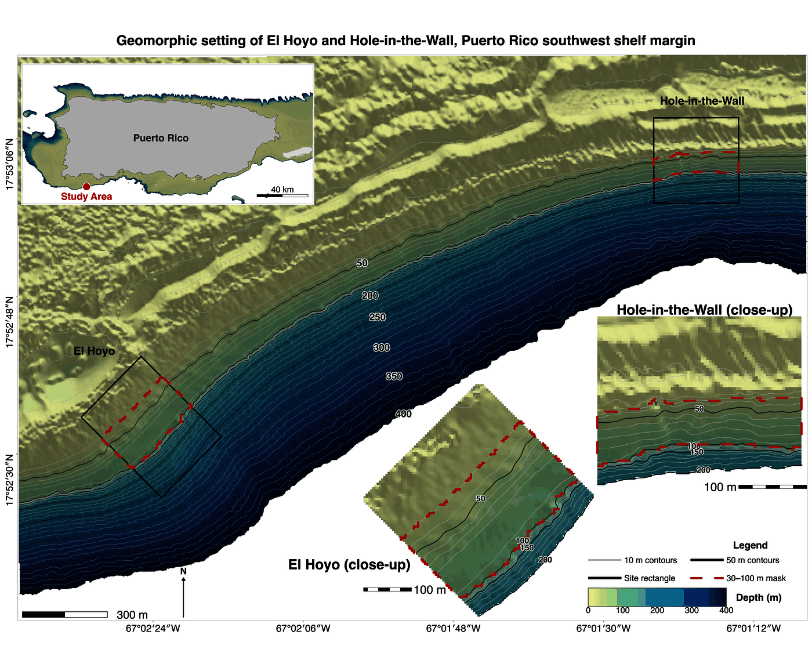

*Study-area context for the example data. The package examples use
reduced bathymetry and sampling rectangles from Hole-in-the-Wall, El
Hoyo, and a broader slope clip along the southwest Puerto Rico shelf
margin near La Parguera, Puerto Rico.*

The installed examples are reduced from analysis rasters and sampling
rectangles used to test terrain workflows on real shelf-margin
morphology. Their purpose is to provide compact rasters with actual
depth gradients, slope breaks, local relief, and sampling geometry so
examples behave like field data rather than idealized toy surfaces.

``` r
library(blueterra)
library(terra)

hitw_path <- blueterra_example("hitw")
hoyo_path <- blueterra_example("hoyo")
slope_path <- blueterra_example("slope")
rect_path <- blueterra_example("sampling_rectangles")

hitw <- read_bathy(hitw_path)
hoyo <- read_bathy(hoyo_path)
slope <- read_bathy(slope_path)
rectangles <- terra::vect(rect_path)

hitw_rect <- rectangles[rectangles$site_id == "hitw", ]
hoyo_rect <- rectangles[rectangles$site_id == "hoyo", ]
slope_rect <- rectangles[rectangles$site_id == "slope", ]
```

``` r
examples <- blueterra_examples()
examples$path <- basename(examples$path)
examples
#> # A tibble: 6 × 8
#>   name                path     type  description crs    nrow  ncol feature_count
#>   <chr>               <chr>    <chr> <chr>       <chr> <dbl> <dbl>         <dbl>
#> 1 hitw                lapargu… rast… Reduced Ho… +pro…    75    75            NA
#> 2 hoyo                lapargu… rast… Reduced El… +pro…   123   124            NA
#> 3 slope               lapargu… rast… Aggregated… +pro…    90   190            NA
#> 4 sampling_rectangles lapargu… vect… Sampling r… +pro…    NA    NA             3
#> 5 synthetic_bathy     synthet… rast… Synthetic … +pro…    60    60            NA
#> 6 synthetic_zones     synthet… vect… Synthetic … +pro…    NA    NA             2
```

`blueterra_example()` returns installed file paths. The short aliases
`"bathy"` and `"zones"` point to the slope bathymetry and sampling
rectangles. The explicitly named `"synthetic_bathy"` and
`"synthetic_zones"` fixtures are kept for numerical tests.

``` r
basename(blueterra_example("hitw"))
#> [1] "laparguera_hitw_bathy.tif"
basename(blueterra_example("hoyo"))
#> [1] "laparguera_hoyo_bathy.tif"
basename(blueterra_example("slope"))
#> [1] "laparguera_slope_bathy.tif"
basename(blueterra_example("sampling_rectangles"))
#> [1] "laparguera_sampling_rectangles.gpkg"
```

## Quick-Start Workflow

This first pass prepares Hole-in-the-Wall bathymetry, derives a compact
metric stack, and summarizes the metrics inside its sampling rectangle.
The output is a table that can move directly into reporting or modeling.

``` r
hitw_prepared <- prepare_bathy(
  hitw,
  depth_range = c(-220, -25),
  smooth = TRUE,
  smooth_window = 3
)

hitw_metrics <- derive_terrain(
  hitw_prepared,
  metrics = c(
    "slope", "aspect", "northness", "eastness", "tri", "rugosity",
    "bpi", "curvature", "surface_area_ratio"
  )
)

terrain_summary <- summarize_terrain(
  hitw_metrics,
  hitw_rect,
  fun = c("mean", "sd", "min", "max")
)

names(hitw_metrics)
#>  [1] "slope_deg"          "aspect_deg"         "northness"         
#>  [4] "eastness"           "tri"                "rugosity_vrm_3x3"  
#>  [7] "bpi_3x3"            "bpi_11x11"          "curvature"         
#> [10] "surface_area_ratio"
terrain_summary[, c("site_id", "site_name", "slope_deg_mean", "bpi_3x3_mean")]
#> # A tibble: 1 × 4
#>   site_id site_name        slope_deg_mean bpi_3x3_mean
#>   <chr>   <chr>                     <dbl>        <dbl>
#> 1 hitw    Hole-in-the-Wall           50.9      0.00568
```

The metric names show which raster layers were created. The summary
table gives site-level terrain values; here, slope and BPI summarize
local gradient and relative position inside the Hole-in-the-Wall
rectangle.

## Reading Bathymetry and Checking Raster Assumptions

`read_bathy()` reads a local raster file and returns a
`terra::SpatRaster`. `as_bathy()` accepts either a path or an existing
`SpatRaster`. `bathy_info()` prints the pieces of raster metadata that
usually matter first: dimensions, extent, cell size, value range, and
CRS.

``` r
class(hitw)
#> [1] "SpatRaster"
#> attr(,"package")
#> [1] "terra"
bathy_info(hitw)
#> # A tibble: 1 × 13
#>   layer    nrow  ncol ncell    xmin   xmax   ymin   ymax  xres  yres   min   max
#>   <chr>   <dbl> <dbl> <dbl>   <dbl>  <dbl>  <dbl>  <dbl> <dbl> <dbl> <dbl> <dbl>
#> 1 bathy_m    75    75  5625 137474. 1.38e5 2.06e5 2.06e5  4.00  4.00 -269. -16.6
#> # ℹ 1 more variable: crs <chr>
check_bathy_crs(hitw)
#> # A tibble: 1 × 4
#>   has_crs is_lonlat is_projected crs                                            
#>   <lgl>   <lgl>     <lgl>        <chr>                                          
#> 1 TRUE    FALSE     TRUE         "PROJCRS[\"NAD83 / Puerto Rico & Virgin Is.\",…
check_bathy_units(hitw, units = "m", positive_depth = FALSE)
#> # A tibble: 1 × 5
#>   layer     min   max units positive_depth
#>   <chr>   <dbl> <dbl> <chr> <lgl>         
#> 1 bathy_m -269. -16.6 m     FALSE

same_raster <- as_bathy(hitw)
path_raster <- as_bathy(hitw_path)
class(same_raster)
#> [1] "SpatRaster"
#> attr(,"package")
#> [1] "terra"
class(path_raster)
#> [1] "SpatRaster"
#> attr(,"package")
#> [1] "terra"
```

## Depth Sign Conventions

Bathymetric rasters are commonly stored either as negative elevation or
as positive depth. `blueterra` preserves the input convention unless the
user explicitly converts it. This avoids silent sign changes in position
metrics such as BPI and TPI, where the interpretation of positive and
negative values depends on the stored vertical convention.

``` r
range(terra::values(hitw), na.rm = TRUE)
#> [1] -268.95309  -16.63148

positive_depth <- set_depth_positive(hitw)
negative_depth <- set_depth_negative(positive_depth)

range(terra::values(positive_depth), na.rm = TRUE)
#> [1]  16.63148 268.95309
range(terra::values(negative_depth), na.rm = TRUE)
#> [1] -268.95309  -16.63148
```

`invert_depth()` is available when a full sign reversal is the explicit
operation being performed.

``` r
range(terra::values(invert_depth(hitw)), na.rm = TRUE)
#> [1]  16.63148 268.95309
```

## CRS and Map-Unit Requirements

Distance-based operations require projected coordinates with linear map
units. Buffering isobath corridors, spacing transects, calculating
widths, and interpreting local neighborhoods are not reliable in
longitude/latitude units. `blueterra` checks CRS assumptions where they
affect the calculation and requires explicit reprojection rather than
changing coordinate systems silently.

``` r
terra::crs(hitw, proj = TRUE)
#> [1] "+proj=lcc +lat_0=17.8333333333333 +lon_0=-66.4333333333333 +lat_1=18.4333333333333 +lat_2=18.0333333333333 +x_0=200000 +y_0=200000 +datum=NAD83 +units=m +no_defs"
terra::res(hitw)
#> [1] 3.996743 3.996743

template <- terra::aggregate(hitw, fact = 2)
hitw_projected <- project_bathy(template, terra::crs(hitw))
class(hitw_projected)
#> [1] "SpatRaster"
#> attr(,"package")
#> [1] "terra"
```

## Raster Preparation

Raster preparation is explicit. Reprojection, resampling, cropping,
masking, smoothing, and depth filtering are separate operations unless
combined through `prepare_bathy()`. This makes it clear which
transformations affect the surface before terrain derivatives are
calculated.

``` r
hitw_crop <- crop_bathy(hitw, terra::ext(hitw_rect))
hitw_mask <- mask_bathy(hitw, hitw_rect)
hitw_smooth <- smooth_bathy(hitw, window = 3)
hitw_filtered <- depth_filter(hitw, depth_range = c(-180, -30))
hitw_resampled <- resample_bathy(hitw, template)

c(
  cropped_cells = terra::ncell(hitw_crop),
  masked_cells = terra::ncell(hitw_mask),
  resampled_cells = terra::ncell(hitw_resampled)
)
#>   cropped_cells    masked_cells resampled_cells 
#>            5625            5625            1444
range(terra::values(hitw_filtered), na.rm = TRUE)
#> [1] -179.88435  -30.45825
```

The filtered range confirms that cells outside the requested depth
interval were removed from the analysis surface.

## Terrain Metrics

Terrain metrics describe different aspects of the same bathymetric
surface. Slope and aspect describe local orientation; northness and
eastness make aspect usable in linear models; TRI, roughness, and
rugosity describe local relief variability; BPI and TPI describe
relative position; curvature summarizes local bending of the surface.
These metrics are scale-sensitive and should be selected with the
feature size and raster resolution in mind.

``` r
slope_deg <- derive_slope(hitw_prepared, units = "degrees")
aspect_deg <- derive_aspect(hitw_prepared, units = "degrees")
northness <- derive_northness(hitw_prepared)
eastness <- derive_eastness(hitw_prepared)
hillshade <- derive_hillshade(hitw_prepared)
roughness <- derive_roughness(hitw_prepared)
tri <- derive_tri(hitw_prepared)
tpi <- derive_tpi(hitw_prepared)
bpi_5 <- derive_bpi(hitw_prepared, window = 5)
bpi_multi <- derive_multiscale_bpi(hitw_prepared, windows = c(3, 7, 11))
rugosity <- derive_rugosity(hitw_prepared, window = 3)
curvature <- derive_curvature(hitw_prepared)
surface_ratio <- derive_surface_area_ratio(hitw_prepared)

metric_classes <- vapply(
  list(
    slope_deg, aspect_deg, northness, eastness, hillshade, roughness,
    tri, tpi, bpi_5, bpi_multi, rugosity, curvature, surface_ratio
  ),
  function(x) class(x)[1],
  character(1)
)
metric_classes
#>  [1] "SpatRaster" "SpatRaster" "SpatRaster" "SpatRaster" "SpatRaster"
#>  [6] "SpatRaster" "SpatRaster" "SpatRaster" "SpatRaster" "SpatRaster"
#> [11] "SpatRaster" "SpatRaster" "SpatRaster"

terra::global(slope_deg, c("min", "mean", "max"), na.rm = TRUE)
#>                min     mean      max
#> slope_deg 10.63308 50.87477 81.67002
terra::global(bpi_5, c("min", "mean", "max"), na.rm = TRUE)
#>               min       mean      max
#> bpi_5x5 -13.18512 0.01187423 13.61357
```

BPI signs follow the stored vertical convention. With negative-elevation
bathymetry, positive BPI indicates cells that are shallower than their
local neighborhood. `derive_curvature()` is a local Laplacian-style
curvature index; it should not be interpreted as profile curvature or
plan curvature.

## Hillshade-Supported Terrain Visualization

Maps should show both the measured surface and the relief structure.
These examples use hillshade as a visual relief layer, then add
bathymetry, metric values, contours, sampling rectangles, transects, or
isobath corridors. Hillshade is for interpretation of form in the
figure; it should not be treated as a model predictor unless the user
explicitly chooses to analyze it.

``` r
plot_sampling_rectangles(
  slope,
  rectangles,
  contour_interval = 50,
  title = "Slope Clip Bathymetry",
  subtitle = "Hillshade, contours, and sampling rectangles",
  caption = "Southwest Puerto Rico shelf margin near La Parguera, Puerto Rico"
)
```

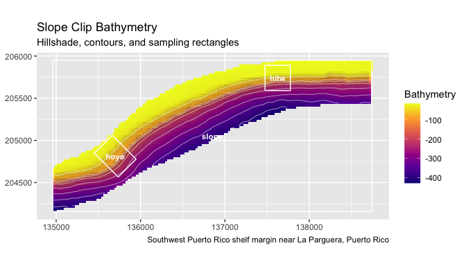

``` r
plot_bathy(
  hitw,
  contours = TRUE,
  contour_interval = 25,
  title = "Hole-in-the-Wall Bathymetry",
  subtitle = "Reduced example raster with real local relief"
)
```

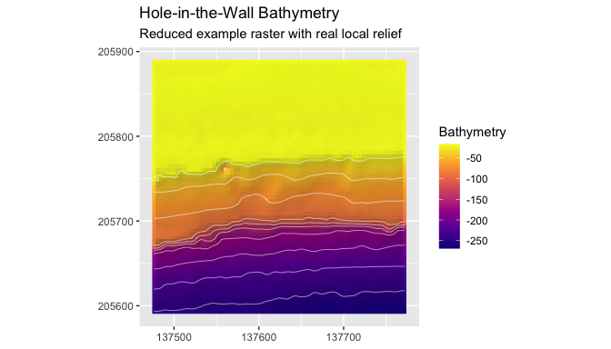

``` r
plot_bathy(
  hoyo,
  contours = TRUE,
  contour_interval = 25,
  vectors = hoyo_rect,
  title = "El Hoyo Bathymetry",
  subtitle = "Sampling rectangle over hillshaded bathymetry"
)
```

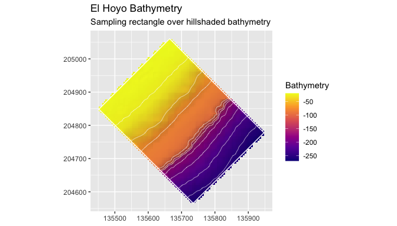

``` r
plot_metric(
  hitw_metrics,
  "slope_deg",
  bathy = hitw_prepared,
  contours = TRUE,
  contour_interval = 25,
  title = "Slope Over Hillshade",
  legend_title = "Slope (degrees)"
)
```

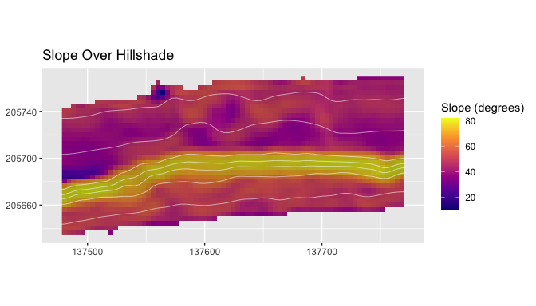

## Process Groups

Process groups keep related terrain derivatives together so the analysis
does not reduce seafloor structure to a single high-ranking variable.
The group labels are interpretive categories. They do not claim to
measure sediment transport, current velocity, or habitat condition
directly; they organize terrain form in a way that can be summarized,
compared, and modeled.

``` r
catalog <- metric_catalog()
catalog[, c("metric", "label", "process_group", "source_function")][1:8, ]
#> # A tibble: 8 × 4
#>   metric     label      process_group     source_function 
#>   <chr>      <chr>      <chr>             <chr>           
#> 1 bathy      Bathymetry base_bathymetry   as_bathy        
#> 2 slope_deg  Slope      slope_gradient    derive_slope    
#> 3 slope_rad  Slope      slope_gradient    derive_slope    
#> 4 aspect_deg Aspect     orientation       derive_aspect   
#> 5 aspect_rad Aspect     orientation       derive_aspect   
#> 6 northness  Northness  orientation       derive_northness
#> 7 eastness   Eastness   orientation       derive_eastness 
#> 8 hillshade  Hillshade  surface_structure derive_hillshade

process_groups()
#> [1] "base_bathymetry"   "slope_gradient"    "orientation"      
#> [4] "surface_structure" "seafloor_rugosity" "seafloor_position"
#> [7] "curvature"
assign_process_groups(hitw_metrics)
#> # A tibble: 10 × 7
#>    metric        metric_standard label process_group description source_function
#>    <chr>         <chr>           <chr> <chr>         <chr>       <chr>          
#>  1 slope_deg     slope_deg       Slope slope_gradie… Local slop… derive_slope   
#>  2 aspect_deg    aspect_deg      Aspe… orientation   Local down… derive_aspect  
#>  3 northness     northness       Nort… orientation   Cosine tra… derive_northne…
#>  4 eastness      eastness        East… orientation   Sine trans… derive_eastness
#>  5 tri           tri             Terr… seafloor_rug… Local terr… derive_tri     
#>  6 rugosity_vrm… rugosity_vrm_3… Vect… seafloor_rug… Vector rug… derive_rugosity
#>  7 bpi_3x3       bpi_3x3         Fine… seafloor_pos… Fine-scale… derive_bpi     
#>  8 bpi_11x11     bpi_11x11       Broa… seafloor_pos… Broad-scal… derive_bpi     
#>  9 curvature     curvature       Curv… curvature     Laplacian-… derive_curvatu…
#> 10 surface_area… surface_area_r… Surf… surface_stru… Approximat… derive_surface…
#> # ℹ 1 more variable: matched <lgl>
select_process_representatives(metrics_available = names(hitw_metrics))
#> # A tibble: 6 × 9
#>   metric             label       process_group description units source_function
#>   <chr>              <chr>       <chr>         <chr>       <chr> <chr>          
#> 1 curvature          Curvature   curvature     Laplacian-… inpu… derive_curvatu…
#> 2 aspect_deg         Aspect      orientation   Local down… degr… derive_aspect  
#> 3 bpi_11x11          Broad BPI   seafloor_pos… Broad-scal… inpu… derive_bpi     
#> 4 rugosity_vrm_3x3   Vector Rug… seafloor_rug… Vector rug… unit… derive_rugosity
#> 5 slope_deg          Slope       slope_gradie… Local slop… degr… derive_slope   
#> 6 surface_area_ratio Surface Ar… surface_stru… Approximat… unit… derive_surface…
#> # ℹ 3 more variables: requires_optional_dependency <lgl>,
#> #   scale_sensitive <lgl>, interpretation_notes <chr>
summarize_process_groups(hitw_metrics)
#> # A tibble: 6 × 3
#>   process_group     n_metrics metrics                        
#>   <chr>                 <int> <chr>                          
#> 1 curvature                 1 curvature                      
#> 2 orientation               3 aspect_deg, northness, eastness
#> 3 seafloor_position         2 bpi_3x3, bpi_11x11             
#> 4 seafloor_rugosity         2 tri, rugosity_vrm_3x3          
#> 5 slope_gradient            1 slope_deg                      
#> 6 surface_structure         1 surface_area_ratio

standardize_metric_names(c("Slope (deg)", "Broad BPI"))
#> [1] "slope_deg" "broad_bpi"
rename_metric_layers(c("old_slope", "old_bpi"), c(old_slope = "slope_deg"))
#> [1] "slope_deg" "old_bpi"
```

## Sampling Rectangles and Polygon Summaries

The sampling rectangles provide a compact example of zone-based terrain
extraction. Each polygon is treated as a spatial sampling frame, and
summary statistics are calculated from the raster cells inside that
frame. This is useful when terrain conditions need to be compared across
sites, mapped sectors, survey blocks, or habitat polygons.

``` r
slope_metrics <- derive_terrain(
  slope,
  metrics = c("slope", "tri", "bpi", "curvature")
)

sampling_summary <- summarize_terrain(
  slope_metrics,
  rectangles,
  fun = c("mean", "sd", "min", "max")
)

sampling_summary[, c(
  "site_id", "site_name", "feature_type",
  "slope_deg_mean", "tri_mean", "bpi_3x3_mean"
)]
#> # A tibble: 3 × 6
#>   site_id site_name        feature_type     slope_deg_mean tri_mean bpi_3x3_mean
#>   <chr>   <chr>            <chr>                     <dbl>    <dbl>        <dbl>
#> 1 hitw    Hole-in-the-Wall sampling_rectan…           31.6    12.9        0.223 
#> 2 hoyo    El Hoyo          sampling_rectan…           26.9     8.94       0.230 
#> 3 slope   Slope Clip       analysis_extent            27.7     9.66      -0.0384

summarize_terrain_by_zone(slope_metrics, rectangles, fun = "mean")
#> # A tibble: 3 × 13
#>   site_id site_name  feature_type source_name width_m height_m angle_deg zone_id
#>   <chr>   <chr>      <chr>        <chr>         <dbl>    <dbl>     <dbl>   <int>
#> 1 hitw    Hole-in-t… sampling_re… Hole In th…     300      300         0       1
#> 2 hoyo    El Hoyo    sampling_re… Hoyo Terra…     300      400       135       2
#> 3 slope   Slope Clip analysis_ex… Slope_clip…     NaN      NaN       NaN       3
#> # ℹ 5 more variables: slope_deg_mean <dbl>, tri_mean <dbl>, bpi_3x3_mean <dbl>,
#> #   bpi_11x11_mean <dbl>, curvature_mean <dbl>
```

``` r
plot_terrain_summary(
  sampling_summary,
  value = "slope_deg_mean",
  group = "site_id"
)
```

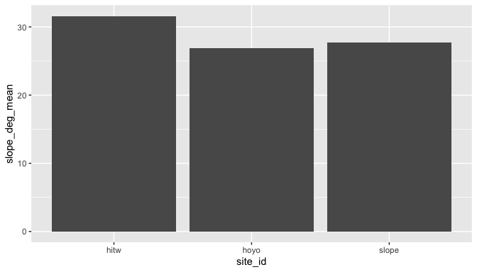

## Depth-Band Summaries

Depth-band summaries divide the raster into interpretable vertical
intervals. This is useful when terrain changes with depth or when
observations are collected within fixed depth ranges. The breaks should
be chosen to match the vertical convention of the input raster.

``` r
depth_bands <- summarize_depth_bands(
  hitw_prepared,
  metrics = hitw_metrics,
  breaks = c(-220, -150, -100, -60, -30, -20)
)
depth_bands[depth_bands$metric == "slope_deg", ]
#> # A tibble: 5 × 8
#>   depth_band  metric    n_cells  mean    sd   min   max median
#>   <chr>       <chr>       <int> <dbl> <dbl> <dbl> <dbl>  <dbl>
#> 1 [-220,-150) slope_deg     819  55.3 10.7   34.8  80.5   51.8
#> 2 [-150,-100) slope_deg     180  77.8  2.29  68.5  81.7   77.8
#> 3 [-100,-60)  slope_deg     791  43.5  9.79  18.8  76.5   40.9
#> 4 [-60,-30)   slope_deg     521  45.7  4.87  10.6  55.5   45.5
#> 5 [-30,-20]   slope_deg       4  NA   NA     NA    NA     NA

positive_bands <- summarize_depth_bands(
  set_depth_positive(hitw_prepared),
  breaks = c(20, 30, 60, 100, 150, 220),
  positive_depth = TRUE
)
positive_bands
#> # A tibble: 5 × 8
#>   depth_band metric  n_cells  mean    sd   min   max median
#>   <chr>      <chr>     <int> <dbl> <dbl> <dbl> <dbl>  <dbl>
#> 1 [20,30)    bathy_m       4  28.9  1.23  27.2  30.0   29.2
#> 2 [30,60)    bathy_m     521  45.5  8.29  30.2  59.9   45.8
#> 3 [60,100)   bathy_m     791  77.8 10.3   60.1  99.9   77.6
#> 4 [100,150)  bathy_m     180 123.  14.3  100.  150.   123. 
#> 5 [150,220]  bathy_m     819 193.  17.9  150.  218.   196.
```

## Transects and Cross-Sections

Transects convert the raster surface into cross-sectional profiles. They
are useful for showing slope breaks, terraces, escarpments, and
cross-shelf gradients that are not always obvious from cell-by-cell
terrain metrics. When `bathy` is supplied and `angle` is left unset,
`make_transects()` estimates the transect direction from the
slope-weighted mean aspect of the clipped bathymetry. An explicit
`angle` remains the correct choice when the analysis requires a fixed
survey bearing.

``` r
hitw_transects <- make_transects(
  hitw_rect,
  spacing = 75,
  bathy = hitw_prepared
)
class(hitw_transects)
#> [1] "SpatVector"
#> attr(,"package")
#> [1] "terra"
unique(as.data.frame(hitw_transects)[, c("angle_deg", "angle_source", "mean_aspect_deg")])
#>   angle_deg angle_source mean_aspect_deg
#> 1  94.61515      surface        175.3849

manual_transects <- make_transects(
  hitw_rect,
  spacing = 75,
  angle = 90
)
unique(as.data.frame(manual_transects)[, c("angle_deg", "angle_source")])
#>   angle_deg angle_source
#> 1        90       manual

transect_samples <- sample_transects(hitw_transects, hitw_prepared, n = 12)
head(transect_samples)
#> # A tibble: 6 × 18
#>   site_id site_name  feature_type source_name width_m height_m angle_deg zone_id
#>   <chr>   <chr>      <chr>        <chr>         <dbl>    <dbl>     <dbl> <chr>  
#> 1 hitw    Hole-in-t… sampling_re… Hole In th…     300      300      94.6 1      
#> 2 hitw    Hole-in-t… sampling_re… Hole In th…     300      300      94.6 1      
#> 3 hitw    Hole-in-t… sampling_re… Hole In th…     300      300      94.6 1      
#> 4 hitw    Hole-in-t… sampling_re… Hole In th…     300      300      94.6 1      
#> 5 hitw    Hole-in-t… sampling_re… Hole In th…     300      300      94.6 1      
#> 6 hitw    Hole-in-t… sampling_re… Hole In th…     300      300      94.6 1      
#> # ℹ 10 more variables: offset <dbl>, angle_source <chr>, mean_aspect_deg <dbl>,
#> #   orientation_weight <chr>, n_orientation_cells <int>, transect_id <chr>,
#> #   distance <dbl>, x <dbl>, y <dbl>, bathy_m <dbl>

cross_sections <- extract_cross_sections(hitw_transects, hitw_prepared, n = 12)
summarize_cross_sections(cross_sections)
#> # A tibble: 4 × 6
#>   transect_id bathy_m_mean bathy_m_sd bathy_m_min bathy_m_max bathy_m_median
#>   <chr>              <dbl>      <dbl>       <dbl>       <dbl>          <dbl>
#> 1 1_1                -102.       66.1       -197.       -45.4          -83.3
#> 2 1_2                -108.       61.2       -192.       -50.7          -95.1
#> 3 1_3                -127.       71.9       -216.       -46.5         -107. 
#> 4 1_4                -110.       71.7       -209.       -37.3          -83.7
```

``` r
plot_transects(
  hitw_prepared,
  hitw_transects,
  color_by = "transect_id",
  show_legend = FALSE,
  contour_interval = 25,
  title = "Terrain-Oriented Transects Across Hole-in-the-Wall"
)
```

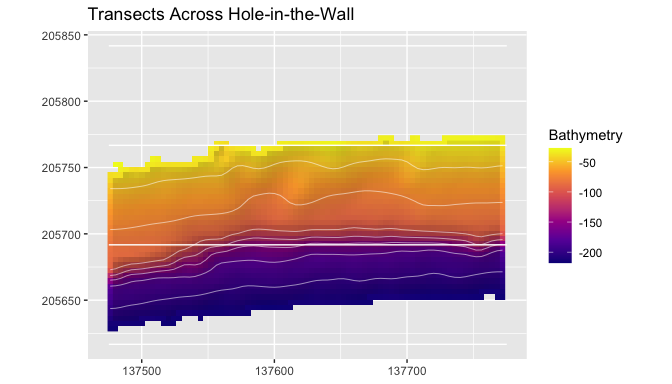

``` r
plot_cross_sections(
  cross_sections,
  value_col = "bathy_m",
  show_legend = TRUE,
  mean_profile = TRUE,
  normalize_distance = TRUE,
  title = "Hole-in-the-Wall Cross-Sections"
)
#> Warning: Removed 7 rows containing missing values or values outside the scale range
#> (`geom_line()`).
```

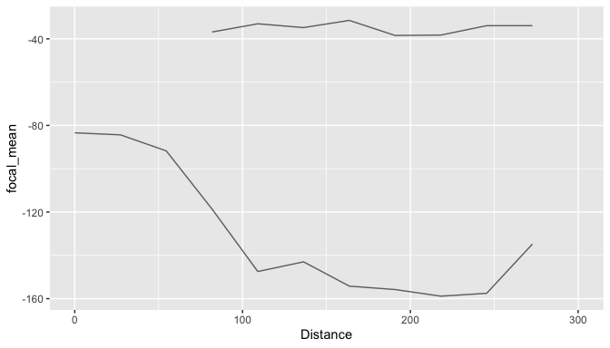

## Isobaths and Isobath Corridors

Isobath corridors summarize terrain along depth horizons. This is useful
when observations are collected along contours or when the analysis
needs to compare terrain structure at equivalent depths while retaining
along-contour variability.

``` r
hitw_isobaths <- extract_isobaths(hitw_prepared, depths = c(-50, -80, -120))
hitw_corridors <- make_isobath_corridors(
  hitw_prepared,
  depths = c(-50, -80, -120),
  width = 20
)

class(hitw_isobaths)
#> [1] "SpatVector"
#> attr(,"package")
#> [1] "terra"
class(hitw_corridors)
#> [1] "SpatVector"
#> attr(,"package")
#> [1] "terra"
terra::geomtype(hitw_corridors)
#> [1] "polygons"

corridor_cells <- extract_isobath_corridors(hitw_metrics, hitw_corridors)
head(corridor_cells)
#> # A tibble: 6 × 15
#>      ID level contour_value depth_label corridor_id slope_deg aspect_deg
#>   <int> <dbl>         <dbl>       <dbl>       <int>     <dbl>      <dbl>
#> 1     1   -50           -50         -50           1        NA         NA
#> 2     1   -50           -50         -50           1        NA         NA
#> 3     1   -50           -50         -50           1        NA         NA
#> 4     1   -50           -50         -50           1        NA         NA
#> 5     1   -50           -50         -50           1        NA         NA
#> 6     1   -50           -50         -50           1        NA         NA
#> # ℹ 8 more variables: northness <dbl>, eastness <dbl>, tri <dbl>,
#> #   rugosity_vrm_3x3 <dbl>, bpi_3x3 <dbl>, bpi_11x11 <dbl>, curvature <dbl>,
#> #   surface_area_ratio <dbl>

corridor_summary <- summarize_isobath_terrain(hitw_metrics, hitw_corridors)
corridor_summary[, c("contour_value", "slope_deg_mean", "bpi_3x3_mean")]
#> # A tibble: 3 × 3
#>   contour_value slope_deg_mean bpi_3x3_mean
#>           <dbl>          <dbl>        <dbl>
#> 1           -50           45.0       0.150 
#> 2           -80           45.6       0.418 
#> 3          -120           61.6       0.0736
```

``` r
plot_bathy(
  hitw_prepared,
  contours = TRUE,
  contour_interval = 25,
  vectors = hitw_isobaths,
  vector_color = "black",
  title = "Isobaths Over Hillshaded Bathymetry"
)
```

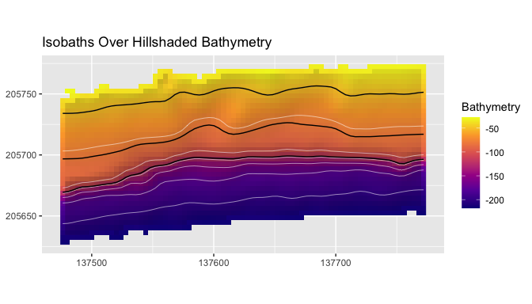

``` r
plot_isobath_corridors(
  hitw_corridors,
  hitw_prepared,
  isobaths = hitw_isobaths,
  background_contours = FALSE,
  title = "Isobath Corridors and Source Isobaths"
)
```

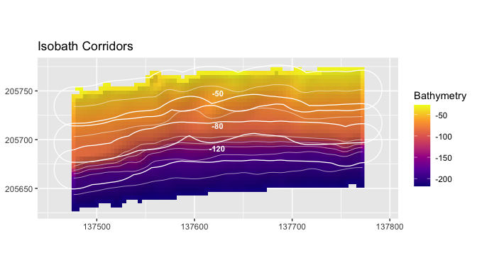

The black lines are the source isobaths. The corridor polygons buffer
those depth horizons and define the terrain extraction zones.

## Model-Ready Terrain Tables

Raster cells, points, and polygon summaries can be converted into tables
for classification, ordination, regression, or other spatial modeling
workflows. The helpers return standard tabular objects and leave model
choice to the user.

``` r
terrain_cells <- sample_terrain_cells(
  hitw_metrics,
  size = 120,
  method = "regular"
)
head(terrain_cells)
#> # A tibble: 6 × 12
#>         x       y slope_deg aspect_deg northness eastness   tri rugosity_vrm_3x3
#>     <dbl>   <dbl>     <dbl>      <dbl>     <dbl>    <dbl> <dbl>            <dbl>
#> 1 137484. 205636.      49.2       170.    -0.985    0.172  3.66         0.00154 
#> 2 137520. 205636.      35.5       166.    -0.972    0.234  2.22         0.00365 
#> 3 137484. 205652.      48.5       164.    -0.963    0.270  3.60         0.00216 
#> 4 137504. 205652.      50.3       168.    -0.977    0.212  3.78         0.000161
#> 5 137520. 205652.      50.4       172.    -0.991    0.137  3.75         0.000537
#> 6 137540. 205652.      52.0       171.    -0.988    0.153  4.01         0.00171 
#> # ℹ 4 more variables: bpi_3x3 <dbl>, bpi_11x11 <dbl>, curvature <dbl>,
#> #   surface_area_ratio <dbl>

points <- terra::centroids(hitw_rect)
extract_terrain_points(hitw_metrics, points)
#> # A tibble: 1 × 17
#>   site_id site_name        feature_type   source_name width_m height_m angle_deg
#>   <chr>   <chr>            <chr>          <chr>         <dbl>    <dbl>     <dbl>
#> 1 hitw    Hole-in-the-Wall sampling_rect… Hole In th…     300      300         0
#> # ℹ 10 more variables: slope_deg <dbl>, aspect_deg <dbl>, northness <dbl>,
#> #   eastness <dbl>, tri <dbl>, rugosity_vrm_3x3 <dbl>, bpi_3x3 <dbl>,
#> #   bpi_11x11 <dbl>, curvature <dbl>, surface_area_ratio <dbl>

model_matrix <- prepare_model_matrix(
  terrain_cells,
  vars = c("slope_deg", "tri", "bpi_3x3", "curvature"),
  scale = TRUE
)

dim(model_matrix$x)
#> [1] 100   4
```

## PCA, Effect Size, and Correlation Helpers

These helpers make exploratory comparisons reproducible. PCA describes
dominant covariation among metrics, effect sizes compare groups in the
original metric units, and correlations identify redundant terrain
derivatives.

``` r
hoyo_prepared <- prepare_bathy(hoyo, depth_range = c(-220, -25), smooth = TRUE)
hoyo_metrics <- derive_terrain(
  hoyo_prepared,
  metrics = c("slope", "tri", "bpi", "curvature")
)

hitw_cells <- sample_terrain_cells(
  hitw_metrics[[c("slope_deg", "tri", "bpi_3x3", "curvature")]],
  size = 40,
  method = "regular"
)
hitw_cells$site <- "Hole-in-the-Wall"

hoyo_cells <- sample_terrain_cells(
  hoyo_metrics[[c("slope_deg", "tri", "bpi_3x3", "curvature")]],
  size = 40,
  method = "regular"
)
hoyo_cells$site <- "El Hoyo"

comparison <- rbind(hitw_cells, hoyo_cells)

pca_set <- terrain_pca_by_group(
  comparison,
  group = "site",
  vars = c("slope_deg", "tri", "bpi_3x3", "curvature")
)
pca_set$overall$variance
#> # A tibble: 4 × 3
#>   component proportion cumulative
#>   <chr>          <dbl>      <dbl>
#> 1 PC1         0.734         0.734
#> 2 PC2         0.234         0.968
#> 3 PC3         0.0323        1.000
#> 4 PC4         0.000144      1
pca_axis_labels(pca_set$overall)
#>                               PC1                               PC2 
#> "PC1 (73.4%; bpi_3x3, curvature)"     "PC2 (23.4%; slope_deg, tri)"

terrain_effect_size(
  comparison,
  group = "site",
  vars = c("slope_deg", "tri", "bpi_3x3", "curvature")
)
#> # A tibble: 4 × 7
#>   variable  group_1          group_2 mean_1  mean_2 effect_size method  
#>   <chr>     <chr>            <chr>    <dbl>   <dbl>       <dbl> <chr>   
#> 1 slope_deg Hole-in-the-Wall El Hoyo 53.4   30.1          1.53  cohens_d
#> 2 tri       Hole-in-the-Wall El Hoyo  5.73   1.98         0.964 cohens_d
#> 3 bpi_3x3   Hole-in-the-Wall El Hoyo  0.434 -0.0869       0.524 cohens_d
#> 4 curvature Hole-in-the-Wall El Hoyo -1.30   0.237       -0.510 cohens_d

terrain_correlation(
  comparison,
  vars = c("slope_deg", "tri", "bpi_3x3", "curvature")
)
#> # A tibble: 6 × 3
#>   var1      var2      correlation
#>   <chr>     <chr>           <dbl>
#> 1 slope_deg tri             0.863
#> 2 slope_deg bpi_3x3         0.454
#> 3 tri       bpi_3x3         0.560
#> 4 slope_deg curvature      -0.443
#> 5 tri       curvature      -0.541
#> 6 bpi_3x3   curvature      -0.999

balanced <- balance_samples(comparison, group = "site", seed = 42)
table(balanced$site)
#> 
#>          El Hoyo Hole-in-the-Wall 
#>               21               21
```

``` r
plot_process_pca(
  pca_set$overall,
  color_col = "site",
  title = "Overall Terrain PCA"
)
```

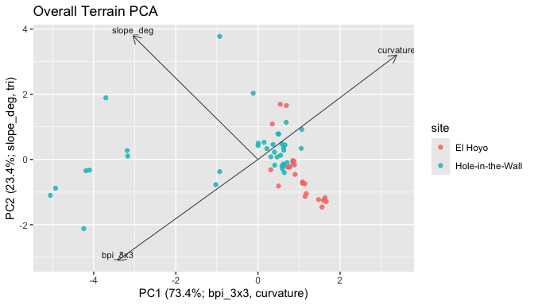

``` r
plot_process_pca(
  pca_set$groups[["Hole-in-the-Wall"]],
  title = "Hole-in-the-Wall Terrain PCA"
)
```

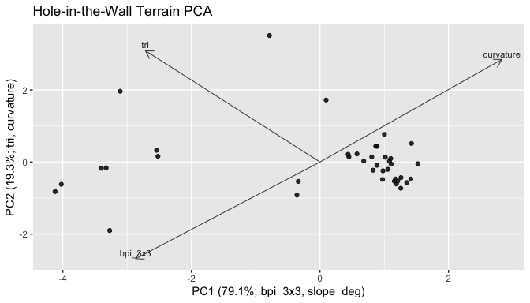

``` r
plot_process_pca(
  pca_set$groups[["El Hoyo"]],
  title = "El Hoyo Terrain PCA"
)
```

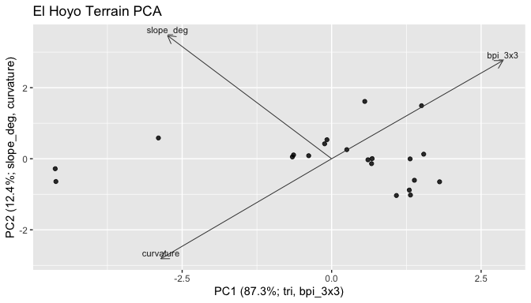

## Plotting Guide

The plotting functions return `ggplot` objects. That keeps the default
maps usable while allowing users to add themes, titles, annotations, or
publication styling with normal `ggplot2` code.

``` r
plot_metric_stack(hitw_metrics[[c("slope_deg", "tri", "bpi_3x3", "curvature")]])
```

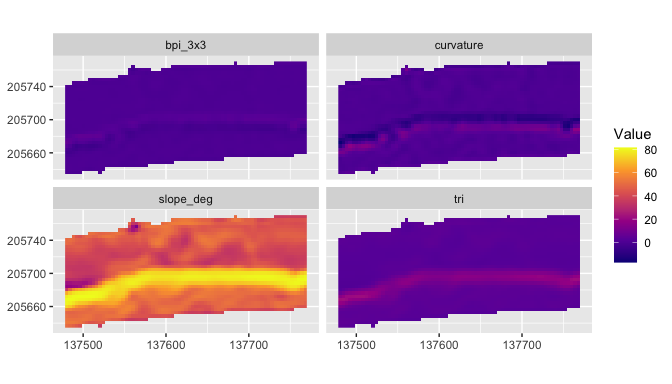

``` r
plot_metric(
  hitw_metrics,
  "rugosity_vrm_3x3",
  bathy = hitw_prepared,
  contours = TRUE,
  contour_interval = 25,
  title = "Rugosity Over Hillshade",
  legend_title = "VRM"
)
```

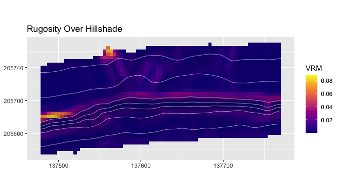

``` r
plot_metric(
  hitw_metrics,
  "bpi_3x3",
  bathy = hitw_prepared,
  contours = TRUE,
  contour_interval = 25,
  title = "BPI Over Hillshade",
  legend_title = "BPI"
)
```

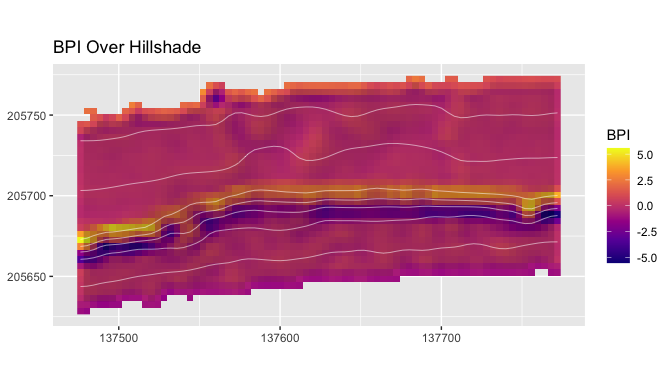

``` r
plot_metric(
  hitw_metrics,
  "curvature",
  bathy = hitw_prepared,
  contours = TRUE,
  contour_interval = 25,
  title = "Local Curvature Over Hillshade",
  legend_title = "Curvature"
)
```

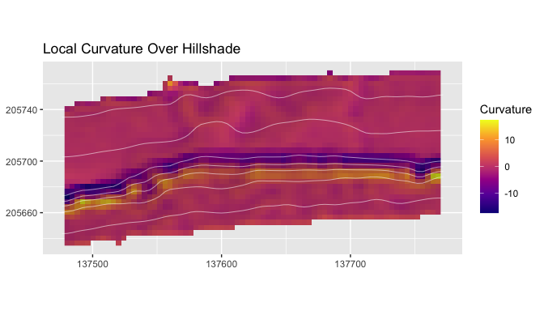

``` r
plot_metric(
  hitw_metrics,
  "surface_area_ratio",
  bathy = hitw_prepared,
  contours = TRUE,
  contour_interval = 25,
  title = "Surface Area Ratio Over Hillshade",
  legend_title = "Ratio"
)
```

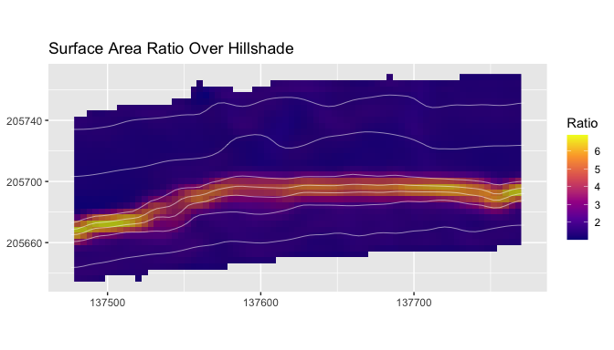

``` r
plot_process_density(comparison, value = "slope_deg", group = "site")
```

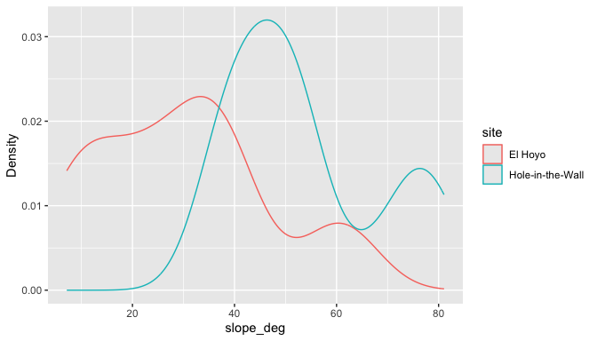

``` r
plot_depth_profile(
  transect_samples[
    transect_samples$transect_id == transect_samples$transect_id[1],
  ],
  value_col = "bathy_m"
)
```

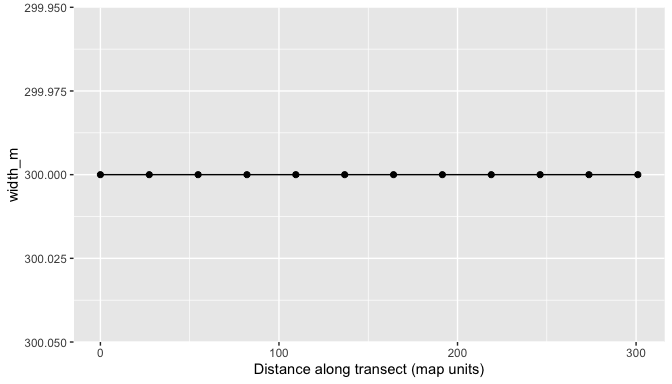

``` r
metric_transect_samples <- sample_transects(
  hitw_transects,
  hitw_metrics[["slope_deg"]],
  n = 25
)

plot_depth_profile(
  metric_transect_samples[
    metric_transect_samples$transect_id == metric_transect_samples$transect_id[1],
  ],
  value_col = "slope_deg",
  title = "Slope Along One Transect"
)
```

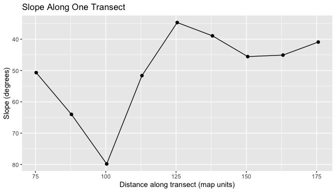

## Custom Metrics and Process Groups

Custom metrics should be raster layers on the same grid, CRS, and extent
as the metric stack they extend. This keeps polygon summaries, PCA
tables, and process group assignments aligned cell by cell. A custom
metric can come from a precomputed raster, a quoted expression using
existing layers, or a function that returns a single-layer
`terra::SpatRaster`.

``` r
renamed <- rename_metric_layers(
  hitw_metrics,
  c(slope_deg = "local_slope", bpi_3x3 = "fine_bpi")
)
names(renamed)[1:4]
#> [1] "local_slope" "aspect_deg"  "northness"   "eastness"

slope_tri <- derive_custom_metric(
  hitw_metrics,
  name = "slope_tri_index",
  expression = quote(slope_deg * tri)
)

relief_index <- derive_custom_metric(
  hitw_metrics,
  name = "relief_index",
  fun = function(r) {
    out <- r[["tri"]] + abs(r[["bpi_3x3"]])
    names(out) <- "relief_index"
    out
  }
)

extended_metrics <- add_metric_layers(
  hitw_metrics,
  slope_tri,
  relief_index
)
names(extended_metrics)
#>  [1] "slope_deg"          "aspect_deg"         "northness"         
#>  [4] "eastness"           "tri"                "rugosity_vrm_3x3"  
#>  [7] "bpi_3x3"            "bpi_11x11"          "curvature"         
#> [10] "surface_area_ratio" "slope_tri_index"    "relief_index"

custom_catalog <- extend_metric_catalog(
  metric_catalog(),
  create_metric_catalog(
    metric = "slope_tri_index",
    label = "Slope-TRI index",
    process_group = "custom_relief",
    description = "Product of local slope and terrain ruggedness index.",
    units = "index",
    source_function = "derive_custom_metric",
    interpretation_notes = "Example index for documentation; users should define metrics that match their own process model."
  ),
  create_metric_catalog(
    metric = "relief_index",
    label = "Relief index",
    process_group = "custom_relief",
    description = "Sum of TRI and absolute fine-scale BPI.",
    units = "index",
    source_function = "derive_custom_metric",
    interpretation_notes = "Example index for documentation."
  )
)

assign_process_groups(extended_metrics, catalog = custom_catalog)
#> # A tibble: 12 × 7
#>    metric        metric_standard label process_group description source_function
#>    <chr>         <chr>           <chr> <chr>         <chr>       <chr>          
#>  1 slope_deg     slope_deg       Slope slope_gradie… Local slop… derive_slope   
#>  2 aspect_deg    aspect_deg      Aspe… orientation   Local down… derive_aspect  
#>  3 northness     northness       Nort… orientation   Cosine tra… derive_northne…
#>  4 eastness      eastness        East… orientation   Sine trans… derive_eastness
#>  5 tri           tri             Terr… seafloor_rug… Local terr… derive_tri     
#>  6 rugosity_vrm… rugosity_vrm_3… Vect… seafloor_rug… Vector rug… derive_rugosity
#>  7 bpi_3x3       bpi_3x3         Fine… seafloor_pos… Fine-scale… derive_bpi     
#>  8 bpi_11x11     bpi_11x11       Broa… seafloor_pos… Broad-scal… derive_bpi     
#>  9 curvature     curvature       Curv… curvature     Laplacian-… derive_curvatu…
#> 10 surface_area… surface_area_r… Surf… surface_stru… Approximat… derive_surface…
#> 11 slope_tri_in… slope_tri_index Slop… custom_relief Product of… derive_custom_…
#> 12 relief_index  relief_index    Reli… custom_relief Sum of TRI… derive_custom_…
#> # ℹ 1 more variable: matched <lgl>
summarize_process_groups(extended_metrics, catalog = custom_catalog)
#> # A tibble: 7 × 3
#>   process_group     n_metrics metrics                        
#>   <chr>                 <int> <chr>                          
#> 1 curvature                 1 curvature                      
#> 2 custom_relief             2 slope_tri_index, relief_index  
#> 3 orientation               3 aspect_deg, northness, eastness
#> 4 seafloor_position         2 bpi_3x3, bpi_11x11             
#> 5 seafloor_rugosity         2 tri, rugosity_vrm_3x3          
#> 6 slope_gradient            1 slope_deg                      
#> 7 surface_structure         1 surface_area_ratio
```

``` r
plot_metric(
  extended_metrics,
  "slope_tri_index",
  bathy = hitw_prepared,
  hillshade = TRUE,
  contours = TRUE,
  contour_interval = 25,
  title = "Custom Slope-TRI Index",
  legend_title = "Index"
)
```

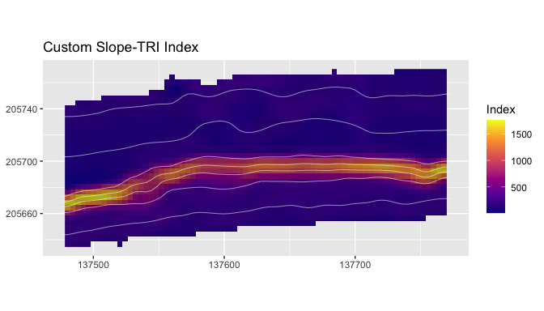

## Function Cookbook

<details>

<summary>

Input and validation functions
</summary>

Use these functions when a raster enters the workflow. They return
`terra::SpatRaster` objects or compact metadata tables.

``` r
hitw_file <- blueterra_example("hitw")
hitw_from_file <- read_bathy(hitw_file)
hitw_from_object <- as_bathy(hitw_from_file)
validate_bathy(hitw_from_object)
check_bathy_crs(hitw_from_object)
#> # A tibble: 1 × 4
#>   has_crs is_lonlat is_projected crs                                            
#>   <lgl>   <lgl>     <lgl>        <chr>                                          
#> 1 TRUE    FALSE     TRUE         "PROJCRS[\"NAD83 / Puerto Rico & Virgin Is.\",…
check_bathy_units(hitw_from_object, units = "m", positive_depth = FALSE)
#> # A tibble: 1 × 5
#>   layer     min   max units positive_depth
#>   <chr>   <dbl> <dbl> <chr> <lgl>         
#> 1 bathy_m -269. -16.6 m     FALSE
bathy_info(hitw_from_object)
#> # A tibble: 1 × 13
#>   layer    nrow  ncol ncell    xmin   xmax   ymin   ymax  xres  yres   min   max
#>   <chr>   <dbl> <dbl> <dbl>   <dbl>  <dbl>  <dbl>  <dbl> <dbl> <dbl> <dbl> <dbl>
#> 1 bathy_m    75    75  5625 137474. 1.38e5 2.06e5 2.06e5  4.00  4.00 -269. -16.6
#> # ℹ 1 more variable: crs <chr>
class(hitw_from_file)
#> [1] "SpatRaster"
#> attr(,"package")
#> [1] "terra"
```

`read_bathy()` is the file-path entry point; `as_bathy()` is useful
inside workflows that already hold a raster object.

</details>

<details>

<summary>

Raster preparation functions
</summary>

These functions make preprocessing choices explicit and return
`terra::SpatRaster` objects.

``` r
prepare_bathy(hitw, depth_range = c(-180, -30))
#> class       : SpatRaster
#> size        : 28, 75, 1  (nrow, ncol, nlyr)
#> resolution  : 3.996743, 3.996743  (x, y)
#> extent      : 137474.2, 137774, 205658.4, 205770.3  (xmin, xmax, ymin, ymax)
#> coord. ref. : NAD83 / Puerto Rico & Virgin Is. (EPSG:32161)
#> source(s)   : memory
#> varname     : laparguera_hitw_bathy
#> name        :     bathy_m
#> min value   : -179.884354
#> max value   :   -30.45825
crop_bathy(hitw, terra::ext(hitw_rect))
#> class       : SpatRaster
#> size        : 75, 75, 1  (nrow, ncol, nlyr)
#> resolution  : 3.996743, 3.996743  (x, y)
#> extent      : 137474.2, 137774, 205590.5, 205890.2  (xmin, xmax, ymin, ymax)
#> coord. ref. : NAD83 / Puerto Rico & Virgin Is. (EPSG:32161)
#> source      : laparguera_hitw_bathy.tif
#> name        :     bathy_m
#> min value   : -268.953094
#> max value   :  -16.631475
mask_bathy(hitw, hitw_rect)
#> class       : SpatRaster
#> size        : 75, 75, 1  (nrow, ncol, nlyr)
#> resolution  : 3.996743, 3.996743  (x, y)
#> extent      : 137474.2, 137774, 205590.5, 205890.2  (xmin, xmax, ymin, ymax)
#> coord. ref. : NAD83 / Puerto Rico & Virgin Is. (EPSG:32161)
#> source(s)   : memory
#> varname     : laparguera_hitw_bathy
#> name        :     bathy_m
#> min value   : -268.953094
#> max value   :  -16.631475
resample_bathy(hitw, template)
#> class       : SpatRaster
#> size        : 38, 38, 1  (nrow, ncol, nlyr)
#> resolution  : 7.993486, 7.993486  (x, y)
#> extent      : 137474.2, 137778, 205586.5, 205890.2  (xmin, xmax, ymin, ymax)
#> coord. ref. : NAD83 / Puerto Rico & Virgin Is. (EPSG:32161)
#> source(s)   : memory
#> name        :     bathy_m
#> min value   : -264.672546
#> max value   :  -16.735676
project_bathy(template, terra::crs(hitw))
#> class       : SpatRaster
#> size        : 38, 38, 1  (nrow, ncol, nlyr)
#> resolution  : 7.993486, 7.993486  (x, y)
#> extent      : 137474.2, 137778, 205586.5, 205890.2  (xmin, xmax, ymin, ymax)
#> coord. ref. : NAD83 / Puerto Rico & Virgin Is. (EPSG:32161)
#> source(s)   : memory
#> name        :     bathy_m
#> min value   : -264.692688
#> max value   :  -16.673401
smooth_bathy(hitw, window = 3)
#> class       : SpatRaster
#> size        : 75, 75, 1  (nrow, ncol, nlyr)
#> resolution  : 3.996743, 3.996743  (x, y)
#> extent      : 137474.2, 137774, 205590.5, 205890.2  (xmin, xmax, ymin, ymax)
#> coord. ref. : NAD83 / Puerto Rico & Virgin Is. (EPSG:32161)
#> source(s)   : memory
#> varname     : laparguera_hitw_bathy
#> name        :     bathy_m
#> min value   : -267.476662
#> max value   :  -16.719014
depth_filter(hitw, c(-180, -30))
#> class       : SpatRaster
#> size        : 28, 75, 1  (nrow, ncol, nlyr)
#> resolution  : 3.996743, 3.996743  (x, y)
#> extent      : 137474.2, 137774, 205658.4, 205770.3  (xmin, xmax, ymin, ymax)
#> coord. ref. : NAD83 / Puerto Rico & Virgin Is. (EPSG:32161)
#> source(s)   : memory
#> varname     : laparguera_hitw_bathy
#> name        :     bathy_m
#> min value   : -179.884354
#> max value   :   -30.45825
invert_depth(hitw)
#> class       : SpatRaster
#> size        : 75, 75, 1  (nrow, ncol, nlyr)
#> resolution  : 3.996743, 3.996743  (x, y)
#> extent      : 137474.2, 137774, 205590.5, 205890.2  (xmin, xmax, ymin, ymax)
#> coord. ref. : NAD83 / Puerto Rico & Virgin Is. (EPSG:32161)
#> source(s)   : memory
#> varname     : laparguera_hitw_bathy
#> name        :    bathy_m
#> min value   :  16.631475
#> max value   : 268.953094
set_depth_positive(hitw)
#> class       : SpatRaster
#> size        : 75, 75, 1  (nrow, ncol, nlyr)
#> resolution  : 3.996743, 3.996743  (x, y)
#> extent      : 137474.2, 137774, 205590.5, 205890.2  (xmin, xmax, ymin, ymax)
#> coord. ref. : NAD83 / Puerto Rico & Virgin Is. (EPSG:32161)
#> source(s)   : memory
#> varname     : laparguera_hitw_bathy
#> name        :    bathy_m
#> min value   :  16.631475
#> max value   : 268.953094
set_depth_negative(positive_depth)
#> class       : SpatRaster
#> size        : 75, 75, 1  (nrow, ncol, nlyr)
#> resolution  : 3.996743, 3.996743  (x, y)
#> extent      : 137474.2, 137774, 205590.5, 205890.2  (xmin, xmax, ymin, ymax)
#> coord. ref. : NAD83 / Puerto Rico & Virgin Is. (EPSG:32161)
#> source(s)   : memory
#> varname     : laparguera_hitw_bathy
#> name        :     bathy_m
#> min value   : -268.953094
#> max value   :  -16.631475
```

The parameter variation is usually the analysis decision: target CRS,
target resolution, depth interval, smoothing window, or sign convention.

</details>

<details>

<summary>

Terrain metric functions
</summary>

Each metric function returns a `terra::SpatRaster`. The stack helpers
return a multi-layer `SpatRaster` with clean layer names.

``` r
derive_slope(hitw_prepared)
#> class       : SpatRaster
#> size        : 37, 75, 1  (nrow, ncol, nlyr)
#> resolution  : 3.996743, 3.996743  (x, y)
#> extent      : 137474.2, 137774, 205626.5, 205774.3  (xmin, xmax, ymin, ymax)
#> coord. ref. : NAD83 / Puerto Rico & Virgin Is. (EPSG:32161)
#> source(s)   : memory
#> varname     : laparguera_hitw_bathy
#> name        : slope_deg
#> min value   : 10.633082
#> max value   : 81.670015
derive_aspect(hitw_prepared)
#> class       : SpatRaster
#> size        : 37, 75, 1  (nrow, ncol, nlyr)
#> resolution  : 3.996743, 3.996743  (x, y)
#> extent      : 137474.2, 137774, 205626.5, 205774.3  (xmin, xmax, ymin, ymax)
#> coord. ref. : NAD83 / Puerto Rico & Virgin Is. (EPSG:32161)
#> source(s)   : memory
#> varname     : laparguera_hitw_bathy
#> name        : aspect_deg
#> min value   :  87.129591
#> max value   :  219.14099
derive_northness(hitw_prepared)
#> class       : SpatRaster
#> size        : 37, 75, 1  (nrow, ncol, nlyr)
#> resolution  : 3.996743, 3.996743  (x, y)
#> extent      : 137474.2, 137774, 205626.5, 205774.3  (xmin, xmax, ymin, ymax)
#> coord. ref. : NAD83 / Puerto Rico & Virgin Is. (EPSG:32161)
#> source(s)   : memory
#> varname     : laparguera_hitw_bathy
#> name        : northness
#> min value   :        -1
#> max value   :  0.050077
derive_eastness(hitw_prepared)
#> class       : SpatRaster
#> size        : 37, 75, 1  (nrow, ncol, nlyr)
#> resolution  : 3.996743, 3.996743  (x, y)
#> extent      : 137474.2, 137774, 205626.5, 205774.3  (xmin, xmax, ymin, ymax)
#> coord. ref. : NAD83 / Puerto Rico & Virgin Is. (EPSG:32161)
#> source(s)   : memory
#> varname     : laparguera_hitw_bathy
#> name        :  eastness
#> min value   : -0.631231
#> max value   :  0.998745
derive_hillshade(hitw_prepared)
#> class       : SpatRaster
#> size        : 37, 75, 1  (nrow, ncol, nlyr)
#> resolution  : 3.996743, 3.996743  (x, y)
#> extent      : 137474.2, 137774, 205626.5, 205774.3  (xmin, xmax, ymin, ymax)
#> coord. ref. : NAD83 / Puerto Rico & Virgin Is. (EPSG:32161)
#> source(s)   : memory
#> varname     : laparguera_hitw_bathy
#> name        : hillshade
#> min value   : -0.523672
#> max value   :  0.619912
derive_roughness(hitw_prepared)
#> class       : SpatRaster
#> size        : 37, 75, 1  (nrow, ncol, nlyr)
#> resolution  : 3.996743, 3.996743  (x, y)
#> extent      : 137474.2, 137774, 205626.5, 205774.3  (xmin, xmax, ymin, ymax)
#> coord. ref. : NAD83 / Puerto Rico & Virgin Is. (EPSG:32161)
#> source(s)   : memory
#> varname     : laparguera_hitw_bathy
#> name        : roughness
#> min value   :         0
#> max value   : 65.460165
derive_tri(hitw_prepared)
#> class       : SpatRaster
#> size        : 37, 75, 1  (nrow, ncol, nlyr)
#> resolution  : 3.996743, 3.996743  (x, y)
#> extent      : 137474.2, 137774, 205626.5, 205774.3  (xmin, xmax, ymin, ymax)
#> coord. ref. : NAD83 / Puerto Rico & Virgin Is. (EPSG:32161)
#> source(s)   : memory
#> varname     : laparguera_hitw_bathy
#> name        :       tri
#> min value   :  1.047873
#> max value   : 21.578462
derive_tpi(hitw_prepared)
#> class       : SpatRaster
#> size        : 37, 75, 1  (nrow, ncol, nlyr)
#> resolution  : 3.996743, 3.996743  (x, y)
#> extent      : 137474.2, 137774, 205626.5, 205774.3  (xmin, xmax, ymin, ymax)
#> coord. ref. : NAD83 / Puerto Rico & Virgin Is. (EPSG:32161)
#> source(s)   : memory
#> varname     : laparguera_hitw_bathy
#> name        :       tpi
#> min value   : -6.241576
#> max value   :  6.279038
derive_bpi(hitw_prepared, window = 5)
#> class       : SpatRaster
#> size        : 37, 75, 1  (nrow, ncol, nlyr)
#> resolution  : 3.996743, 3.996743  (x, y)
#> extent      : 137474.2, 137774, 205626.5, 205774.3  (xmin, xmax, ymin, ymax)
#> coord. ref. : NAD83 / Puerto Rico & Virgin Is. (EPSG:32161)
#> source(s)   : memory
#> varname     : laparguera_hitw_bathy
#> name        :    bpi_5x5
#> min value   : -13.185123
#> max value   :  13.613569
derive_multiscale_bpi(hitw_prepared, windows = c(3, 7))
#> class       : SpatRaster
#> size        : 37, 75, 2  (nrow, ncol, nlyr)
#> resolution  : 3.996743, 3.996743  (x, y)
#> extent      : 137474.2, 137774, 205626.5, 205774.3  (xmin, xmax, ymin, ymax)
#> coord. ref. : NAD83 / Puerto Rico & Virgin Is. (EPSG:32161)
#> source(s)   : memory
#> varnames    : laparguera_hitw_bathy
#>               laparguera_hitw_bathy
#> names       :   bpi_3x3,    bpi_7x7
#> min values  : -5.548068, -18.969588
#> max values  :  5.581367,  20.310758
derive_rugosity(hitw_prepared, window = 3)
#> class       : SpatRaster
#> size        : 37, 75, 1  (nrow, ncol, nlyr)
#> resolution  : 3.996743, 3.996743  (x, y)
#> extent      : 137474.2, 137774, 205626.5, 205774.3  (xmin, xmax, ymin, ymax)
#> coord. ref. : NAD83 / Puerto Rico & Virgin Is. (EPSG:32161)
#> source(s)   : memory
#> varname     : laparguera_hitw_bathy
#> name        : rugosity_vrm_3x3
#> min value   :         0.000016
#> max value   :         0.088559
derive_curvature(hitw_prepared)
#> class       : SpatRaster
#> size        : 37, 75, 1  (nrow, ncol, nlyr)
#> resolution  : 3.996743, 3.996743  (x, y)
#> extent      : 137474.2, 137774, 205626.5, 205774.3  (xmin, xmax, ymin, ymax)
#> coord. ref. : NAD83 / Puerto Rico & Virgin Is. (EPSG:32161)
#> source(s)   : memory
#> varname     : laparguera_hitw_bathy
#> name        :  curvature
#> min value   : -17.331033
#> max value   :  17.263913
derive_surface_area_ratio(hitw_prepared)
#> class       : SpatRaster
#> size        : 37, 75, 1  (nrow, ncol, nlyr)
#> resolution  : 3.996743, 3.996743  (x, y)
#> extent      : 137474.2, 137774, 205626.5, 205774.3  (xmin, xmax, ymin, ymax)
#> coord. ref. : NAD83 / Puerto Rico & Virgin Is. (EPSG:32161)
#> source(s)   : memory
#> varname     : laparguera_hitw_bathy
#> name        : surface_area_ratio
#> min value   :           1.017471
#> max value   :           6.902548
derive_metric_stack(hitw_prepared, metrics = c("slope", "bpi"))
#> class       : SpatRaster
#> size        : 37, 75, 3  (nrow, ncol, nlyr)
#> resolution  : 3.996743, 3.996743  (x, y)
#> extent      : 137474.2, 137774, 205626.5, 205774.3  (xmin, xmax, ymin, ymax)
#> coord. ref. : NAD83 / Puerto Rico & Virgin Is. (EPSG:32161)
#> source(s)   : memory
#> varnames    : laparguera_hitw_bathy
#>               laparguera_hitw_bathy
#>               laparguera_hitw_bathy
#> names       : slope_deg,   bpi_3x3,  bpi_11x11
#> min values  : 10.633082, -5.548068, -24.949998
#> max values  : 81.670015,  5.581367,  29.158179
derive_terrain(hitw_prepared, metrics = c("slope", "tri", "bpi"))
#> class       : SpatRaster
#> size        : 37, 75, 4  (nrow, ncol, nlyr)
#> resolution  : 3.996743, 3.996743  (x, y)
#> extent      : 137474.2, 137774, 205626.5, 205774.3  (xmin, xmax, ymin, ymax)
#> coord. ref. : NAD83 / Puerto Rico & Virgin Is. (EPSG:32161)
#> source(s)   : memory
#> varnames    : laparguera_hitw_bathy
#>               laparguera_hitw_bathy
#>               laparguera_hitw_bathy
#>               laparguera_hitw_bathy
#> names       : slope_deg,       tri,   bpi_3x3,  bpi_11x11
#> min values  : 10.633082,  1.047873, -5.548068, -24.949998
#> max values  : 81.670015, 21.578462,  5.581367,  29.158179
```

Use smaller focal windows for fine features and larger windows for
broader terrain position.

</details>

<details>

<summary>

Process group functions
</summary>

These functions return tibbles, character vectors, or renamed metric
labels that keep terrain interpretation organized.

``` r
metric_catalog()
#> # A tibble: 16 × 9
#>    metric             label      process_group description units source_function
#>    <chr>              <chr>      <chr>         <chr>       <chr> <chr>          
#>  1 bathy              Bathymetry base_bathyme… Input bath… inpu… as_bathy       
#>  2 slope_deg          Slope      slope_gradie… Local slop… degr… derive_slope   
#>  3 slope_rad          Slope      slope_gradie… Local slop… radi… derive_slope   
#>  4 aspect_deg         Aspect     orientation   Local down… degr… derive_aspect  
#>  5 aspect_rad         Aspect     orientation   Local down… radi… derive_aspect  
#>  6 northness          Northness  orientation   Cosine tra… unit… derive_northne…
#>  7 eastness           Eastness   orientation   Sine trans… unit… derive_eastness
#>  8 hillshade          Hillshade  surface_stru… Illuminati… rela… derive_hillsha…
#>  9 roughness          Roughness  seafloor_rug… Local rang… inpu… derive_roughne…
#> 10 tri                Terrain R… seafloor_rug… Local terr… inpu… derive_tri     
#> 11 tpi                Topograph… seafloor_pos… Cell posit… inpu… derive_tpi     
#> 12 bpi_3x3            Fine BPI   seafloor_pos… Fine-scale… inpu… derive_bpi     
#> 13 bpi_11x11          Broad BPI  seafloor_pos… Broad-scal… inpu… derive_bpi     
#> 14 curvature          Curvature  curvature     Laplacian-… inpu… derive_curvatu…
#> 15 surface_area_ratio Surface A… surface_stru… Approximat… unit… derive_surface…
#> 16 rugosity_vrm_3x3   Vector Ru… seafloor_rug… Vector rug… unit… derive_rugosity
#> # ℹ 3 more variables: requires_optional_dependency <lgl>,
#> #   scale_sensitive <lgl>, interpretation_notes <chr>
process_groups()
#> [1] "base_bathymetry"   "slope_gradient"    "orientation"      
#> [4] "surface_structure" "seafloor_rugosity" "seafloor_position"
#> [7] "curvature"
assign_process_groups(hitw_metrics)
#> # A tibble: 10 × 7
#>    metric        metric_standard label process_group description source_function
#>    <chr>         <chr>           <chr> <chr>         <chr>       <chr>          
#>  1 slope_deg     slope_deg       Slope slope_gradie… Local slop… derive_slope   
#>  2 aspect_deg    aspect_deg      Aspe… orientation   Local down… derive_aspect  
#>  3 northness     northness       Nort… orientation   Cosine tra… derive_northne…
#>  4 eastness      eastness        East… orientation   Sine trans… derive_eastness
#>  5 tri           tri             Terr… seafloor_rug… Local terr… derive_tri     
#>  6 rugosity_vrm… rugosity_vrm_3… Vect… seafloor_rug… Vector rug… derive_rugosity
#>  7 bpi_3x3       bpi_3x3         Fine… seafloor_pos… Fine-scale… derive_bpi     
#>  8 bpi_11x11     bpi_11x11       Broa… seafloor_pos… Broad-scal… derive_bpi     
#>  9 curvature     curvature       Curv… curvature     Laplacian-… derive_curvatu…
#> 10 surface_area… surface_area_r… Surf… surface_stru… Approximat… derive_surface…
#> # ℹ 1 more variable: matched <lgl>
assign_process_groups(extended_metrics, catalog = custom_catalog)
#> # A tibble: 12 × 7
#>    metric        metric_standard label process_group description source_function
#>    <chr>         <chr>           <chr> <chr>         <chr>       <chr>          
#>  1 slope_deg     slope_deg       Slope slope_gradie… Local slop… derive_slope   
#>  2 aspect_deg    aspect_deg      Aspe… orientation   Local down… derive_aspect  
#>  3 northness     northness       Nort… orientation   Cosine tra… derive_northne…
#>  4 eastness      eastness        East… orientation   Sine trans… derive_eastness
#>  5 tri           tri             Terr… seafloor_rug… Local terr… derive_tri     
#>  6 rugosity_vrm… rugosity_vrm_3… Vect… seafloor_rug… Vector rug… derive_rugosity
#>  7 bpi_3x3       bpi_3x3         Fine… seafloor_pos… Fine-scale… derive_bpi     
#>  8 bpi_11x11     bpi_11x11       Broa… seafloor_pos… Broad-scal… derive_bpi     
#>  9 curvature     curvature       Curv… curvature     Laplacian-… derive_curvatu…
#> 10 surface_area… surface_area_r… Surf… surface_stru… Approximat… derive_surface…
#> 11 slope_tri_in… slope_tri_index Slop… custom_relief Product of… derive_custom_…
#> 12 relief_index  relief_index    Reli… custom_relief Sum of TRI… derive_custom_…
#> # ℹ 1 more variable: matched <lgl>
select_process_representatives(metrics_available = names(hitw_metrics))
#> # A tibble: 6 × 9
#>   metric             label       process_group description units source_function
#>   <chr>              <chr>       <chr>         <chr>       <chr> <chr>          
#> 1 curvature          Curvature   curvature     Laplacian-… inpu… derive_curvatu…
#> 2 aspect_deg         Aspect      orientation   Local down… degr… derive_aspect  
#> 3 bpi_11x11          Broad BPI   seafloor_pos… Broad-scal… inpu… derive_bpi     
#> 4 rugosity_vrm_3x3   Vector Rug… seafloor_rug… Vector rug… unit… derive_rugosity
#> 5 slope_deg          Slope       slope_gradie… Local slop… degr… derive_slope   
#> 6 surface_area_ratio Surface Ar… surface_stru… Approximat… unit… derive_surface…
#> # ℹ 3 more variables: requires_optional_dependency <lgl>,
#> #   scale_sensitive <lgl>, interpretation_notes <chr>
summarize_process_groups(hitw_metrics)
#> # A tibble: 6 × 3
#>   process_group     n_metrics metrics                        
#>   <chr>                 <int> <chr>                          
#> 1 curvature                 1 curvature                      
#> 2 orientation               3 aspect_deg, northness, eastness
#> 3 seafloor_position         2 bpi_3x3, bpi_11x11             
#> 4 seafloor_rugosity         2 tri, rugosity_vrm_3x3          
#> 5 slope_gradient            1 slope_deg                      
#> 6 surface_structure         1 surface_area_ratio
create_metric_catalog(metric = "custom_index", process_group = "custom_relief")
#> # A tibble: 1 × 9
#>   metric       label        process_group description units source_function
#>   <chr>        <chr>        <chr>         <chr>       <chr> <chr>          
#> 1 custom_index custom_index custom_relief <NA>        <NA>  <NA>           
#> # ℹ 3 more variables: requires_optional_dependency <lgl>,
#> #   scale_sensitive <lgl>, interpretation_notes <chr>
extend_metric_catalog(metric_catalog(), create_metric_catalog("custom_index", process_group = "custom_relief"))
#> # A tibble: 17 × 9
#>    metric             label      process_group description units source_function
#>    <chr>              <chr>      <chr>         <chr>       <chr> <chr>          
#>  1 bathy              Bathymetry base_bathyme… Input bath… inpu… as_bathy       
#>  2 slope_deg          Slope      slope_gradie… Local slop… degr… derive_slope   
#>  3 slope_rad          Slope      slope_gradie… Local slop… radi… derive_slope   
#>  4 aspect_deg         Aspect     orientation   Local down… degr… derive_aspect  
#>  5 aspect_rad         Aspect     orientation   Local down… radi… derive_aspect  
#>  6 northness          Northness  orientation   Cosine tra… unit… derive_northne…
#>  7 eastness           Eastness   orientation   Sine trans… unit… derive_eastness
#>  8 hillshade          Hillshade  surface_stru… Illuminati… rela… derive_hillsha…
#>  9 roughness          Roughness  seafloor_rug… Local rang… inpu… derive_roughne…
#> 10 tri                Terrain R… seafloor_rug… Local terr… inpu… derive_tri     
#> 11 tpi                Topograph… seafloor_pos… Cell posit… inpu… derive_tpi     
#> 12 bpi_3x3            Fine BPI   seafloor_pos… Fine-scale… inpu… derive_bpi     
#> 13 bpi_11x11          Broad BPI  seafloor_pos… Broad-scal… inpu… derive_bpi     
#> 14 curvature          Curvature  curvature     Laplacian-… inpu… derive_curvatu…
#> 15 surface_area_ratio Surface A… surface_stru… Approximat… unit… derive_surface…
#> 16 rugosity_vrm_3x3   Vector Ru… seafloor_rug… Vector rug… unit… derive_rugosity
#> 17 custom_index       custom_in… custom_relief <NA>        <NA>  <NA>           
#> # ℹ 3 more variables: requires_optional_dependency <lgl>,
#> #   scale_sensitive <lgl>, interpretation_notes <chr>
standardize_metric_names(c("Slope degrees", "BPI 3 x 3"))
#> [1] "slope_degrees" "bpi_3_x_3"
rename_metric_layers(c("slope_old", "bpi_old"), c(slope_old = "slope_deg"))
#> [1] "slope_deg" "bpi_old"
```

Interpret process groups as terrain-form categories, not direct
measurements of physical forcing.

</details>

<details>

<summary>

Transects, isobaths, and summaries
</summary>

These functions work with `terra::SpatVector` objects or local vector
paths and return vectors, extracted cells, or summary tables.

``` r
estimate_surface_orientation(hitw_prepared, hitw_rect)
#> [1] 94.61515
make_transects(hitw_rect, spacing = 100, bathy = hitw_prepared)
#> class       : SpatVector
#> geometry    : lines
#> dimensions  : 3, 14  (geometries, attributes)
#> extent      : 137537.1, 137762, 205591, 205891  (xmin, xmax, ymin, ymax)
#> coord. ref. : NAD83 / Puerto Rico & Virgin Is. (EPSG:32161)
#> names       : site_id        site_name    feature_type      source_name width_m height_m angle_deg zone_id   offset angle_source   (and 4 more)
#> type        :   <chr>            <chr>           <chr>            <chr>   <num>    <num>     <num>   <chr>    <num>        <chr>
#> values      :    hitw Hole-in-the-Wall sampling_recta~ Hole In the Wall     300      300   94.6151       1 -124.264      surface
#>                  hitw Hole-in-the-Wall sampling_recta~ Hole In the Wall     300      300   94.6151       1 -24.2641      surface
#>                  hitw Hole-in-the-Wall sampling_recta~ Hole In the Wall     300      300   94.6151       1  75.7359      surface
sample_transects(hitw_transects, hitw_prepared, n = 5)
#> # A tibble: 20 × 18
#>    site_id site_name feature_type source_name width_m height_m angle_deg zone_id
#>    <chr>   <chr>     <chr>        <chr>         <dbl>    <dbl>     <dbl> <chr>  
#>  1 hitw    Hole-in-… sampling_re… Hole In th…     300      300      94.6 1      
#>  2 hitw    Hole-in-… sampling_re… Hole In th…     300      300      94.6 1      
#>  3 hitw    Hole-in-… sampling_re… Hole In th…     300      300      94.6 1      
#>  4 hitw    Hole-in-… sampling_re… Hole In th…     300      300      94.6 1      
#>  5 hitw    Hole-in-… sampling_re… Hole In th…     300      300      94.6 1      
#>  6 hitw    Hole-in-… sampling_re… Hole In th…     300      300      94.6 1      
#>  7 hitw    Hole-in-… sampling_re… Hole In th…     300      300      94.6 1      
#>  8 hitw    Hole-in-… sampling_re… Hole In th…     300      300      94.6 1      
#>  9 hitw    Hole-in-… sampling_re… Hole In th…     300      300      94.6 1      
#> 10 hitw    Hole-in-… sampling_re… Hole In th…     300      300      94.6 1      
#> 11 hitw    Hole-in-… sampling_re… Hole In th…     300      300      94.6 1      
#> 12 hitw    Hole-in-… sampling_re… Hole In th…     300      300      94.6 1      
#> 13 hitw    Hole-in-… sampling_re… Hole In th…     300      300      94.6 1      
#> 14 hitw    Hole-in-… sampling_re… Hole In th…     300      300      94.6 1      
#> 15 hitw    Hole-in-… sampling_re… Hole In th…     300      300      94.6 1      
#> 16 hitw    Hole-in-… sampling_re… Hole In th…     300      300      94.6 1      
#> 17 hitw    Hole-in-… sampling_re… Hole In th…     300      300      94.6 1      
#> 18 hitw    Hole-in-… sampling_re… Hole In th…     300      300      94.6 1      
#> 19 hitw    Hole-in-… sampling_re… Hole In th…     300      300      94.6 1      
#> 20 hitw    Hole-in-… sampling_re… Hole In th…     300      300      94.6 1      
#> # ℹ 10 more variables: offset <dbl>, angle_source <chr>, mean_aspect_deg <dbl>,
#> #   orientation_weight <chr>, n_orientation_cells <int>, transect_id <chr>,
#> #   distance <dbl>, x <dbl>, y <dbl>, bathy_m <dbl>
extract_cross_sections(hitw_transects, hitw_prepared, n = 5)
#> # A tibble: 20 × 18
#>    site_id site_name feature_type source_name width_m height_m angle_deg zone_id
#>    <chr>   <chr>     <chr>        <chr>         <dbl>    <dbl>     <dbl> <chr>  
#>  1 hitw    Hole-in-… sampling_re… Hole In th…     300      300      94.6 1      
#>  2 hitw    Hole-in-… sampling_re… Hole In th…     300      300      94.6 1      
#>  3 hitw    Hole-in-… sampling_re… Hole In th…     300      300      94.6 1      
#>  4 hitw    Hole-in-… sampling_re… Hole In th…     300      300      94.6 1      
#>  5 hitw    Hole-in-… sampling_re… Hole In th…     300      300      94.6 1      
#>  6 hitw    Hole-in-… sampling_re… Hole In th…     300      300      94.6 1      
#>  7 hitw    Hole-in-… sampling_re… Hole In th…     300      300      94.6 1      
#>  8 hitw    Hole-in-… sampling_re… Hole In th…     300      300      94.6 1      
#>  9 hitw    Hole-in-… sampling_re… Hole In th…     300      300      94.6 1      
#> 10 hitw    Hole-in-… sampling_re… Hole In th…     300      300      94.6 1      
#> 11 hitw    Hole-in-… sampling_re… Hole In th…     300      300      94.6 1      
#> 12 hitw    Hole-in-… sampling_re… Hole In th…     300      300      94.6 1      
#> 13 hitw    Hole-in-… sampling_re… Hole In th…     300      300      94.6 1      
#> 14 hitw    Hole-in-… sampling_re… Hole In th…     300      300      94.6 1      
#> 15 hitw    Hole-in-… sampling_re… Hole In th…     300      300      94.6 1      
#> 16 hitw    Hole-in-… sampling_re… Hole In th…     300      300      94.6 1      
#> 17 hitw    Hole-in-… sampling_re… Hole In th…     300      300      94.6 1      
#> 18 hitw    Hole-in-… sampling_re… Hole In th…     300      300      94.6 1      
#> 19 hitw    Hole-in-… sampling_re… Hole In th…     300      300      94.6 1      
#> 20 hitw    Hole-in-… sampling_re… Hole In th…     300      300      94.6 1      
#> # ℹ 10 more variables: offset <dbl>, angle_source <chr>, mean_aspect_deg <dbl>,
#> #   orientation_weight <chr>, n_orientation_cells <int>, transect_id <chr>,
#> #   distance <dbl>, x <dbl>, y <dbl>, bathy_m <dbl>
summarize_cross_sections(cross_sections)
#> # A tibble: 4 × 6
#>   transect_id bathy_m_mean bathy_m_sd bathy_m_min bathy_m_max bathy_m_median
#>   <chr>              <dbl>      <dbl>       <dbl>       <dbl>          <dbl>
#> 1 1_1                -102.       66.1       -197.       -45.4          -83.3
#> 2 1_2                -108.       61.2       -192.       -50.7          -95.1
#> 3 1_3                -127.       71.9       -216.       -46.5         -107. 
#> 4 1_4                -110.       71.7       -209.       -37.3          -83.7
extract_isobaths(hitw_prepared, depths = c(-50, -80))
#> class       : SpatVector
#> geometry    : lines
#> dimensions  : 2, 3  (geometries, attributes)
#> extent      : 137476.2, 137772, 205696.8, 205756.6  (xmin, xmax, ymin, ymax)
#> coord. ref. : NAD83 / Puerto Rico & Virgin Is. (EPSG:32161)
#> names       : level contour_value depth_label
#> type        : <num>         <num>       <num>
#> values      :   -50           -50         -50
#>                 -80           -80         -80
make_isobath_corridors(hitw_prepared, depths = c(-50, -80), width = 20)
#> class       : SpatVector
#> geometry    : polygons
#> dimensions  : 2, 4  (geometries, attributes)
#> extent      : 137456.2, 137792, 205676.8, 205776.5  (xmin, xmax, ymin, ymax)
#> coord. ref. : NAD83 / Puerto Rico & Virgin Is. (EPSG:32161)
#> names       : level contour_value depth_label corridor_id
#> type        : <num>         <num>       <num>       <int>
#> values      :   -50           -50         -50           1
#>                 -80           -80         -80           2
extract_isobath_corridors(hitw_metrics, hitw_corridors)
#> # A tibble: 2,295 × 15
#>       ID level contour_value depth_label corridor_id slope_deg aspect_deg
#>    <int> <dbl>         <dbl>       <dbl>       <int>     <dbl>      <dbl>
#>  1     1   -50           -50         -50           1        NA         NA
#>  2     1   -50           -50         -50           1        NA         NA
#>  3     1   -50           -50         -50           1        NA         NA
#>  4     1   -50           -50         -50           1        NA         NA
#>  5     1   -50           -50         -50           1        NA         NA
#>  6     1   -50           -50         -50           1        NA         NA
#>  7     1   -50           -50         -50           1        NA         NA
#>  8     1   -50           -50         -50           1        NA         NA
#>  9     1   -50           -50         -50           1        NA         NA
#> 10     1   -50           -50         -50           1        NA         NA
#> # ℹ 2,285 more rows
#> # ℹ 8 more variables: northness <dbl>, eastness <dbl>, tri <dbl>,
#> #   rugosity_vrm_3x3 <dbl>, bpi_3x3 <dbl>, bpi_11x11 <dbl>, curvature <dbl>,
#> #   surface_area_ratio <dbl>
summarize_isobath_terrain(hitw_metrics, hitw_corridors)
#> # A tibble: 3 × 55
#>   level contour_value depth_label corridor_id zone_id slope_deg_mean
#>   <dbl>         <dbl>       <dbl>       <int>   <int>          <dbl>
#> 1   -50           -50         -50           1       1           45.0
#> 2   -80           -80         -80           2       2           45.6
#> 3  -120          -120        -120           3       3           61.6
#> # ℹ 49 more variables: slope_deg_sd <dbl>, slope_deg_min <dbl>,
#> #   slope_deg_max <dbl>, slope_deg_median <dbl>, aspect_deg_mean <dbl>,
#> #   aspect_deg_sd <dbl>, aspect_deg_min <dbl>, aspect_deg_max <dbl>,
#> #   aspect_deg_median <dbl>, northness_mean <dbl>, northness_sd <dbl>,
#> #   northness_min <dbl>, northness_max <dbl>, northness_median <dbl>,
#> #   eastness_mean <dbl>, eastness_sd <dbl>, eastness_min <dbl>,
#> #   eastness_max <dbl>, eastness_median <dbl>, tri_mean <dbl>, tri_sd <dbl>, …
summarize_terrain(hitw_metrics, hitw_rect)
#> # A tibble: 1 × 58
#>   site_id site_name  feature_type source_name width_m height_m angle_deg zone_id
#>   <chr>   <chr>      <chr>        <chr>         <dbl>    <dbl>     <dbl>   <int>
#> 1 hitw    Hole-in-t… sampling_re… Hole In th…     300      300         0       1
#> # ℹ 50 more variables: slope_deg_mean <dbl>, slope_deg_sd <dbl>,
#> #   slope_deg_min <dbl>, slope_deg_max <dbl>, slope_deg_median <dbl>,
#> #   aspect_deg_mean <dbl>, aspect_deg_sd <dbl>, aspect_deg_min <dbl>,
#> #   aspect_deg_max <dbl>, aspect_deg_median <dbl>, northness_mean <dbl>,
#> #   northness_sd <dbl>, northness_min <dbl>, northness_max <dbl>,
#> #   northness_median <dbl>, eastness_mean <dbl>, eastness_sd <dbl>,
#> #   eastness_min <dbl>, eastness_max <dbl>, eastness_median <dbl>, …
summarize_terrain_by_zone(slope_metrics, rectangles)
#> # A tibble: 3 × 33
#>   site_id site_name  feature_type source_name width_m height_m angle_deg zone_id
#>   <chr>   <chr>      <chr>        <chr>         <dbl>    <dbl>     <dbl>   <int>
#> 1 hitw    Hole-in-t… sampling_re… Hole In th…     300      300         0       1
#> 2 hoyo    El Hoyo    sampling_re… Hoyo Terra…     300      400       135       2
#> 3 slope   Slope Clip analysis_ex… Slope_clip…     NaN      NaN       NaN       3
#> # ℹ 25 more variables: slope_deg_mean <dbl>, slope_deg_sd <dbl>,
#> #   slope_deg_min <dbl>, slope_deg_max <dbl>, slope_deg_median <dbl>,
#> #   tri_mean <dbl>, tri_sd <dbl>, tri_min <dbl>, tri_max <dbl>,
#> #   tri_median <dbl>, bpi_3x3_mean <dbl>, bpi_3x3_sd <dbl>, bpi_3x3_min <dbl>,
#> #   bpi_3x3_max <dbl>, bpi_3x3_median <dbl>, bpi_11x11_mean <dbl>,
#> #   bpi_11x11_sd <dbl>, bpi_11x11_min <dbl>, bpi_11x11_max <dbl>,
#> #   bpi_11x11_median <dbl>, curvature_mean <dbl>, curvature_sd <dbl>, …
summarize_depth_bands(hitw_prepared, breaks = c(-220, -100, -20))
#> # A tibble: 2 × 8
#>   depth_band  metric  n_cells   mean    sd    min    max median
#>   <chr>       <chr>     <int>  <dbl> <dbl>  <dbl>  <dbl>  <dbl>
#> 1 [-220,-100) bathy_m     999 -180.   31.9 -218.  -100.  -190. 
#> 2 [-100,-20]  bathy_m    1316  -64.9  18.6  -99.9  -27.2  -66.3
```

Spacing, width, and contour depth are map-unit or vertical-unit
decisions and should match the stored CRS and depth convention.

</details>

<details>

<summary>

Modeling and plotting helpers
</summary>

These helpers return tibbles, model matrices, PCA objects, or `ggplot`
objects.

``` r
extract_terrain_points(hitw_metrics, terra::centroids(hitw_rect))
#> # A tibble: 1 × 17
#>   site_id site_name        feature_type   source_name width_m height_m angle_deg
#>   <chr>   <chr>            <chr>          <chr>         <dbl>    <dbl>     <dbl>
#> 1 hitw    Hole-in-the-Wall sampling_rect… Hole In th…     300      300         0
#> # ℹ 10 more variables: slope_deg <dbl>, aspect_deg <dbl>, northness <dbl>,
#> #   eastness <dbl>, tri <dbl>, rugosity_vrm_3x3 <dbl>, bpi_3x3 <dbl>,
#> #   bpi_11x11 <dbl>, curvature <dbl>, surface_area_ratio <dbl>
sample_terrain_cells(hitw_metrics, size = 10, seed = 42)
#> # A tibble: 10 × 12
#>          x      y slope_deg aspect_deg northness eastness   tri rugosity_vrm_3x3
#>      <dbl>  <dbl>     <dbl>      <dbl>     <dbl>    <dbl> <dbl>            <dbl>
#>  1 137564. 2.06e5      75.5       161.    -0.944   0.329  12.3          0.00724 
#>  2 137540. 2.06e5      48.2       164.    -0.961   0.278   3.49         0.00927 
#>  3 137572. 2.06e5      78.6       165.    -0.966   0.258  15.7          0.00234 
#>  4 137728. 2.06e5      38.4       174.    -0.994   0.106   2.45         0.000596
#>  5 137756. 2.06e5      63.3       178.    -0.999   0.0319  6.27         0.0329  
#>  6 137580. 2.06e5      71.6       176.    -0.998   0.0624  9.15         0.00723 
#>  7 137524. 2.06e5      44.8       166.    -0.970   0.243   3.15         0.00382 
#>  8 137492. 2.06e5      47.6       170.    -0.984   0.178   3.46         0.00241 
#>  9 137604. 2.06e5      53.8       172.    -0.990   0.143   4.24         0.00414 
#> 10 137568. 2.06e5      37.7       153.    -0.893   0.450   2.44         0.0346  
#> # ℹ 4 more variables: bpi_3x3 <dbl>, bpi_11x11 <dbl>, curvature <dbl>,
#> #   surface_area_ratio <dbl>
terrain_pca(terrain_cells[, c("slope_deg", "tri", "bpi_3x3", "curvature")])
#> $scores
#> # A tibble: 100 × 5
#>    row_id     PC1    PC2     PC3      PC4
#>     <int>   <dbl>  <dbl>   <dbl>    <dbl>
#>  1      1  0.352   0.736  0.169  -0.00942
#>  2      2 -0.124   1.56  -0.328   0.0748 
#>  3      3 -0.221   0.251  0.134   0.0111 
#>  4      4 -0.442  -0.122  0.195  -0.0215 
#>  5      5 -0.0705  0.231  0.208   0.0314 
#>  6      6 -0.348  -0.204  0.249   0.0124 
#>  7      7  0.383   0.796  0.174   0.0231 
#>  8      8 -0.621   0.370 -0.0515  0.00393
#>  9      9  0.0587  0.146  0.300   0.0163 
#> 10     10  0.206   0.970  0.0431 -0.00602
#> # ℹ 90 more rows
#> 
#> $loadings
#> # A tibble: 4 × 5
#>   variable     PC1    PC2      PC3     PC4
#>   <chr>      <dbl>  <dbl>    <dbl>   <dbl>
#> 1 slope_deg  0.484 -0.519  0.705    0.0165
#> 2 tri        0.491 -0.506 -0.709   -0.0150
#> 3 bpi_3x3   -0.513 -0.487 -0.0229   0.707 
#> 4 curvature  0.512  0.488 -0.00864  0.707 
#> 
#> $variance
#> # A tibble: 4 × 3
#>   component proportion cumulative
#>   <chr>          <dbl>      <dbl>
#> 1 PC1         0.647         0.647
#> 2 PC2         0.337         0.984
#> 3 PC3         0.0158        1.000
#> 4 PC4         0.000444      1    
#> 
#> $model
#> Standard deviations (1, .., p=4):
#> [1] 1.60861554 1.16084205 0.25105293 0.04212113
#> 
#> Rotation (n x k) = (4 x 4):
#>                  PC1        PC2          PC3         PC4
#> slope_deg  0.4839159 -0.5188400  0.704526577  0.01651498
#> tri        0.4909682 -0.5056483 -0.709256942 -0.01498749
#> bpi_3x3   -0.5126137 -0.4866339 -0.022852027  0.70703071
#> curvature  0.5118622  0.4881723 -0.008641577  0.70683110
#> 
#> $vars
#> [1] "slope_deg" "tri"       "bpi_3x3"   "curvature"
#> 
#> $complete_rows
#>   [1] TRUE TRUE TRUE TRUE TRUE TRUE TRUE TRUE TRUE TRUE TRUE TRUE TRUE TRUE TRUE
#>  [16] TRUE TRUE TRUE TRUE TRUE TRUE TRUE TRUE TRUE TRUE TRUE TRUE TRUE TRUE TRUE
#>  [31] TRUE TRUE TRUE TRUE TRUE TRUE TRUE TRUE TRUE TRUE TRUE TRUE TRUE TRUE TRUE
#>  [46] TRUE TRUE TRUE TRUE TRUE TRUE TRUE TRUE TRUE TRUE TRUE TRUE TRUE TRUE TRUE
#>  [61] TRUE TRUE TRUE TRUE TRUE TRUE TRUE TRUE TRUE TRUE TRUE TRUE TRUE TRUE TRUE
#>  [76] TRUE TRUE TRUE TRUE TRUE TRUE TRUE TRUE TRUE TRUE TRUE TRUE TRUE TRUE TRUE
#>  [91] TRUE TRUE TRUE TRUE TRUE TRUE TRUE TRUE TRUE TRUE
pca_axis_labels(pca_set$overall)
#>                               PC1                               PC2 
#> "PC1 (73.4%; bpi_3x3, curvature)"     "PC2 (23.4%; slope_deg, tri)"
terrain_pca_by_group(comparison, group = "site", vars = c("slope_deg", "tri", "bpi_3x3", "curvature"))
#> $overall
#> $overall$scores
#> # A tibble: 60 × 6
#>    row_id      PC1    PC2     PC3       PC4 site            
#>     <int>    <dbl>  <dbl>   <dbl>     <dbl> <chr>           
#>  1      1  0.00271 0.428  -0.308  -0.0102   Hole-in-the-Wall
#>  2      2  0.313   0.0785 -0.215  -0.0905   Hole-in-the-Wall
#>  3      3 -3.70    1.89    1.35   -0.00150  Hole-in-the-Wall
#>  4      4 -0.932   3.77    1.15   -0.000698 Hole-in-the-Wall
#>  5      5 -0.115   2.03   -0.0969  0.0347   Hole-in-the-Wall
#>  6      6  0.151   0.526  -0.309  -0.00717  Hole-in-the-Wall
#>  7      7  0.487   0.784  -0.247   0.00719  Hole-in-the-Wall
#>  8      8  0.00662 0.499  -0.327   0.0150   Hole-in-the-Wall
#>  9      9  0.218   0.331  -0.270   0.0175   Hole-in-the-Wall
#> 10     10  0.581   0.477  -0.211   0.00287  Hole-in-the-Wall
#> # ℹ 50 more rows
#> 
#> $overall$loadings
#> # A tibble: 4 × 5
#>   variable     PC1    PC2     PC3     PC4
#>   <chr>      <dbl>  <dbl>   <dbl>   <dbl>
#> 1 slope_deg -0.463  0.577 -0.672   0.0156
#> 2 tri       -0.501  0.455  0.735  -0.0332
#> 3 bpi_3x3   -0.520 -0.471 -0.0300  0.712 
#> 4 curvature  0.514  0.487  0.0802  0.701 
#> 
#> $overall$variance
#> # A tibble: 4 × 3
#>   component proportion cumulative
#>   <chr>          <dbl>      <dbl>
#> 1 PC1         0.734         0.734
#> 2 PC2         0.234         0.968
#> 3 PC3         0.0323        1.000
#> 4 PC4         0.000144      1    
#> 
#> $overall$model
#> Standard deviations (1, .., p=4):
#> [1] 1.71292914 0.96746341 0.35959847 0.02402639
#> 
#> Rotation (n x k) = (4 x 4):
#>                  PC1        PC2         PC3         PC4
#> slope_deg -0.4632561  0.5772409 -0.67226726  0.01560311
#> tri       -0.5008467  0.4553379  0.73533587 -0.03318226
#> bpi_3x3   -0.5195018 -0.4710937 -0.02998655  0.71224252
#> curvature  0.5144552  0.4873716  0.08024145  0.70097509
#> 
#> $overall$vars
#> [1] "slope_deg" "tri"       "bpi_3x3"   "curvature"
#> 
#> $overall$complete_rows
#>  [1] TRUE TRUE TRUE TRUE TRUE TRUE TRUE TRUE TRUE TRUE TRUE TRUE TRUE TRUE TRUE
#> [16] TRUE TRUE TRUE TRUE TRUE TRUE TRUE TRUE TRUE TRUE TRUE TRUE TRUE TRUE TRUE
#> [31] TRUE TRUE TRUE TRUE TRUE TRUE TRUE TRUE TRUE TRUE TRUE TRUE TRUE TRUE TRUE
#> [46] TRUE TRUE TRUE TRUE TRUE TRUE TRUE TRUE TRUE TRUE TRUE TRUE TRUE TRUE TRUE
#> 
#> 
#> $groups
#> $groups$`El Hoyo`
#> $groups$`El Hoyo`$scores
#> # A tibble: 21 × 6
#>    row_id     PC1     PC2      PC3      PC4 site   
#>     <int>   <dbl>   <dbl>    <dbl>    <dbl> <chr>  
#>  1      1  0.253   0.256  -0.0601   0.0100  El Hoyo
#>  2      2  1.54    0.129   0.0733   0.0174  El Hoyo
#>  3      3 -4.62   -0.281   0.207   -0.0289  El Hoyo
#>  4      4 -0.384   0.0859 -0.181   -0.0217  El Hoyo
#>  5      5 -0.0783  0.536  -0.0447  -0.0293  El Hoyo
#>  6      6  1.08   -1.03    0.00954 -0.0109  El Hoyo
#>  7      7  1.38   -0.605   0.0616   0.00889 El Hoyo
#>  8      8 -2.90    0.585   0.105    0.0356  El Hoyo
#>  9      9 -0.657   0.0513 -0.153    0.00799 El Hoyo
#> 10     10  1.81   -0.648   0.161   -0.0133  El Hoyo
#> # ℹ 11 more rows
#> 
#> $groups$`El Hoyo`$loadings
#> # A tibble: 4 × 5
#>   variable     PC1    PC2     PC3    PC4
#>   <chr>      <dbl>  <dbl>   <dbl>  <dbl>
#> 1 slope_deg -0.482  0.609 -0.617  -0.124
#> 2 tri       -0.513  0.387  0.750   0.159
#> 3 bpi_3x3    0.503  0.485 -0.0577  0.713
#> 4 curvature -0.502 -0.494 -0.231   0.671
#> 
#> $groups$`El Hoyo`$variance
#> # A tibble: 4 × 3
#>   component proportion cumulative
#>   <chr>          <dbl>      <dbl>
#> 1 PC1        0.873          0.873
#> 2 PC2        0.124          0.997
#> 3 PC3        0.00318        1.000
#> 4 PC4        0.0000774      1    
#> 
#> $groups$`El Hoyo`$model
#> Standard deviations (1, .., p=4):
#> [1] 1.86830682 0.70456919 0.11270360 0.01760044
#> 
#> Rotation (n x k) = (4 x 4):
#>                  PC1        PC2        PC3        PC4
#> slope_deg -0.4820269  0.6090108 -0.6174660 -0.1244653
#> tri       -0.5130162  0.3865783  0.7496345  0.1594355
#> bpi_3x3    0.5029299  0.4852718 -0.0576920  0.7129126
#> curvature -0.5015236 -0.4941400 -0.2312044  0.6714494
#> 
#> $groups$`El Hoyo`$vars
#> [1] "slope_deg" "tri"       "bpi_3x3"   "curvature"
#> 
#> $groups$`El Hoyo`$complete_rows
#>  [1] TRUE TRUE TRUE TRUE TRUE TRUE TRUE TRUE TRUE TRUE TRUE TRUE TRUE TRUE TRUE
#> [16] TRUE TRUE TRUE TRUE TRUE TRUE
#> 
#> 
#> $groups$`Hole-in-the-Wall`
#> $groups$`Hole-in-the-Wall`$scores
#> # A tibble: 39 × 6
#>    row_id     PC1     PC2     PC3      PC4 site            
#>     <int>   <dbl>   <dbl>   <dbl>    <dbl> <chr>           
#>  1      1  0.450   0.145  -0.253  -0.0153  Hole-in-the-Wall
#>  2      2  0.826  -0.228  -0.0147 -0.0773  Hole-in-the-Wall
#>  3      3 -3.11    1.96    0.759   0.00423 Hole-in-the-Wall
#>  4      4 -0.785   3.51    0.249  -0.0112  Hole-in-the-Wall
#>  5      5  0.0955  1.72   -0.515   0.0118  Hole-in-the-Wall
#>  6      6  0.576   0.225  -0.269  -0.0134  Hole-in-the-Wall
#>  7      7  0.867   0.442  -0.246  -0.00186 Hole-in-the-Wall
#>  8      8  0.438   0.213  -0.296   0.00489 Hole-in-the-Wall
#>  9      9  0.681   0.0286 -0.162   0.0100  Hole-in-the-Wall
#> 10     10  1.02    0.133  -0.105  -0.00184 Hole-in-the-Wall
#> # ℹ 29 more rows
#> 
#> $groups$`Hole-in-the-Wall`$loadings
#> # A tibble: 4 × 5
#>   variable     PC1    PC2     PC3      PC4
#>   <chr>      <dbl>  <dbl>   <dbl>    <dbl>
#> 1 slope_deg -0.503  0.463 -0.730  -0.00458
#> 2 tri       -0.483  0.549  0.682  -0.0206 
#> 3 bpi_3x3   -0.510 -0.477  0.0448  0.714  
#> 4 curvature  0.503  0.506 -0.0305  0.700  
#> 
#> $groups$`Hole-in-the-Wall`$variance
#> # A tibble: 4 × 3
#>   component proportion cumulative
#>   <chr>          <dbl>      <dbl>
#> 1 PC1         0.791         0.791
#> 2 PC2         0.193         0.984
#> 3 PC3         0.0154        1.000
#> 4 PC4         0.000122      1    
#> 
#> $groups$`Hole-in-the-Wall`$model
#> Standard deviations (1, .., p=4):
#> [1] 1.77915117 0.87888221 0.24839162 0.02210872
#> 
#> Rotation (n x k) = (4 x 4):
#>                  PC1        PC2         PC3          PC4
#> slope_deg -0.5032797  0.4627120 -0.72978497 -0.004583079
#> tri       -0.4828993  0.5494592  0.68152810 -0.020551019
#> bpi_3x3   -0.5101358 -0.4771661  0.04477657  0.714191180
#> curvature  0.5032686  0.5062654 -0.03046964  0.699633911
#> 
#> $groups$`Hole-in-the-Wall`$vars
#> [1] "slope_deg" "tri"       "bpi_3x3"   "curvature"
#> 
#> $groups$`Hole-in-the-Wall`$complete_rows
#>  [1] TRUE TRUE TRUE TRUE TRUE TRUE TRUE TRUE TRUE TRUE TRUE TRUE TRUE TRUE TRUE
#> [16] TRUE TRUE TRUE TRUE TRUE TRUE TRUE TRUE TRUE TRUE TRUE TRUE TRUE TRUE TRUE
#> [31] TRUE TRUE TRUE TRUE TRUE TRUE TRUE TRUE TRUE
terrain_effect_size(comparison, group = "site", vars = c("slope_deg", "tri"))
#> # A tibble: 2 × 7
#>   variable  group_1          group_2 mean_1 mean_2 effect_size method  
#>   <chr>     <chr>            <chr>    <dbl>  <dbl>       <dbl> <chr>   
#> 1 slope_deg Hole-in-the-Wall El Hoyo  53.4   30.1        1.53  cohens_d
#> 2 tri       Hole-in-the-Wall El Hoyo   5.73   1.98       0.964 cohens_d
terrain_correlation(terrain_cells[, c("slope_deg", "tri", "bpi_3x3")])
#> # A tibble: 3 × 3
#>   var1      var2    correlation
#>   <chr>     <chr>         <dbl>
#> 1 slope_deg tri           0.937
#> 2 slope_deg bpi_3x3      -0.303
#> 3 tri       bpi_3x3      -0.319
prepare_model_matrix(terrain_cells, vars = c("slope_deg", "tri"))
#> $x
#>        slope_deg       tri
#>   [1,]  49.22131  3.655033
#>   [2,]  35.53555  2.216408
#>   [3,]  48.53633  3.602090
#>   [4,]  50.29143  3.778023
#>   [5,]  50.37710  3.751410
#>   [6,]  52.00356  4.011178
#>   [7,]  49.05671  3.564754
#>   [8,]  43.30516  3.003612
#>   [9,]  52.69241  3.946576
#>  [10,]  45.40529  3.172553
#>  [11,]  36.39630  2.269088
#>  [12,]  35.09590  2.222560
#>  [13,]  80.08801 18.303712
#>  [14,]  81.67002 21.357051
#>  [15,]  79.89227 17.312415
#>  [16,]  70.81283  8.895432
#>  [17,]  49.13471  3.692606
#>  [18,]  53.93537  4.176288
#>  [19,]  54.55880  4.236592
#>  [20,]  48.86273  3.532824
#>  [21,]  52.75806  4.047659
#>  [22,]  52.89317  4.042651
#>  [23,]  50.02787  3.710052
#>  [24,]  51.14884  3.790538
#>  [25,]  47.66665  3.414372
#>  [26,]  46.87119  3.341227
#>  [27,]  43.92735  2.992767
#>  [28,]  49.79188  3.639455
#>  [29,]  31.04468  1.808938
#>  [30,]  26.85930  1.583151
#>  [31,]  38.24002  2.446373
#>  [32,]  67.07782  7.452875
#>  [33,]  78.56703 15.513223
#>  [34,]  77.89530 14.563315
#>  [35,]  75.28839 11.592824
#>  [36,]  77.30421 13.738417
#>  [37,]  77.64843 13.822137
#>  [38,]  77.26896 13.347224
#>  [39,]  77.39414 13.546784
#>  [40,]  77.82590 14.205062
#>  [41,]  79.32782 15.930913
#>  [42,]  80.08570 17.691255
#>  [43,]  79.88841 17.742564
#>  [44,]  81.50512 21.237063
#>  [45,]  34.88487  2.162254
#>  [46,]  34.01629  2.113310
#>  [47,]  37.90655  2.426745
#>  [48,]  47.21131  3.363953
#>  [49,]  49.67808  3.682491
#>  [50,]  47.58521  3.388292
#>  [51,]  46.33709  3.281216
#>  [52,]  45.62321  3.149753
#>  [53,]  47.11388  3.278829
#>  [54,]  46.17220  3.268771
#>  [55,]  48.03619  3.424045
#>  [56,]  51.87033  3.834848
#>  [57,]  48.88185  3.620696
#>  [58,]  45.78940  3.140556
#>  [59,]  40.21921  2.567461
#>  [60,]  39.44560  2.530415
#>  [61,]  43.64634  2.916141
#>  [62,]  42.95579  2.888391
#>  [63,]  37.60221  2.407735
#>  [64,]  38.94548  2.459064
#>  [65,]  39.92914  2.582627
#>  [66,]  40.28461  2.577538
#>  [67,]  40.24879  2.628668
#>  [68,]  38.15235  2.481956
#>  [69,]  45.38453  3.203610
#>  [70,]  47.25992  3.353605
#>  [71,]  34.64780  2.143088
#>  [72,]  36.74131  2.337519
#>  [73,]  44.38915  3.093961
#>  [74,]  38.43118  2.453699
#>  [75,]  38.12070  2.386975
#>  [76,]  39.09137  2.469918
#>  [77,]  48.52340  3.511676
#>  [78,]  51.86965  4.092080
#>  [79,]  39.29628  2.624837
#>  [80,]  46.28634  3.263666
#>  [81,]  52.51891  4.121127
#>  [82,]  43.24860  2.960689
#>  [83,]  44.58014  3.115806
#>  [84,]  48.00625  3.529812
#>  [85,]  51.89493  3.932351
#>  [86,]  48.20158  3.434108
#>  [87,]  43.67843  3.021786
#>  [88,]  44.87854  3.032824
#>  [89,]  47.31773  3.287205
#>  [90,]  46.00428  3.200094
#>  [91,]  45.16081  3.003273
#>  [92,]  53.39810  4.064891
#>  [93,]  52.85676  4.130381
#>  [94,]  47.72486  3.451756
#>  [95,]  42.89171  2.948806
#>  [96,]  52.56121  4.040430
#>  [97,]  44.38953  3.137012
#>  [98,]  43.13595  2.879061
#>  [99,]  43.37973  2.836687
#> [100,]  43.42013  2.941682
#> 
#> $y
#> NULL
#> 
#> $data
#> # A tibble: 100 × 12
#>          x      y slope_deg aspect_deg northness eastness   tri rugosity_vrm_3x3
#>      <dbl>  <dbl>     <dbl>      <dbl>     <dbl>    <dbl> <dbl>            <dbl>
#>  1 137484. 2.06e5      49.2       170.    -0.985   0.172   3.66         0.00154 
#>  2 137520. 2.06e5      35.5       166.    -0.972   0.234   2.22         0.00365 
#>  3 137484. 2.06e5      48.5       164.    -0.963   0.270   3.60         0.00216 
#>  4 137504. 2.06e5      50.3       168.    -0.977   0.212   3.78         0.000161
#>  5 137520. 2.06e5      50.4       172.    -0.991   0.137   3.75         0.000537
#>  6 137540. 2.06e5      52.0       171.    -0.988   0.153   4.01         0.00171 
#>  7 137560. 2.06e5      49.1       178.    -1.000   0.0276  3.56         0.00593 
#>  8 137576. 2.06e5      43.3       162.    -0.952   0.306   3.00         0.00114 
#>  9 137596. 2.06e5      52.7       181.    -1.000  -0.0203  3.95         0.00366 
#> 10 137616. 2.06e5      45.4       173.    -0.992   0.127   3.17         0.00199 
#> # ℹ 90 more rows
#> # ℹ 4 more variables: bpi_3x3 <dbl>, bpi_11x11 <dbl>, curvature <dbl>,
#> #   surface_area_ratio <dbl>
balance_samples(comparison, group = "site", seed = 42)
#> # A tibble: 42 × 7
#>          x       y slope_deg   tri  bpi_3x3 curvature site   
#>      <dbl>   <dbl>     <dbl> <dbl>    <dbl>     <dbl> <chr>  
#>  1 135698. 204865.     38.5  2.30  -0.165      0.537  El Hoyo
#>  2 135586. 204753.     36.7  2.30  -0.0225     0.0208 El Hoyo
#>  3 135698. 204641.     31.2  1.87  -0.00338    0.0224 El Hoyo
#>  4 135526. 204809.      7.13 0.370  0.0960    -0.345  El Hoyo
#>  5 135754. 204697.     36.0  2.12  -0.137      0.401  El Hoyo
#>  6 135642. 204697.     18.1  0.942  0.182     -0.538  El Hoyo
#>  7 135754. 204865.      8.24 0.423 -0.0317     0.0878 El Hoyo
#>  8 135810. 204865.     31.6  1.85   0.377     -1.18   El Hoyo
#>  9 135754. 204753.     58.4  4.71  -0.454      1.31   El Hoyo
#> 10 135698. 204753.     12.0  0.616  0.0421    -0.135  El Hoyo
#> # ℹ 32 more rows
derive_custom_metric(hitw_metrics, "slope_tri_index", expression = quote(slope_deg * tri))
#> class       : SpatRaster
#> size        : 37, 75, 1  (nrow, ncol, nlyr)
#> resolution  : 3.996743, 3.996743  (x, y)
#> extent      : 137474.2, 137774, 205626.5, 205774.3  (xmin, xmax, ymin, ymax)
#> coord. ref. : NAD83 / Puerto Rico & Virgin Is. (EPSG:32161)
#> source(s)   : memory
#> varname     : laparguera_hitw_bathy
#> name        : slope_tri_index
#> min value   :       11.522078
#> max value   :     1759.994854
add_metric_layers(hitw_metrics, slope_tri)
#> class       : SpatRaster
#> size        : 37, 75, 11  (nrow, ncol, nlyr)
#> resolution  : 3.996743, 3.996743  (x, y)
#> extent      : 137474.2, 137774, 205626.5, 205774.3  (xmin, xmax, ymin, ymax)
#> coord. ref. : NAD83 / Puerto Rico & Virgin Is. (EPSG:32161)
#> source(s)   : memory
#> varnames    : laparguera_hitw_bathy
#>               laparguera_hitw_bathy
#>               laparguera_hitw_bathy
#>               laparguera_hitw_bathy
#>               laparguera_hitw_bathy
#>               ...
#> names       : slope_deg, aspect_deg, northness,  eastness,       tri, rugos~m_3x3, ...
#> min values  : 10.633082,  87.129591,        -1, -0.631231,  1.047873,    0.000016, ...
#> max values  : 81.670015,  219.14099,  0.050077,  0.998745, 21.578462,    0.088559, ...
```

``` r
invisible(list(
  plot_bathy(hitw_prepared),
  plot_metric(hitw_metrics, "slope_deg", bathy = hitw_prepared),
  plot_terrain_map(hitw_prepared, hitw_metrics[["tri"]]),
  plot_sampling_rectangles(slope, rectangles),
  plot_transects(hitw_prepared, hitw_transects),
  plot_isobath_corridors(hitw_corridors, hitw_prepared, isobaths = hitw_isobaths),
  plot_cross_sections(cross_sections, value_col = "bathy_m"),
  plot_depth_profile(transect_samples, value_col = "bathy_m"),
  plot_metric_stack(hitw_metrics[[c("slope_deg", "tri")]]),
  plot_process_density(comparison, value = "slope_deg", group = "site"),
  plot_process_pca(pca_set$overall),
  plot_terrain_summary(sampling_summary, value = "slope_deg_mean"),
  plot_hillshade(hitw_prepared)
))
```

The map helpers use hillshade as a visual layer and return standard
`ggplot` objects for further styling.

</details>

## Reproducibility

Examples and tests write only to temporary paths when an output file is
needed. Distance-based operations such as transects and isobath
corridors require a projected CRS with linear map units. Raster
derivatives should be interpreted in relation to grid resolution,
focal-window size, smoothing, and the vertical sign convention stored in
the input raster.

## Citation

``` r
citation("blueterra")
#> To cite package 'blueterra' in publications use:
#> 
#>   Cordero E (2026). _blueterra: Process-Oriented Geomorphometry for
#>   Submerged Terrain_. R package version 0.1.0,
#>   <https://github.com/el-cordero/blueterra>.
#> 
#> A BibTeX entry for LaTeX users is
#> 
#>   @Manual{,
#>     title = {blueterra: Process-Oriented Geomorphometry for Submerged Terrain},
#>     author = {Elvin Cordero},
#>     year = {2026},
#>     note = {R package version 0.1.0},
#>     url = {https://github.com/el-cordero/blueterra},
#>   }
```

## License

MIT. See `LICENSE` and `LICENSE.md`.
