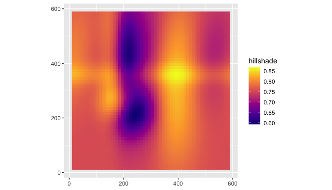
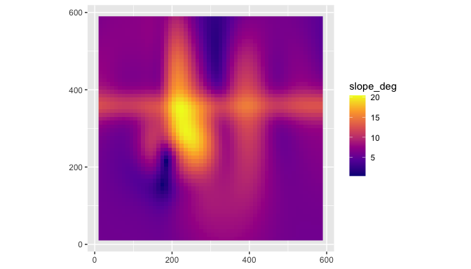
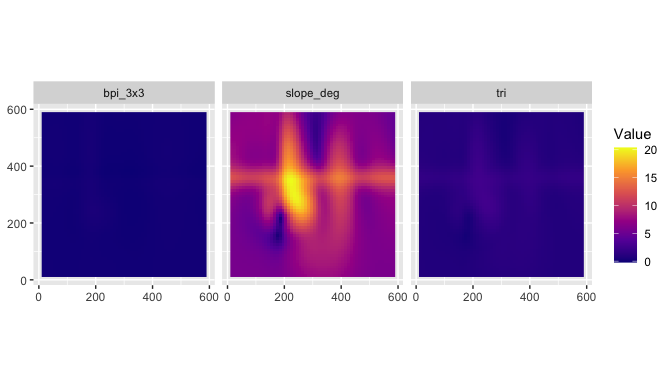
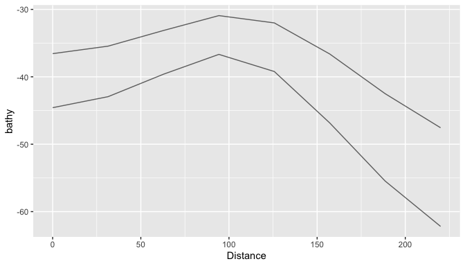
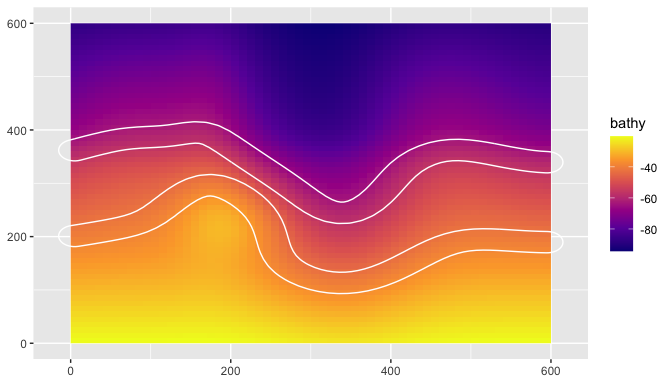
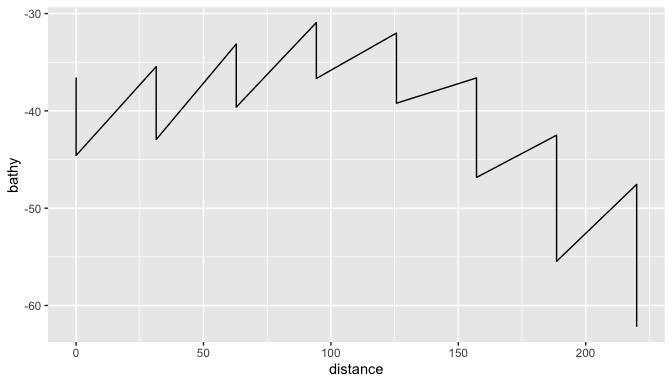
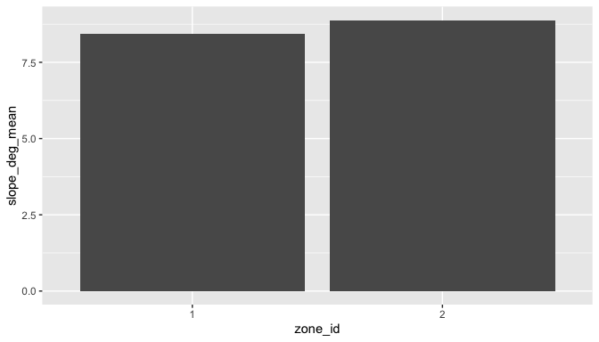
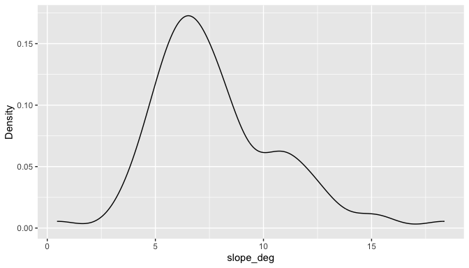
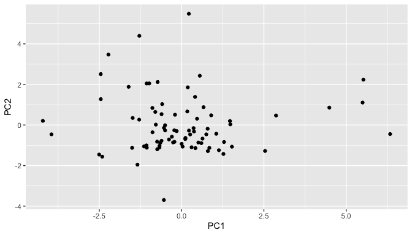

# blueterra

`blueterra` is an R package for geomorphometric analysis of submerged
terrain. It works from user-supplied bathymetric or elevation rasters
and builds `terra`-based workflows for deriving terrain metrics,
organizing those metrics into process-oriented groups, and summarizing
submerged landscapes across polygons, transects, depth bands, and
isobath corridors. The package is designed for seafloor classification,
habitat mapping, shelf-margin analysis, and spatial modeling where
terrain structure is part of the physical template.

## Installation

``` r
install.packages("remotes")
remotes::install_github("el-cordero/blueterra")
```

From a local source checkout:

``` r
install.packages("path/to/blueterra", repos = NULL, type = "source")
```

## Core Workflow

``` r
library(blueterra)
library(terra)
#> terra 1.9.27

bathy <- read_bathy(blueterra_example("bathy"))
zones <- vect(blueterra_example("zones"))

prepared <- prepare_bathy(bathy, depth_range = c(-90, -20), smooth = TRUE)
metrics <- derive_terrain(
  prepared,
  metrics = c("slope", "aspect", "northness", "eastness", "tri", "bpi",
              "curvature", "surface_area_ratio")
)

zone_summary <- summarize_terrain(metrics, zones)
depth_summary <- summarize_depth_bands(
  prepared,
  metrics = metrics,
  breaks = c(-90, -70, -50, -30, -20)
)
```

The workflow is deliberately explicit: depth signs are preserved unless
a conversion function is called, and coordinate reference systems are
not changed unless the user requests a projection.

## Data Input

``` r
bathy_path <- blueterra_example("bathy")
zones_path <- blueterra_example("zones")

class(bathy_path)
#> [1] "character"
class(zones_path)
#> [1] "character"

bathy <- read_bathy(bathy_path)
class(bathy)
#> [1] "SpatRaster"
#> attr(,"package")
#> [1] "terra"

bathy_info(bathy)
#> # A tibble: 1 × 13
#>   layer  nrow  ncol ncell  xmin  xmax  ymin  ymax  xres  yres   min   max crs   
#>   <chr> <dbl> <dbl> <dbl> <dbl> <dbl> <dbl> <dbl> <dbl> <dbl> <dbl> <dbl> <chr> 
#> 1 bathy    60    60  3600     0   600     0   600    10    10 -94.3 -20.3 "PROJ…
check_bathy_crs(bathy)
#> # A tibble: 1 × 4
#>   has_crs is_lonlat is_projected crs                                            
#>   <lgl>   <lgl>     <lgl>        <chr>                                          
#> 1 TRUE    FALSE     TRUE         "PROJCRS[\"WGS 84 / UTM zone 20N\",\n    BASEG…
check_bathy_units(bathy, units = "m", positive_depth = FALSE)
#> # A tibble: 1 × 5
#>   layer   min   max units positive_depth
#>   <chr> <dbl> <dbl> <chr> <lgl>         
#> 1 bathy -94.3 -20.3 m     FALSE
```

`as_bathy()` accepts an existing `SpatRaster` or a local raster path:

``` r
same_bathy <- as_bathy(bathy)
path_bathy <- as_bathy(bathy_path)
class(same_bathy)
#> [1] "SpatRaster"
#> attr(,"package")
#> [1] "terra"
class(path_bathy)
#> [1] "SpatRaster"
#> attr(,"package")
#> [1] "terra"
```

## Raster Preparation

``` r
cropped <- crop_bathy(bathy, ext(50, 400, 50, 400))
masked <- mask_bathy(bathy, zones[1, ])
smoothed <- smooth_bathy(bathy, window = 3)
filtered <- depth_filter(bathy, depth_range = c(-80, -30))

positive_depth <- set_depth_positive(bathy)
negative_depth <- set_depth_negative(positive_depth)
inverted_depth <- invert_depth(negative_depth)

class(cropped)
#> [1] "SpatRaster"
#> attr(,"package")
#> [1] "terra"
class(masked)
#> [1] "SpatRaster"
#> attr(,"package")
#> [1] "terra"
range(values(filtered), na.rm = TRUE)
#> [1] -79.94401 -30.00223
range(values(positive_depth), na.rm = TRUE)
#> [1] 20.32121 94.27760
range(values(negative_depth), na.rm = TRUE)
#> [1] -94.27760 -20.32121
```

Projection and resampling are available as explicit operations:

``` r
coarse <- aggregate(bathy, fact = 2)
resampled <- resample_bathy(bathy, coarse)
projected <- project_bathy(coarse, crs(bathy))
prepared <- prepare_bathy(
  bathy,
  depth_range = c(-85, -25),
  smooth = TRUE,
  smooth_window = 3
)

class(resampled)
#> [1] "SpatRaster"
#> attr(,"package")
#> [1] "terra"
class(projected)
#> [1] "SpatRaster"
#> attr(,"package")
#> [1] "terra"
class(prepared)
#> [1] "SpatRaster"
#> attr(,"package")
#> [1] "terra"
```

## Terrain Metrics

Terrain derivatives are scale-sensitive; select window sizes that match
the feature size being interpreted.

``` r
slope <- derive_slope(bathy, units = "degrees")
aspect <- derive_aspect(bathy, units = "degrees")
northness <- derive_northness(bathy)
eastness <- derive_eastness(bathy)
hillshade <- derive_hillshade(bathy)
roughness <- derive_roughness(bathy)
rugosity <- derive_rugosity(bathy, window = 3)
tri <- derive_tri(bathy)
tpi <- derive_tpi(bathy)
bpi <- derive_bpi(bathy, window = 5)
multiscale_bpi <- derive_multiscale_bpi(bathy, windows = c(3, 7, 11))
curvature <- derive_curvature(bathy)
sar <- derive_surface_area_ratio(bathy)
metric_stack <- derive_metric_stack(
  bathy,
  metrics = c("slope", "northness", "eastness", "tri", "bpi", "curvature")
)

names(metric_stack)
#> [1] "slope_deg" "northness" "eastness"  "tri"       "bpi_3x3"   "bpi_11x11"
#> [7] "curvature"
global(slope, c("min", "mean", "max"), na.rm = TRUE)
#>                 min    mean      max
#> slope_deg 0.3642881 8.13533 20.39519
global(bpi, c("min", "mean", "max"), na.rm = TRUE)
#>               min         mean     max
#> bpi_5x5 -1.412532 -0.003263646 1.29699
```

`derive_terrain()` is the high-level stack builder:

``` r
terrain <- derive_terrain(bathy)
names(terrain)
#>  [1] "bathy"              "slope_deg"          "aspect_deg"        
#>  [4] "northness"          "eastness"           "hillshade"         
#>  [7] "roughness"          "tri"                "tpi"               
#> [10] "bpi_3x3"            "bpi_11x11"          "curvature"         
#> [13] "surface_area_ratio"
class(terrain)
#> [1] "SpatRaster"
#> attr(,"package")
#> [1] "terra"
```

## Process Groups

Process groups are an interpretation layer for organizing terrain form.

``` r
catalog <- metric_catalog()
head(catalog)
#> # A tibble: 6 × 9
#>   metric     label      process_group   description        units source_function
#>   <chr>      <chr>      <chr>           <chr>              <chr> <chr>          
#> 1 bathy      Bathymetry base_bathymetry Input bathymetric… inpu… as_bathy       
#> 2 slope_deg  Slope      slope_gradient  Local slope gradi… degr… derive_slope   
#> 3 slope_rad  Slope      slope_gradient  Local slope gradi… radi… derive_slope   
#> 4 aspect_deg Aspect     orientation     Local downslope-f… degr… derive_aspect  
#> 5 aspect_rad Aspect     orientation     Local downslope-f… radi… derive_aspect  
#> 6 northness  Northness  orientation     Cosine transform … unit… derive_northne…
#> # ℹ 3 more variables: requires_optional_dependency <lgl>,
#> #   scale_sensitive <lgl>, interpretation_notes <chr>

process_groups()
#> [1] "base_bathymetry"   "slope_gradient"    "orientation"      
#> [4] "surface_structure" "seafloor_rugosity" "seafloor_position"
#> [7] "curvature"
assign_process_groups(metric_stack)
#> # A tibble: 7 × 7
#>   metric metric_standard label process_group description source_function matched
#>   <chr>  <chr>           <chr> <chr>         <chr>       <chr>           <lgl>  
#> 1 slope… slope_deg       Slope slope_gradie… Local slop… derive_slope    TRUE   
#> 2 north… northness       Nort… orientation   Cosine tra… derive_northne… TRUE   
#> 3 eastn… eastness        East… orientation   Sine trans… derive_eastness TRUE   
#> 4 tri    tri             Terr… seafloor_rug… Local terr… derive_tri      TRUE   
#> 5 bpi_3… bpi_3x3         Fine… seafloor_pos… Fine-scale… derive_bpi      TRUE   
#> 6 bpi_1… bpi_11x11       Broa… seafloor_pos… Broad-scal… derive_bpi      TRUE   
#> 7 curva… curvature       Curv… curvature     Laplacian-… derive_curvatu… TRUE
select_process_representatives(metrics_available = names(metric_stack))
#> # A tibble: 5 × 9
#>   metric    label                process_group description units source_function
#>   <chr>     <chr>                <chr>         <chr>       <chr> <chr>          
#> 1 curvature Curvature            curvature     Laplacian-… inpu… derive_curvatu…
#> 2 eastness  Eastness             orientation   Sine trans… unit… derive_eastness
#> 3 bpi_11x11 Broad BPI            seafloor_pos… Broad-scal… inpu… derive_bpi     
#> 4 tri       Terrain Ruggedness … seafloor_rug… Local terr… inpu… derive_tri     
#> 5 slope_deg Slope                slope_gradie… Local slop… degr… derive_slope   
#> # ℹ 3 more variables: requires_optional_dependency <lgl>,
#> #   scale_sensitive <lgl>, interpretation_notes <chr>
summarize_process_groups(metric_stack)
#> # A tibble: 5 × 3
#>   process_group     n_metrics metrics            
#>   <chr>                 <int> <chr>              
#> 1 curvature                 1 curvature          
#> 2 orientation               2 northness, eastness
#> 3 seafloor_position         2 bpi_3x3, bpi_11x11 
#> 4 seafloor_rugosity         1 tri                
#> 5 slope_gradient            1 slope_deg

standardize_metric_names(c("Slope (deg)", "Broad BPI"))
#> [1] "slope_deg" "broad_bpi"
rename_metric_layers(c("old_slope"), c(old_slope = "slope_deg"))
#> [1] "slope_deg"
```

## Depth Bands

``` r
summarize_depth_bands(
  bathy,
  metrics = metric_stack,
  breaks = c(-90, -70, -50, -30, -20)
)
#> # A tibble: 28 × 8
#>    depth_band metric    n_cells    mean    sd    min    max  median
#>    <chr>      <chr>       <int>   <dbl> <dbl>  <dbl>  <dbl>   <dbl>
#>  1 [-90,-70)  slope_deg    1048  8.21   2.82   2.44  18.4    7.12  
#>  2 [-90,-70)  northness    1048  0.758  0.227  0.323  1.000  0.850 
#>  3 [-90,-70)  eastness     1048  0.0223 0.612 -0.940  0.947 -0.0240
#>  4 [-90,-70)  tri          1048  1.12   0.388  0.355  2.41   0.974 
#>  5 [-90,-70)  bpi_3x3      1048 -0.0457 0.133 -0.700  0.195 -0.0152
#>  6 [-90,-70)  bpi_11x11    1048 -0.679  1.18  -3.59   2.23  -0.754 
#>  7 [-90,-70)  curvature    1048  0.0564 0.249 -0.586  0.686  0.0193
#>  8 [-70,-50)  slope_deg     768 10.7    3.44   5.98  20.4   10.2   
#>  9 [-70,-50)  northness     768  0.849  0.153  0.424  1.000  0.926 
#> 10 [-70,-50)  eastness      768 -0.0303 0.505 -0.862  0.906 -0.0978
#> # ℹ 18 more rows

summarize_depth_bands(
  set_depth_positive(bathy),
  metrics = metric_stack,
  breaks = c(20, 30, 50, 70, 90),
  positive_depth = TRUE
)
#> # A tibble: 28 × 8
#>    depth_band metric    n_cells     mean     sd     min     max   median
#>    <chr>      <chr>       <int>    <dbl>  <dbl>   <dbl>   <dbl>    <dbl>
#>  1 [20,30)    slope_deg     518  6.13    0.981   0.364   8.26    5.82   
#>  2 [20,30)    northness     518  0.980   0.0289  0.844   1.000   0.996  
#>  3 [20,30)    eastness      518  0.00127 0.195  -0.395   0.536  -0.0172 
#>  4 [20,30)    tri           518  0.830   0.140   0.321   1.14    0.771  
#>  5 [20,30)    bpi_3x3       518  0.0668  0.177  -0.0269  0.658   0.00357
#>  6 [20,30)    bpi_11x11     518  0.999   1.01   -0.300   3.56    0.655  
#>  7 [20,30)    curvature     518 -0.0117  0.0522 -0.857   0.0805 -0.00681
#>  8 [30,50)    slope_deg    1147  7.55    3.01    0.451  20.0     6.72   
#>  9 [30,50)    northness    1147  0.795   0.299  -0.991   1.000   0.916  
#> 10 [30,50)    eastness     1147 -0.0696  0.524  -1.000   1.000  -0.154  
#> # ℹ 18 more rows
```

## Transects

Transects are useful when observations are collected along cross-shelf
or cross-slope sections.

``` r
transects <- make_transects(zones[1, ], spacing = 100)
class(transects)
#> [1] "SpatVector"
#> attr(,"package")
#> [1] "terra"

transect_samples <- sample_transects(transects, bathy, n = 8)
head(transect_samples)
#> # A tibble: 6 × 5
#>   transect_id distance     x     y bathy
#>   <chr>          <dbl> <dbl> <dbl> <dbl>
#> 1 1_1              0     80   179. -36.6
#> 2 1_1             31.4  111.  179. -35.5
#> 3 1_1             62.9  143.  179. -33.1
#> 4 1_1             94.3  174.  179. -30.9
#> 5 1_1            126.   206.  179. -32.0
#> 6 1_1            157.   237.  179. -36.6

cross_sections <- extract_cross_sections(transects, bathy, n = 8)
summarize_cross_sections(cross_sections)
#> # A tibble: 2 × 6
#>   transect_id bathy_mean bathy_sd bathy_min bathy_max bathy_median
#>   <chr>            <dbl>    <dbl>     <dbl>     <dbl>        <dbl>
#> 1 1_1              -36.8     5.62     -47.6     -30.9        -36.0
#> 2 1_2              -45.9     8.76     -62.2     -36.7        -43.8
```

## Isobath Corridors

Isobath corridors summarize terrain along depth horizons.

``` r
isobaths <- extract_isobaths(bathy, depths = c(-40, -60))
corridors <- make_isobath_corridors(bathy, depths = c(-40, -60), width = 20)

class(isobaths)
#> [1] "SpatVector"
#> attr(,"package")
#> [1] "terra"
class(corridors)
#> [1] "SpatVector"
#> attr(,"package")
#> [1] "terra"

corridor_cells <- extract_isobath_corridors(metric_stack, corridors)
head(corridor_cells)
#> # A tibble: 6 × 12
#>      ID level contour_value depth_label corridor_id slope_deg northness eastness
#>   <int> <dbl>         <dbl>       <dbl>       <int>     <dbl>     <dbl>    <dbl>
#> 1     1   -40           -40         -40           1      11.0     0.995  -0.0990
#> 2     1   -40           -40         -40           1      11.9     0.985   0.171 
#> 3     1   -40           -40         -40           1      10.3     0.873  -0.488 
#> 4     1   -40           -40         -40           1      10.6     0.924  -0.383 
#> 5     1   -40           -40         -40           1      10.8     0.984  -0.178 
#> 6     1   -40           -40         -40           1      11.6     0.995   0.104 
#> # ℹ 4 more variables: tri <dbl>, bpi_3x3 <dbl>, bpi_11x11 <dbl>,
#> #   curvature <dbl>

summarize_isobath_terrain(metric_stack, corridors)
#> # A tibble: 2 × 40
#>   level contour_value depth_label corridor_id zone_id slope_deg_mean
#>   <dbl>         <dbl>       <dbl>       <int>   <int>          <dbl>
#> 1   -40           -40         -40           1       1           9.17
#> 2   -60           -60         -60           2       2          12.3 
#> # ℹ 34 more variables: slope_deg_sd <dbl>, slope_deg_min <dbl>,
#> #   slope_deg_max <dbl>, slope_deg_median <dbl>, northness_mean <dbl>,
#> #   northness_sd <dbl>, northness_min <dbl>, northness_max <dbl>,
#> #   northness_median <dbl>, eastness_mean <dbl>, eastness_sd <dbl>,
#> #   eastness_min <dbl>, eastness_max <dbl>, eastness_median <dbl>,
#> #   tri_mean <dbl>, tri_sd <dbl>, tri_min <dbl>, tri_max <dbl>,
#> #   tri_median <dbl>, bpi_3x3_mean <dbl>, bpi_3x3_sd <dbl>, …
```

## Polygon Summaries

``` r
terrain_summary <- summarize_terrain(metric_stack, zones)
terrain_summary
#> # A tibble: 2 × 37
#>   zone_id setting     slope_deg_mean slope_deg_sd slope_deg_min slope_deg_max
#>     <int> <chr>                <dbl>        <dbl>         <dbl>         <dbl>
#> 1       1 ridge_basin           8.42         4.60         0.364          20.2
#> 2       2 slope_break           8.89         2.70         1.91           15.0
#> # ℹ 31 more variables: slope_deg_median <dbl>, northness_mean <dbl>,
#> #   northness_sd <dbl>, northness_min <dbl>, northness_max <dbl>,
#> #   northness_median <dbl>, eastness_mean <dbl>, eastness_sd <dbl>,
#> #   eastness_min <dbl>, eastness_max <dbl>, eastness_median <dbl>,
#> #   tri_mean <dbl>, tri_sd <dbl>, tri_min <dbl>, tri_max <dbl>,
#> #   tri_median <dbl>, bpi_3x3_mean <dbl>, bpi_3x3_sd <dbl>, bpi_3x3_min <dbl>,
#> #   bpi_3x3_max <dbl>, bpi_3x3_median <dbl>, bpi_11x11_mean <dbl>, …

summarize_terrain_by_zone(metric_stack, zones)
#> # A tibble: 2 × 37
#>   zone_id setting     slope_deg_mean slope_deg_sd slope_deg_min slope_deg_max
#>     <int> <chr>                <dbl>        <dbl>         <dbl>         <dbl>
#> 1       1 ridge_basin           8.42         4.60         0.364          20.2
#> 2       2 slope_break           8.89         2.70         1.91           15.0
#> # ℹ 31 more variables: slope_deg_median <dbl>, northness_mean <dbl>,
#> #   northness_sd <dbl>, northness_min <dbl>, northness_max <dbl>,
#> #   northness_median <dbl>, eastness_mean <dbl>, eastness_sd <dbl>,
#> #   eastness_min <dbl>, eastness_max <dbl>, eastness_median <dbl>,
#> #   tri_mean <dbl>, tri_sd <dbl>, tri_min <dbl>, tri_max <dbl>,
#> #   tri_median <dbl>, bpi_3x3_mean <dbl>, bpi_3x3_sd <dbl>, bpi_3x3_min <dbl>,
#> #   bpi_3x3_max <dbl>, bpi_3x3_median <dbl>, bpi_11x11_mean <dbl>, …

points <- centroids(zones)
extract_terrain_points(metric_stack, points)
#> # A tibble: 2 × 9
#>   zone_id setting slope_deg northness eastness   tri bpi_3x3 bpi_11x11 curvature
#>   <chr>   <chr>       <dbl>     <dbl>    <dbl> <dbl>   <dbl>     <dbl>     <dbl>
#> 1 zone_a  ridge_…      2.69    -0.719    0.569 0.394  0.176      2.31    -0.529 
#> 2 zone_b  slope_…     10.8      0.619   -0.784 1.41   0.0235     0.322   -0.0708
sample_terrain_cells(metric_stack, size = 10, method = "regular")
#> # A tibble: 16 × 9
#>        x     y slope_deg northness eastness   tri  bpi_3x3 bpi_11x11 curvature
#>    <dbl> <dbl>     <dbl>     <dbl>    <dbl> <dbl>    <dbl>     <dbl>     <dbl>
#>  1    75    75      5.52     1.000  -0.0156 0.728 -0.00288   -0.0614   0.00857
#>  2   225    75      6.76     0.879   0.477  0.922  0.00346    0.0740  -0.0101 
#>  3   375    75      8.55     0.957  -0.289  1.19  -0.0239    -0.344    0.0717 
#>  4   525    75      5.83     0.999  -0.0491 0.778  0.00843    0.133   -0.0253 
#>  5    75   225      4.93     0.915  -0.403  0.679 -0.0193    -0.286    0.0591 
#>  6   225   225     12.9      0.276   0.961  1.81   0.229      3.01    -0.689  
#>  7   375   225      9.91     0.763  -0.646  1.28  -0.0796    -1.13     0.239  
#>  8   525   225      5.98     0.994   0.110  0.809  0.0173     0.273   -0.0520 
#>  9    75   375     10.4      0.991  -0.137  1.43  -0.0261    -0.142    0.0777 
#> 10   225   375     18.9      0.634   0.773  2.53  -0.139     -1.27     0.420  
#> 11   375   375     13.8      0.673  -0.740  1.78  -0.129     -1.50     0.388  
#> 12   525   375     11.5      0.949   0.315  1.61  -0.0519    -0.368    0.156  
#> 13    75   525      7.04     0.988  -0.153  0.962  0.0275     0.316   -0.0827 
#> 14   225   525     11.6      0.369   0.929  1.61  -0.0452    -0.334    0.136  
#> 15   375   525      7.53     0.442  -0.897  1.04  -0.0220    -0.311    0.0658 
#> 16   525   525      6.23     0.874   0.486  0.849  0.00734    0.121   -0.0220
```

## Modeling Helpers

``` r
cells <- sample_terrain_cells(metric_stack, size = 80)
pca <- terrain_pca(cells)
pca$variance
#> # A tibble: 7 × 3
#>   component  proportion cumulative
#>   <chr>           <dbl>      <dbl>
#> 1 PC1       0.439            0.439
#> 2 PC2       0.294            0.733
#> 3 PC3       0.159            0.893
#> 4 PC4       0.0932           0.986
#> 5 PC5       0.0139           1.000
#> 6 PC6       0.000263         1.000
#> 7 PC7       0.000000184      1

terrain_correlation(cells)
#> # A tibble: 21 × 3
#>    var1      var2      correlation
#>    <chr>     <chr>           <dbl>
#>  1 slope_deg northness     -0.0846
#>  2 slope_deg eastness       0.308 
#>  3 northness eastness       0.157 
#>  4 slope_deg tri            0.998 
#>  5 northness tri           -0.0704
#>  6 eastness  tri            0.317 
#>  7 slope_deg bpi_3x3        0.213 
#>  8 northness bpi_3x3        0.0599
#>  9 eastness  bpi_3x3       -0.130 
#> 10 tri       bpi_3x3        0.226 
#> # ℹ 11 more rows

model_data <- prepare_model_matrix(cells, vars = names(metric_stack), scale = TRUE)
class(model_data$x)
#> [1] "matrix" "array"
dim(model_data$x)
#> [1] 80  7

effect_data <- data.frame(
  group = rep(c("A", "B"), each = 10),
  slope = c(1:10, 6:15)
)
terrain_effect_size(effect_data, group = "group", vars = "slope")
#> # A tibble: 1 × 7
#>   variable group_1 group_2 mean_1 mean_2 effect_size method  
#>   <chr>    <chr>   <chr>    <dbl>  <dbl>       <dbl> <chr>   
#> 1 slope    A       B          5.5   10.5       -1.65 cohens_d
balance_samples(data.frame(group = rep(c("A", "B"), c(5, 12)), value = seq_len(17)),
                group = "group")
#> # A tibble: 10 × 2
#>    group value
#>    <chr> <int>
#>  1 A         2
#>  2 A         3
#>  3 A         5
#>  4 A         1
#>  5 A         4
#>  6 B         8
#>  7 B         9
#>  8 B        12
#>  9 B        16
#> 10 B        11
```

## Plotting

``` r
plot_bathy(bathy)
```


``` r
plot_hillshade(bathy)
```



``` r
plot_metric(metric_stack, "slope_deg")
```



``` r
plot_metric_stack(metric_stack[[c("slope_deg", "tri", "bpi_3x3")]])
```



``` r
plot_cross_sections(transect_samples)
```



``` r
plot_isobath_corridors(corridors, bathy)
```



``` r
plot_depth_profile(transect_samples, depth_col = "bathy")
```



``` r
plot_terrain_summary(terrain_summary, value = "slope_deg_mean")
```



``` r
plot_process_density(cells, value = "slope_deg")
```



``` r
plot_process_pca(pca)
```



## Utility Functions

``` r
blueterra_extdata()
#> [1] "/private/var/folders/7j/dr505g_j3zd9z6m9qdykzc4w0000gn/T/RtmpvGjX8t/temp_libpath82c665a40b9c/blueterra/extdata"
blueterra_extdata("example_bathy.tif")
#> [1] "/private/var/folders/7j/dr505g_j3zd9z6m9qdykzc4w0000gn/T/RtmpvGjX8t/temp_libpath82c665a40b9c/blueterra/extdata/example_bathy.tif"
blueterra_example("bathy")
#> [1] "/private/var/folders/7j/dr505g_j3zd9z6m9qdykzc4w0000gn/T/RtmpvGjX8t/temp_libpath82c665a40b9c/blueterra/extdata/example_bathy.tif"
blueterra_example("zones")
#> [1] "/private/var/folders/7j/dr505g_j3zd9z6m9qdykzc4w0000gn/T/RtmpvGjX8t/temp_libpath82c665a40b9c/blueterra/extdata/example_zones.gpkg"
blueterra_options()
#> $blueterra.progress
#> [1] TRUE
#> 
#> $blueterra.max_plot_cells
#> [1] 10000
old <- blueterra_options(blueterra.progress = FALSE)
blueterra_options(blueterra.progress = old$blueterra.progress)
```

## Reproducibility

Analyses should record the raster source, horizontal CRS, vertical
units, vertical sign convention, raster resolution, smoothing choices,
and focal window sizes. Terrain metrics such as slope, curvature,
rugosity, TPI, and BPI are not invariant to grid resolution or
preprocessing.

## Citation

Citation metadata will be added with the first archived release. Until
then, cite the GitHub repository and package version used in the
analysis.

## License

MIT. See `LICENSE.md`.
