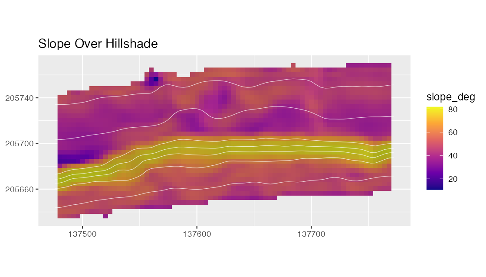
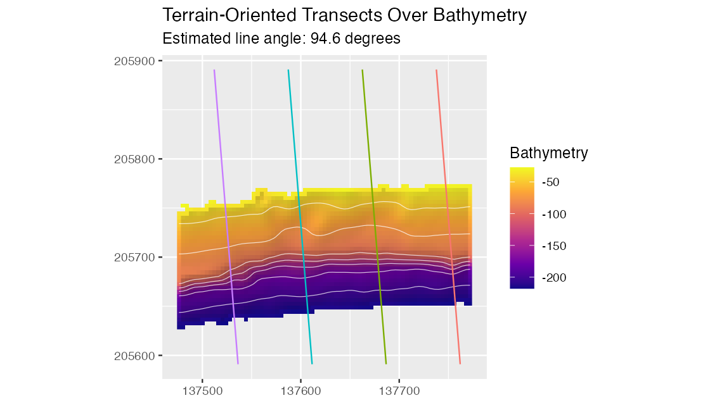
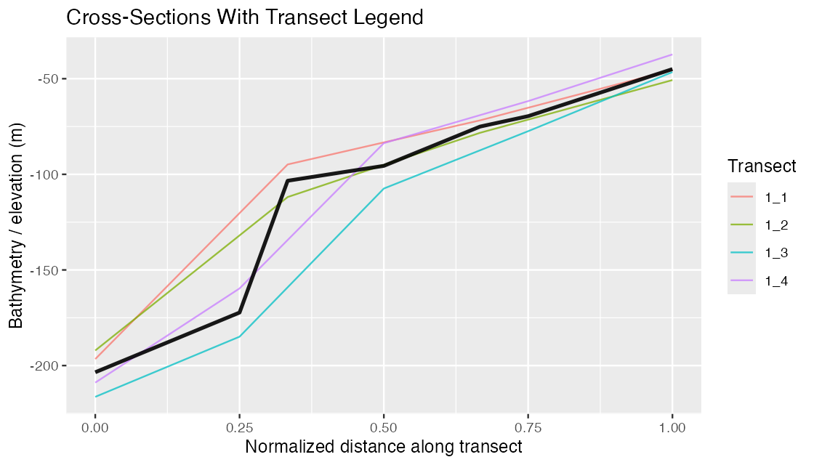
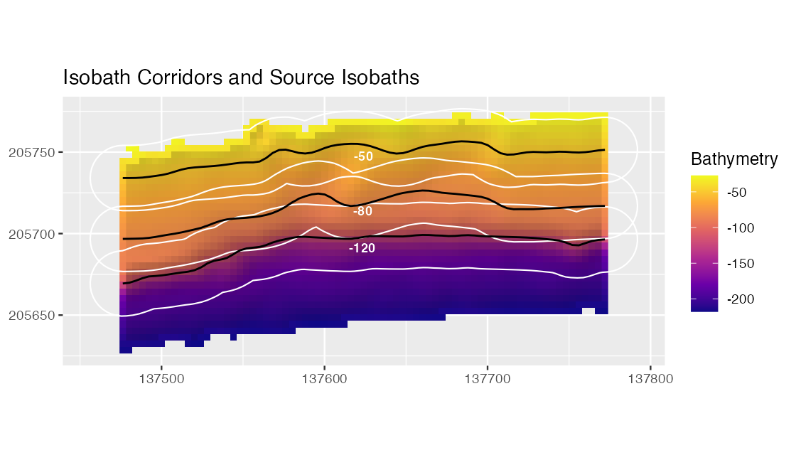
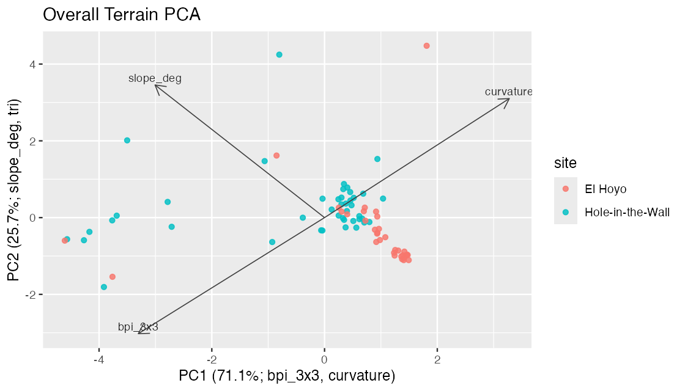

```{r, include = FALSE}
knitr::opts_chunk$set(collapse = TRUE, comment = "#>")
```

The visual proof is a compact gallery from the package QA run. It shows that the
site examples are built from real reduced bathymetry, that hillshade-supported
maps render with vector overlays, and that profile and modeling outputs use the
intended raster value columns.

The full QA report is kept in `qa/visual-proof/visual-proof.md` in the source
repository. The CRAN source package excludes the QA directory, so only selected
small figures are copied into package figure assets for documentation.

## Terrain Metrics



*Slope over hillshaded Hole-in-the-Wall bathymetry. The figure demonstrates
that metric maps can use bathymetry-derived hillshade and contours as visual
context while preserving the metric as the mapped value.*

## Transects



*Transects are oriented from local surface aspect and plotted over the prepared
bathymetry. The line angle is recorded in the transect attributes so the choice
is inspectable.*

## Cross-Sections



*Cross-section profiles use `bathy_m` explicitly on the y-axis. Numeric
metadata such as transect width, height, offset, and angle are ignored during
automatic value-column inference.*

## Isobath Corridors



*Isobath corridors are shown with the source isobaths in black. The black lines
mark the depth horizons that were buffered to create extraction corridors.*

## PCA



*PCA scores retain site metadata and the axis labels report dominant loading
directions. This makes exploratory terrain separation easier to inspect before
formal modeling.*

## Local QA Summary

The local validation pass for this site recorded:

- pkgdown build: completed locally
- R CMD check: 0 errors, 0 warnings
- source package size: below 9 MB
- expected website URL: <https://el-cordero.github.io/blueterra/>
- deployment workflow: `.github/workflows/pkgdown.yaml`

GitHub Actions results are available from the repository Actions tab:
<https://github.com/el-cordero/blueterra/actions>.
